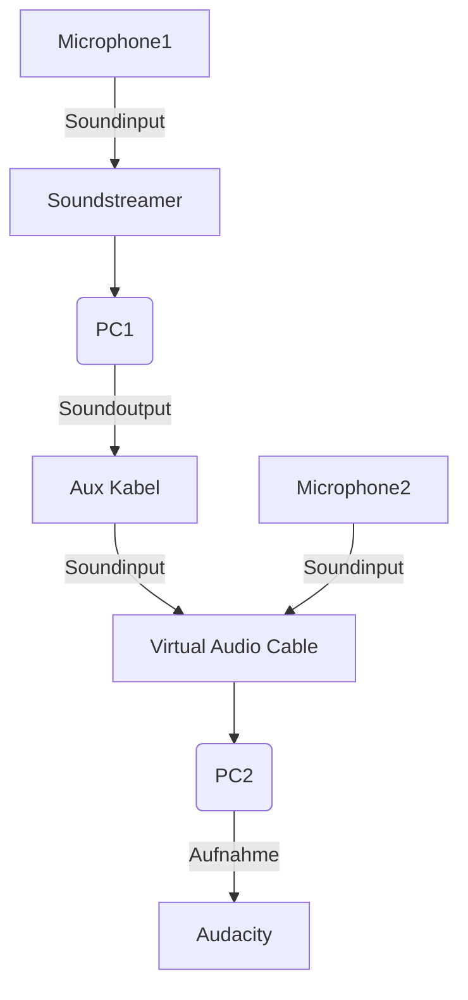

# PyJ(H)ack

## Die Idee
Hi! Dieses Projekt trägt den Namen PyJ(H)ack. Es hat das Ziel eine Software zu schreiben, welche die Möglichkeit bietet Soundeingaben zwischen zwei Usern oder einem User und einem Server zu senden. Dies soll mit möglichst wenig delay wie möglich geschehen. Großes Endziel ist es eine Plattform zu schaffen, auf welcher User ihre eigene Soundbibliothek schaffen können, mit anderen Usern Musik schaffen und auf diese Daten mit jedem Gerät wieder zugreifen, ohne eigenen Speicher zu benötigen. Sounddateien sollen ebenfalls einfach geteilt werden können.
Als Programmiersprache für dieses Projekt wurde Python gewählt, welches nicht gerade für seine Realtimefähigkeit bekannt ist. Genau dieser Grund ist aber mein Ansporn eine Software zu schreiben, welche so performant wie möglich arbeitet.

## Funktionalitäten Client

Der Client muss die folgenden Funktionalitäten beinhalten:

**Soundaufnahme:** Es muss Sound von einem Mikrofon aufgenommen werden können, dies beinhaltet sowohl die Möglichkeit Sound zu senden, als auch einfach als Soundfile zu speichern. Eine Möglichkeit, Sound aus Programmen aufzunehmen, wäre ebenfalls brauchbar, aber hat erstmal keine Priorität.

**Soundwiedergabe:** Die Möglichkeit ein Soundfile, oder jeglichen einkommenden Ton wiedergeben zu können, sollte auch vorhanden sein, hierdurch kann der User die erstellten Soundfiles gleich anhören.

**Login in Userprofil:** Damit der User wirklich als er selber erkannt wird, und auch seine erstellten Werke sicher sind, muss ein Login System existieren.

**Erstellen von Soundservern:** Damit die Aufnahme in die Soundbibliothek oder auch das Senden von Ton an andere User funktioniert, muss ein Server existieren. Jeder User soll die Möglichkeit haben, eigene Server zu starten und stoppen.

**Client- Server Verbindung:** Um Ton in die eigene Bibliothek hochladen zu können, muss der User eine stabile Verbindung zu einem der zentralen Server herstellen zu können.

**Client-Client Verbindung:**  Um den Usern auch die Möglichkeit zu geben, ohne fremde externe Server produktiv zu arbeiten und Soundwerke zu erzeugen, soll die Möglichkeit bestehen sich direkt zu einem Partner zu verbinden und alles local abzuwickeln.

## Server Funktionalitäten
Ein Server muss die folgenden Funktionen bieten:

**Verbindung zum User:** Ein User soll sich mit dem Server verbinden können ohne, dass er von anderen Usern blockiert wird oder er selber andere User behindert.

**Erstellen von Soundfiles:** Eingehende Samples eines Users müssen in das jeweilige Soundfile gespeichert werden und dem User daraufhin zur Verfügung gestellt

**Ansehen der eigenen Soundbibliothek:** Jedem User wird eine eigene Bibliothek zugeteilt, in der er seine Werke speichern kann.

## Die Umsetzung

Ich kann zwar mit Erfahrungen im Bereich Python, sowie Webentwicklung dienen, ich habe aber vorher noch nie Soundverarbeitung in Python gemacht. Dafür habe ich mich nach Bibliotheken umgeschaut, welche mir bei dieser Aufgabe helfen. Zuerst stieß ich auf die Bibliothek Sounddevice

### Sounddevice
Die folgenden Dateien stammen aus ihrer [Documentation](https://python-sounddevice.readthedocs.io/en/0.4.1/examples.html).

**play_file.py**
```python
#!/usr/bin/env python3
"""Load an audio file into memory and play its contents.

NumPy and the soundfile module (https://PySoundFile.readthedocs.io/)
must be installed for this to work.

This example program loads the whole file into memory before starting
playback.
To play very long files, you should use play_long_file.py instead.

"""
import argparse

import sounddevice as sd
import soundfile as sf

def int_or_str(text):
    """Helper function for argument parsing."""
    try:
        return int(text)
    except ValueError:
        return text

parser = argparse.ArgumentParser(add_help=False)
parser.add_argument(
    '-l', '--list-devices', action='store_true',
    help='show list of audio devices and exit')
args, remaining = parser.parse_known_args()
if args.list_devices:
    print(sd.query_devices())
    parser.exit(0)
parser = argparse.ArgumentParser(
    description=__doc__,
    formatter_class=argparse.RawDescriptionHelpFormatter,
    parents=[parser])
parser.add_argument(
    'filename', metavar='FILENAME',
    help='audio file to be played back')
parser.add_argument(
    '-d', '--device', type=int_or_str,
    help='output device (numeric ID or substring)')
args = parser.parse_args(remaining)

try:
    data, fs = sf.read(args.filename, dtype='float32')
    sd.play(data, fs, device=args.device)
    status = sd.wait()
except KeyboardInterrupt:
    parser.exit('\nInterrupted by user')
except Exception as e:
    parser.exit(type(e).__name__ + ': ' + str(e))
if status:
    parser.exit('Error during playback: ' + str(status))
```
**play_long_file.py**
```python
#!/usr/bin/env python3
"""Play an audio file using a limited amount of memory.

The soundfile module (https://PySoundFile.readthedocs.io/) must be
installed for this to work.  NumPy is not needed.

In contrast to play_file.py, which loads the whole file into memory
before starting playback, this example program only holds a given number
of audio blocks in memory and is therefore able to play files that are
larger than the available RAM.

A similar example could of course be implemented using NumPy,
but this example shows what can be done when NumPy is not available.

"""
import argparse
import queue
import sys
import threading

import sounddevice as sd
import soundfile as sf

def int_or_str(text):
    """Helper function for argument parsing."""
    try:
        return int(text)
    except ValueError:
        return text

parser = argparse.ArgumentParser(add_help=False)
parser.add_argument(
    '-l', '--list-devices', action='store_true',
    help='show list of audio devices and exit')
args, remaining = parser.parse_known_args()
if args.list_devices:
    print(sd.query_devices())
    parser.exit(0)
parser = argparse.ArgumentParser(
    description=__doc__,
    formatter_class=argparse.RawDescriptionHelpFormatter,
    parents=[parser])
parser.add_argument(
    'filename', metavar='FILENAME',
    help='audio file to be played back')
parser.add_argument(
    '-d', '--device', type=int_or_str,
    help='output device (numeric ID or substring)')
parser.add_argument(
    '-b', '--blocksize', type=int, default=2048,
    help='block size (default: %(default)s)')
parser.add_argument(
    '-q', '--buffersize', type=int, default=20,
    help='number of blocks used for buffering (default: %(default)s)')
args = parser.parse_args(remaining)
if args.blocksize == 0:
    parser.error('blocksize must not be zero')
if args.buffersize < 1:
    parser.error('buffersize must be at least 1')

q = queue.Queue(maxsize=args.buffersize)
event = threading.Event()

def callback(outdata, frames, time, status):
    assert frames == args.blocksize
    if status.output_underflow:
        print('Output underflow: increase blocksize?', file=sys.stderr)
        raise sd.CallbackAbort
    assert not status
    try:
        data = q.get_nowait()
    except queue.Empty as e:
        print('Buffer is empty: increase buffersize?', file=sys.stderr)
        raise sd.CallbackAbort from e
    if len(data) < len(outdata):
        outdata[:len(data)] = data
        outdata[len(data):] = b'\x00' * (len(outdata) - len(data))
        raise sd.CallbackStop
    else:
        outdata[:] = data

try:
    with sf.SoundFile(args.filename) as f:
        for _ in range(args.buffersize):
            data = f.buffer_read(args.blocksize, dtype='float32')
            if not data:
                break
            q.put_nowait(data)  # Pre-fill queue
        stream = sd.RawOutputStream(
            samplerate=f.samplerate, blocksize=args.blocksize,
            device=args.device, channels=f.channels, dtype='float32',
            callback=callback, finished_callback=event.set)
        with stream:
            timeout = args.blocksize * args.buffersize / f.samplerate
            while data:
                data = f.buffer_read(args.blocksize, dtype='float32')
                q.put(data, timeout=timeout)
            event.wait()  # Wait until playback is finished
except KeyboardInterrupt:
    parser.exit('\nInterrupted by user')
except queue.Full:
    # A timeout occurred, i.e. there was an error in the callback
    parser.exit(1)
except Exception as e:
    parser.exit(type(e).__name__ + ': ' + str(e))
```

**play_sine.py**
```python
#!/usr/bin/env python3
"""Play a sine signal."""
import argparse
import sys

import numpy as np
import sounddevice as sd

def int_or_str(text):
    """Helper function for argument parsing."""
    try:
        return int(text)
    except ValueError:
        return text

parser = argparse.ArgumentParser(add_help=False)
parser.add_argument(
    '-l', '--list-devices', action='store_true',
    help='show list of audio devices and exit')
args, remaining = parser.parse_known_args()
if args.list_devices:
    print(sd.query_devices())
    parser.exit(0)
parser = argparse.ArgumentParser(
    description=__doc__,
    formatter_class=argparse.RawDescriptionHelpFormatter,
    parents=[parser])
parser.add_argument(
    'frequency', nargs='?', metavar='FREQUENCY', type=float, default=500,
    help='frequency in Hz (default: %(default)s)')
parser.add_argument(
    '-d', '--device', type=int_or_str,
    help='output device (numeric ID or substring)')
parser.add_argument(
    '-a', '--amplitude', type=float, default=0.2,
    help='amplitude (default: %(default)s)')
args = parser.parse_args(remaining)

start_idx = 0

try:
    samplerate = sd.query_devices(args.device, 'output')['default_samplerate']

    def callback(outdata, frames, time, status):
        if status:
            print(status, file=sys.stderr)
        global start_idx
        t = (start_idx + np.arange(frames)) / samplerate
        t = t.reshape(-1, 1)
        outdata[:] = args.amplitude * np.sin(2 * np.pi * args.frequency * t)
        start_idx += frames

    with sd.OutputStream(device=args.device, channels=1, callback=callback,
                         samplerate=samplerate):
        print('#' * 80)
        print('press Return to quit')
        print('#' * 80)
        input()
except KeyboardInterrupt:
    parser.exit('')
except Exception as e:
    parser.exit(type(e).__name__ + ': ' + str(e))
```

**asynchio_coroutines.py**
```python
#!/usr/bin/env python3
"""An example for using a stream in an asyncio coroutine.

This example shows how to create a stream in a coroutine and how to wait for
the completion of the stream.

You need Python 3.7 or newer to run this.

"""
import asyncio
import sys

import numpy as np
import sounddevice as sd

async def record_buffer(buffer, **kwargs):
    loop = asyncio.get_event_loop()
    event = asyncio.Event()
    idx = 0

    def callback(indata, frame_count, time_info, status):
        nonlocal idx
        if status:
            print(status)
        remainder = len(buffer) - idx
        if remainder == 0:
            loop.call_soon_threadsafe(event.set)
            raise sd.CallbackStop
        indata = indata[:remainder]
        buffer[idx:idx + len(indata)] = indata
        idx += len(indata)

    stream = sd.InputStream(callback=callback, dtype=buffer.dtype,
                            channels=buffer.shape[1], **kwargs)
    with stream:
        await event.wait()

async def play_buffer(buffer, **kwargs):
    loop = asyncio.get_event_loop()
    event = asyncio.Event()
    idx = 0

    def callback(outdata, frame_count, time_info, status):
        nonlocal idx
        if status:
            print(status)
        remainder = len(buffer) - idx
        if remainder == 0:
            loop.call_soon_threadsafe(event.set)
            raise sd.CallbackStop
        valid_frames = frame_count if remainder >= frame_count else remainder
        outdata[:valid_frames] = buffer[idx:idx + valid_frames]
        outdata[valid_frames:] = 0
        idx += valid_frames

    stream = sd.OutputStream(callback=callback, dtype=buffer.dtype,
                             channels=buffer.shape[1], **kwargs)
    with stream:
        await event.wait()

async def main(frames=150_000, channels=1, dtype='float32', **kwargs):
    buffer = np.empty((frames, channels), dtype=dtype)
    print('recording buffer ...')
    await record_buffer(buffer, **kwargs)
    print('playing buffer ...')
    await play_buffer(buffer, **kwargs)
    print('done')

if __name__ == "__main__":
    try:
        asyncio.run(main())
    except KeyboardInterrupt:
        sys.exit('\nInterrupted by user')
```
**wire.py**
```python
#!/usr/bin/env python3
"""Pass input directly to output.

https://app.assembla.com/spaces/portaudio/git/source/master/test/patest_wire.c

"""
import argparse

import sounddevice as sd
import numpy  # Make sure NumPy is loaded before it is used in the callback
assert numpy  # avoid "imported but unused" message (W0611)

def int_or_str(text):
    """Helper function for argument parsing."""
    try:
        return int(text)
    except ValueError:
        return text

parser = argparse.ArgumentParser(add_help=False)
parser.add_argument(
    '-l', '--list-devices', action='store_true',
    help='show list of audio devices and exit')
args, remaining = parser.parse_known_args()
if args.list_devices:
    print(sd.query_devices())
    parser.exit(0)
parser = argparse.ArgumentParser(
    description=__doc__,
    formatter_class=argparse.RawDescriptionHelpFormatter,
    parents=[parser])
parser.add_argument(
    '-i', '--input-device', type=int_or_str,
    help='input device (numeric ID or substring)')
parser.add_argument(
    '-o', '--output-device', type=int_or_str,
    help='output device (numeric ID or substring)')
parser.add_argument(
    '-c', '--channels', type=int, default=2,
    help='number of channels')
parser.add_argument('--dtype', help='audio data type')
parser.add_argument('--samplerate', type=float, help='sampling rate')
parser.add_argument('--blocksize', type=int, help='block size')
parser.add_argument('--latency', type=float, help='latency in seconds')
args = parser.parse_args(remaining)

def callback(indata, outdata, frames, time, status):
    if status:
        print(status)
    outdata[:] = indata

try:
    with sd.Stream(device=(args.input_device, args.output_device),
                   samplerate=args.samplerate, blocksize=args.blocksize,
                   dtype=args.dtype, latency=args.latency,
                   channels=args.channels, callback=callback):
        print('#' * 80)
        print('press Return to quit')
        print('#' * 80)
        input()
except KeyboardInterrupt:
    parser.exit('')
except Exception as e:
    parser.exit(type(e).__name__ + ': ' + str(e))
```
**plot_input.py**
```python
#!/usr/bin/env python3
"""Plot the live microphone signal(s) with matplotlib.

Matplotlib and NumPy have to be installed.

"""
import argparse
import queue
import sys

from matplotlib.animation import FuncAnimation
import matplotlib.pyplot as plt
import numpy as np
import sounddevice as sd

def int_or_str(text):
    """Helper function for argument parsing."""
    try:
        return int(text)
    except ValueError:
        return text

parser = argparse.ArgumentParser(add_help=False)
parser.add_argument(
    '-l', '--list-devices', action='store_true',
    help='show list of audio devices and exit')
args, remaining = parser.parse_known_args()
if args.list_devices:
    print(sd.query_devices())
    parser.exit(0)
parser = argparse.ArgumentParser(
    description=__doc__,
    formatter_class=argparse.RawDescriptionHelpFormatter,
    parents=[parser])
parser.add_argument(
    'channels', type=int, default=[1], nargs='*', metavar='CHANNEL',
    help='input channels to plot (default: the first)')
parser.add_argument(
    '-d', '--device', type=int_or_str,
    help='input device (numeric ID or substring)')
parser.add_argument(
    '-w', '--window', type=float, default=200, metavar='DURATION',
    help='visible time slot (default: %(default)s ms)')
parser.add_argument(
    '-i', '--interval', type=float, default=30,
    help='minimum time between plot updates (default: %(default)s ms)')
parser.add_argument(
    '-b', '--blocksize', type=int, help='block size (in samples)')
parser.add_argument(
    '-r', '--samplerate', type=float, help='sampling rate of audio device')
parser.add_argument(
    '-n', '--downsample', type=int, default=10, metavar='N',
    help='display every Nth sample (default: %(default)s)')
args = parser.parse_args(remaining)
if any(c < 1 for c in args.channels):
    parser.error('argument CHANNEL: must be >= 1')
mapping = [c - 1 for c in args.channels]  # Channel numbers start with 1
q = queue.Queue()

def audio_callback(indata, frames, time, status):
    """This is called (from a separate thread) for each audio block."""
    if status:
        print(status, file=sys.stderr)
    # Fancy indexing with mapping creates a (necessary!) copy:
    q.put(indata[::args.downsample, mapping])

def update_plot(frame):
    """This is called by matplotlib for each plot update.

 Typically, audio callbacks happen more frequently than plot updates,
 therefore the queue tends to contain multiple blocks of audio data.

 """
    global plotdata
    while True:
        try:
            data = q.get_nowait()
        except queue.Empty:
            break
        shift = len(data)
        plotdata = np.roll(plotdata, -shift, axis=0)
        plotdata[-shift:, :] = data
    for column, line in enumerate(lines):
        line.set_ydata(plotdata[:, column])
    return lines

try:
    if args.samplerate is None:
        device_info = sd.query_devices(args.device, 'input')
        args.samplerate = device_info['default_samplerate']

    length = int(args.window * args.samplerate / (1000 * args.downsample))
    plotdata = np.zeros((length, len(args.channels)))

    fig, ax = plt.subplots()
    lines = ax.plot(plotdata)
    if len(args.channels) > 1:
        ax.legend(['channel {}'.format(c) for c in args.channels],
                  loc='lower left', ncol=len(args.channels))
    ax.axis((0, len(plotdata), -1, 1))
    ax.set_yticks([0])
    ax.yaxis.grid(True)
    ax.tick_params(bottom=False, top=False, labelbottom=False,
                   right=False, left=False, labelleft=False)
    fig.tight_layout(pad=0)

    stream = sd.InputStream(
        device=args.device, channels=max(args.channels),
        samplerate=args.samplerate, callback=audio_callback)
    ani = FuncAnimation(fig, update_plot, interval=args.interval, blit=True)
    with stream:
        plt.show()
except Exception as e:
    parser.exit(type(e).__name__ + ': ' + str(e))
```

**spectogram.py**
```python
#!/usr/bin/env python3
"""Show a text-mode spectrogram using live microphone data."""
import argparse
import math
import shutil

import numpy as np
import sounddevice as sd

usage_line = ' press <enter> to quit, +<enter> or -<enter> to change scaling '

def int_or_str(text):
    """Helper function for argument parsing."""
    try:
        return int(text)
    except ValueError:
        return text

try:
    columns, _ = shutil.get_terminal_size()
except AttributeError:
    columns = 80

parser = argparse.ArgumentParser(add_help=False)
parser.add_argument(
    '-l', '--list-devices', action='store_true',
    help='show list of audio devices and exit')
args, remaining = parser.parse_known_args()
if args.list_devices:
    print(sd.query_devices())
    parser.exit(0)
parser = argparse.ArgumentParser(
    description=__doc__ + '\n\nSupported keys:' + usage_line,
    formatter_class=argparse.RawDescriptionHelpFormatter,
    parents=[parser])
parser.add_argument(
    '-b', '--block-duration', type=float, metavar='DURATION', default=50,
    help='block size (default %(default)s milliseconds)')
parser.add_argument(
    '-c', '--columns', type=int, default=columns,
    help='width of spectrogram')
parser.add_argument(
    '-d', '--device', type=int_or_str,
    help='input device (numeric ID or substring)')
parser.add_argument(
    '-g', '--gain', type=float, default=10,
    help='initial gain factor (default %(default)s)')
parser.add_argument(
    '-r', '--range', type=float, nargs=2,
    metavar=('LOW', 'HIGH'), default=[100, 2000],
    help='frequency range (default %(default)s Hz)')
args = parser.parse_args(remaining)
low, high = args.range
if high <= low:
    parser.error('HIGH must be greater than LOW')

# Create a nice output gradient using ANSI escape sequences.
# Stolen from https://gist.github.com/maurisvh/df919538bcef391bc89f
colors = 30, 34, 35, 91, 93, 97
chars = ' :%#\t#%:'
gradient = []
for bg, fg in zip(colors, colors[1:]):
    for char in chars:
        if char == '\t':
            bg, fg = fg, bg
        else:
            gradient.append('\x1b[{};{}m{}'.format(fg, bg + 10, char))

try:
    samplerate = sd.query_devices(args.device, 'input')['default_samplerate']

    delta_f = (high - low) / (args.columns - 1)
    fftsize = math.ceil(samplerate / delta_f)
    low_bin = math.floor(low / delta_f)

    def callback(indata, frames, time, status):
        if status:
            text = ' ' + str(status) + ' '
            print('\x1b[34;40m', text.center(args.columns, '#'),
                  '\x1b[0m', sep='')
        if any(indata):
            magnitude = np.abs(np.fft.rfft(indata[:, 0], n=fftsize))
            magnitude *= args.gain / fftsize
            line = (gradient[int(np.clip(x, 0, 1) * (len(gradient) - 1))]
                    for x in magnitude[low_bin:low_bin + args.columns])
            print(*line, sep='', end='\x1b[0m\n')
        else:
            print('no input')

    with sd.InputStream(device=args.device, channels=1, callback=callback,
                        blocksize=int(samplerate * args.block_duration / 1000),
                        samplerate=samplerate):
        while True:
            response = input()
            if response in ('', 'q', 'Q'):
                break
            for ch in response:
                if ch == '+':
                    args.gain *= 2
                elif ch == '-':
                    args.gain /= 2
                else:
                    print('\x1b[31;40m', usage_line.center(args.columns, '#'),
                          '\x1b[0m', sep='')
                    break
except KeyboardInterrupt:
    parser.exit('Interrupted by user')
except Exception as e:
    parser.exit(type(e).__name__ + ': ' + str(e))
```

**rec_unlimited.py**
```python
#!/usr/bin/env python3
"""Create a recording with arbitrary duration.

The soundfile module (https://PySoundFile.readthedocs.io/) has to be installed!

"""
import argparse
import tempfile
import queue
import sys

import sounddevice as sd
import soundfile as sf
import numpy  # Make sure NumPy is loaded before it is used in the callback
assert numpy  # avoid "imported but unused" message (W0611)

def int_or_str(text):
    """Helper function for argument parsing."""
    try:
        return int(text)
    except ValueError:
        return text

parser = argparse.ArgumentParser(add_help=False)
parser.add_argument(
    '-l', '--list-devices', action='store_true',
    help='show list of audio devices and exit')
args, remaining = parser.parse_known_args()
if args.list_devices:
    print(sd.query_devices())
    parser.exit(0)
parser = argparse.ArgumentParser(
    description=__doc__,
    formatter_class=argparse.RawDescriptionHelpFormatter,
    parents=[parser])
parser.add_argument(
    'filename', nargs='?', metavar='FILENAME',
    help='audio file to store recording to')
parser.add_argument(
    '-d', '--device', type=int_or_str,
    help='input device (numeric ID or substring)')
parser.add_argument(
    '-r', '--samplerate', type=int, help='sampling rate')
parser.add_argument(
    '-c', '--channels', type=int, default=1, help='number of input channels')
parser.add_argument(
    '-t', '--subtype', type=str, help='sound file subtype (e.g. "PCM_24")')
args = parser.parse_args(remaining)

q = queue.Queue()

def callback(indata, frames, time, status):
    """This is called (from a separate thread) for each audio block."""
    if status:
        print(status, file=sys.stderr)
    q.put(indata.copy())

try:
    if args.samplerate is None:
        device_info = sd.query_devices(args.device, 'input')
        # soundfile expects an int, sounddevice provides a float:
        args.samplerate = int(device_info['default_samplerate'])
    if args.filename is None:
        args.filename = tempfile.mktemp(prefix='delme_rec_unlimited_',
                                        suffix='.wav', dir='')

    # Make sure the file is opened before recording anything:
    with sf.SoundFile(args.filename, mode='x', samplerate=args.samplerate,
                      channels=args.channels, subtype=args.subtype) as file:
        with sd.InputStream(samplerate=args.samplerate, device=args.device,
                            channels=args.channels, callback=callback):
            print('#' * 80)
            print('press Ctrl+C to stop the recording')
            print('#' * 80)
            while True:
                file.write(q.get())
except KeyboardInterrupt:
    print('\nRecording finished: ' + repr(args.filename))
    parser.exit(0)
except Exception as e:
    parser.exit(type(e).__name__ + ': ' + str(e))
```

**asyncio_coroutines.py**
```python
#!/usr/bin/env python3
"""An example for using a stream in an asyncio coroutine.

This example shows how to create a stream in a coroutine and how to wait for
the completion of the stream.

You need Python 3.7 or newer to run this.

"""
import asyncio
import sys

import numpy as np
import sounddevice as sd

async def record_buffer(buffer, **kwargs):
    loop = asyncio.get_event_loop()
    event = asyncio.Event()
    idx = 0

    def callback(indata, frame_count, time_info, status):
        nonlocal idx
        if status:
            print(status)
        remainder = len(buffer) - idx
        if remainder == 0:
            loop.call_soon_threadsafe(event.set)
            raise sd.CallbackStop
        indata = indata[:remainder]
        buffer[idx:idx + len(indata)] = indata
        idx += len(indata)

    stream = sd.InputStream(callback=callback, dtype=buffer.dtype,
                            channels=buffer.shape[1], **kwargs)
    with stream:
        await event.wait()

async def play_buffer(buffer, **kwargs):
    loop = asyncio.get_event_loop()
    event = asyncio.Event()
    idx = 0

    def callback(outdata, frame_count, time_info, status):
        nonlocal idx
        if status:
            print(status)
        remainder = len(buffer) - idx
        if remainder == 0:
            loop.call_soon_threadsafe(event.set)
            raise sd.CallbackStop
        valid_frames = frame_count if remainder >= frame_count else remainder
        outdata[:valid_frames] = buffer[idx:idx + valid_frames]
        outdata[valid_frames:] = 0
        idx += valid_frames

    stream = sd.OutputStream(callback=callback, dtype=buffer.dtype,
                             channels=buffer.shape[1], **kwargs)
    with stream:
        await event.wait()

async def main(frames=150_000, channels=1, dtype='float32', **kwargs):
    buffer = np.empty((frames, channels), dtype=dtype)
    print('recording buffer ...')
    await record_buffer(buffer, **kwargs)
    print('playing buffer ...')
    await play_buffer(buffer, **kwargs)
    print('done')

if __name__ == "__main__":
    try:
        asyncio.run(main())
    except KeyboardInterrupt:
        sys.exit('\nInterrupted by user')
```

**asyncio_generators.py**
```python
#!/usr/bin/env python3
"""Creating an asyncio generator for blocks of audio data.

This example shows how a generator can be used to analyze audio input blocks.
In addition, it shows how a generator can be created that yields not only input
blocks but also output blocks where audio data can be written to.

You need Python 3.7 or newer to run this.

"""
import asyncio
import queue
import sys

import numpy as np
import sounddevice as sd

async def inputstream_generator(channels=1, **kwargs):
    """Generator that yields blocks of input data as NumPy arrays."""
    q_in = asyncio.Queue()
    loop = asyncio.get_event_loop()

    def callback(indata, frame_count, time_info, status):
        loop.call_soon_threadsafe(q_in.put_nowait, (indata.copy(), status))

    stream = sd.InputStream(callback=callback, channels=channels, **kwargs)
    with stream:
        while True:
            indata, status = await q_in.get()
            yield indata, status

async def stream_generator(blocksize, *, channels=1, dtype='float32',
                           pre_fill_blocks=10, **kwargs):
    """Generator that yields blocks of input/output data as NumPy arrays.

 The output blocks are uninitialized and have to be filled with
 appropriate audio signals.

 """
    assert blocksize != 0
    q_in = asyncio.Queue()
    q_out = queue.Queue()
    loop = asyncio.get_event_loop()

    def callback(indata, outdata, frame_count, time_info, status):
        loop.call_soon_threadsafe(q_in.put_nowait, (indata.copy(), status))
        outdata[:] = q_out.get_nowait()

    # pre-fill output queue
    for _ in range(pre_fill_blocks):
        q_out.put(np.zeros((blocksize, channels), dtype=dtype))

    stream = sd.Stream(blocksize=blocksize, callback=callback, dtype=dtype,
                       channels=channels, **kwargs)
    with stream:
        while True:
            indata, status = await q_in.get()
            outdata = np.empty((blocksize, channels), dtype=dtype)
            yield indata, outdata, status
            q_out.put_nowait(outdata)

async def print_input_infos(**kwargs):
    """Show minimum and maximum value of each incoming audio block."""
    async for indata, status in inputstream_generator(**kwargs):
        if status:
            print(status)
        print('min:', indata.min(), '\t', 'max:', indata.max())

async def wire_coro(**kwargs):
    """Create a connection between audio inputs and outputs.

 Asynchronously iterates over a stream generator and for each block
 simply copies the input data into the output block.

 """
    async for indata, outdata, status in stream_generator(**kwargs):
        if status:
            print(status)
        outdata[:] = indata

async def main(**kwargs):
    print('Some informations about the input signal:')
    try:
        await asyncio.wait_for(print_input_infos(), timeout=2)
    except asyncio.TimeoutError:
        pass
    print('\nEnough of that, activating wire ...\n')
    audio_task = asyncio.create_task(wire_coro(**kwargs))
    for i in range(10, 0, -1):
        print(i)
        await asyncio.sleep(1)
    audio_task.cancel()
    try:
        await audio_task
    except asyncio.CancelledError:
        print('\nwire was cancelled')

if __name__ == "__main__":
    try:
        asyncio.run(main(blocksize=1024))
    except KeyboardInterrupt:
        sys.exit('\nInterrupted by user')
```

Diese Bibliothek, erweist sich als sehr mächtig und bietet alle wichtigen Funktionalitäten, allerdings kam ich mit der Ausgabe ihrer Streams nicht klar, und somit sah ich mich nach anderen Bibliotheken um, behalte diese aber für  alle Fälle im Hinterkopf

### Pyshine
Pyshine war Bibliothek Nummer 2, hier wurden ebenfalls die ersten Netzwerkversuche unternommen.

**Client.py**
```python
import socket,cv2, pickle,struct
import pyshine as ps

mode =  'get'
name = 'CLIENT RECEIVING AUDIO'
audio,context = ps.audioCapture(mode=mode)
ps.showPlot(context,name)

# create socket
client_socket = socket.socket(socket.AF_INET,socket.SOCK_STREAM)
host_ip = '192.168.56.1'
port = 4982

socket_address = (host_ip,port)
client_socket.connect(socket_address) 
print("CLIENT CONNECTED TO",socket_address)
data = b""
payload_size = struct.calcsize("Q")
while True:
	while len(data) < payload_size:
		packet = client_socket.recv(4*1024) # 4K
		if not packet: break
		data+=packet
	packed_msg_size = data[:payload_size]
	data = data[payload_size:]
	msg_size = struct.unpack("Q",packed_msg_size)[0]
	
	while len(data) < msg_size:
		data += client_socket.recv(4*1024)
	frame_data = data[:msg_size]
	data  = data[msg_size:]
	frame = pickle.loads(frame_data)
	audio.put(frame)

```

**server.py**

```python
import socket, cv2, pickle,struct,time
import pyshine as ps

mode =  'send'
name = 'SERVER TRANSMITTING AUDIO'
audio,context= ps.audioCapture(mode=mode)
#ps.showPlot(context,name)

# Socket Create
server_socket = socket.socket(socket.AF_INET,socket.SOCK_STREAM)
host_ip = '192.168.56.1'
port = 4982
backlog = 5
socket_address = (host_ip,port)
print('STARTING SERVER AT',socket_address,'...')
server_socket.bind(socket_address)
server_socket.listen(backlog)

while True:
	client_socket,addr = server_socket.accept()
	print('GOT CONNECTION FROM:',addr)
	if client_socket:

		while(True):
			frame = audio.get()
			print(str(frame))
			a = pickle.dumps(frame)
			message = struct.pack("Q",len(a))+a
			client_socket.sendall(message)
			
	else:
		break

client_socket.close()			

```
Diese Bibliothek, wurde von mir aber nicht weiter verfolgt, da ich auf eine andere Bibliothek stieß, welche mich mehr überzeugte.

### PyAudio
PyAudio ist ebenfalls eine sehr mächtige Bibliothek für die Audioverarbeitung. 
**SoundStreamer.py**
```python
import pyaudio
import struct
import math
import wave
import time
import numpy
import scipy.io.wavfile as wav
from npsocket import SocketNumpyArray
import datetime

from SoundClient import AudioClient

FORMAT = pyaudio.paInt16
CHANNELS = 1
RATE = 44100 
INPUT_BLOCK_TIME = 0.05
#INPUT_FRAMES_PER_BLOCK = int(RATE*INPUT_BLOCK_TIME)
INPUT_FRAMES_PER_BLOCK = 1024

class Soundstreamer(object):
    def __init__(self):
        self.fname = "test2.wav"
        self.mode ='wb'
        self.pa = pyaudio.PyAudio()
        self.wavefile = self._prepare_file(self.fname, self.mode)
        self.list_all_devices()
        self.eingabe_auswahl()
        self.frames = []
        #self.AudioClient = AudioClient(50000,"localhost")
        #self.AudioClient.connect_to_server()
        self.sock_sender = SocketNumpyArray()
        self.sock_sender.initialize_sender('localhost', 9999)
        f = open("sendetimes.txt", "w")
        f.write("")
        f.close()
        #self.stream = self.open_mic_stream()
        self.stream = self.open_mic_stream_without_callback()

    def eingabe_auswahl(self):
        print("Geben sie ihre Device Id für das Mikrofon ein: ")
        device_id = input()
        self.device_id = int(device_id)

    def list_all_devices(self):
        Ausgabedevices = []
        Eingabedevices = []

        for i in range( self.pa.get_device_count() ):    
            Deviceeigenschaften = [] 
            devinfo = self.pa.get_device_info_by_index(i)
            for keyword in ["microfon","input","mikrofon"]:   
                if keyword in devinfo["name"].lower():
                    print( "Device %d: %s"%(i,devinfo["name"]) )
                    Deviceeigenschaften = [i,devinfo]
                    Eingabedevices.append(Deviceeigenschaften)
            for keyword in ["output","headphones","kopfhörer","lautsprecher","speaker","nvidia"]:
                if keyword in devinfo["name"].lower():
                    print( "Device %d: %s"%(i,devinfo["name"]) )
                    Deviceeigenschaften = [i,devinfo]
                    Ausgabedevices.append(Deviceeigenschaften)

        print("Folgende Ausgabe Devices gefunden:")
        for device in Ausgabedevices:
            print("Device ",device[0]," ",device[1]["name"])

        print("-"*50)
        print("Folgende Eingabe Devices gefunden:")
        for device in Eingabedevices:
            print("Device ",device[0]," ",device[1]["name"])

        self.Eingabedevices = Eingabedevices
        self.Ausgabedevices = Ausgabedevices


    def open_mic_stream(self):
        stream = self.pa.open(   format = FORMAT,
                                 channels = CHANNELS,
                                 rate = RATE,
                                 input = True,
                                 input_device_index = self.device_id,
                                 frames_per_buffer = INPUT_FRAMES_PER_BLOCK,
                                 stream_callback=self.get_callback())
        return(stream)

    def open_mic_stream_without_callback(self):
        stream = self.pa.open(   format = FORMAT,
                                 channels = CHANNELS,
                                 rate = RATE,
                                 input = True,
                                 input_device_index = self.device_id,
                                 frames_per_buffer = INPUT_FRAMES_PER_BLOCK)
        return(stream)
    def start_recording(self):
        self.stream.start_stream()

    def stop_recording(self):
        self.stream.stop_stream()
        #return self

    def get_callback(self):
        def callback(in_data, frame_count, time_info, status):
            self.wavefile.writeframes(in_data)
            return in_data, pyaudio.paContinue
        return callback

      
    def stop_mic_stream(self):
        self.stream.close()

    def listen_stream(self):
        try:
            block = self.stream.read(INPUT_FRAMES_PER_BLOCK)
        except IOError as e:
            # dammit. 
            print( "(%d) Error recording: %s"%(1,e) )
            return
        #print(block)
        test = numpy.fromstring(block,dtype=numpy.int16)
        self.frames.append(numpy.fromstring(block, dtype=numpy.int16))
        self.send_to_Server(numpy.fromstring(block, dtype=numpy.int16))

    def _prepare_file(self, fname, mode='wb'):
        wavefile = wave.open(fname, mode)
        wavefile.setnchannels(CHANNELS)
        wavefile.setsampwidth(self.pa.get_sample_size(pyaudio.paInt16))
        wavefile.setframerate(RATE)
        return wavefile

    def stream_to_file(self):
        numpydata = numpy.hstack(self.frames)
        wav.write('out.wav',RATE,numpydata)
        self.send_to_Server(numpydata)

    def send_to_Server(self,daten):
        #numpydata = numpy.hstack(self.frames)
        #daten = numpy.fromstring(daten, dtype=numpy.int16)
        #daten.tostring()
        #self.AudioClient.send_data_to_server(daten)
        
        sendetime = datetime.datetime.now()
        f = open("sendetimes.txt", "a")
        f.write(str(sendetime)+"\n")
        f.close()

        self.sock_sender.send_numpy_array(daten)
    
    def stop_audio(self):
        self.AudioClient.close_connection()

    def send_states(self):
        self.sock_sender.send_numpy_array(["stopping"])

if __name__ == "__main__":
    BOB = Soundstreamer()
    #BOB.list_all_devices()
    for i in range(1000):
        #BOB.send_states()
        BOB.listen_stream()
    BOB.send_states()
    #BOB.stream_to_file()
    #BOB.stop_audio()

    #BOB.start_recording()
    #time.sleep(20)
    #BOB.stop_recording()

```
## V1.0

die Version 1.0 hatte zum Ziel die Hauptfunktionalitäten zu schaffen und anhand dessen dann erste Performance Messungen durchzuführen.
**npsocket.py**
```python
import socket
import numpy as np
import pickle
import struct
import datetime


class SocketNumpyArray():
    def __init__(self):
        self.address = ''
        self.port = 0
        self.socket = socket.socket(socket.AF_INET, socket.SOCK_STREAM)
        self.type = None  # server or client

    def initialize_sender(self, address, port):
        """
        :param address: host address of the socket e.g 'localhost' or your ip
        :type address: str
        :param port: port in which the socket should be intialized. e.g 4000
        :type port: int
        :return: None
        :rtype: None
        """


        self.address = address
        self. port = port
        self.socket.connect((self.address, self.port))

    def send_numpy_array(self, np_array):
        """
        :param np_array: Numpy array to send to the listening socket
        :type np_array: ndarray
        :return: None
        :rtype: None
        """
        data = pickle.dumps(np_array)
        #sende_time = datetime.datetime.now()
        # Send message length first
        message_size = struct.pack("L", len(data))  ### CHANGED

        # Then data
        self.socket.sendall(message_size + data)

    def initalize_receiver(self, port):
        """
        :param port: port to listen
        :type port: int
        :return: numpy array
        :rtype: ndarray
        """
        self.address = ''
        self.port = port
        self.socket.bind((self.address, self.port))
        print('Socket bind complete')
        self.socket.listen(10)
        self.conn, addr = self.socket.accept()
        print('Socket now listening')
        self.payload_size = struct.calcsize("L")  ### CHANGED
        self.data = b''

    def receive_array(self):

        while len(self.data) < self.payload_size:
            self.data += self.conn.recv(4096)

        packed_msg_size = self.data[:self.payload_size]
        self.data = self.data[self.payload_size:]
        msg_size = struct.unpack("L", packed_msg_size)[0]

        # Retrieve all data based on message size
        while len(self.data) < msg_size:
            self.data += self.conn.recv(4096)

        frame_data = self.data[:msg_size]
        self.data = self.data[msg_size:]

        # Extract frame
        frame = pickle.loads(frame_data)
        return frame

```
Diese Datei bildet die gesamte Netzwerkfunktionalität ab, sie erstellt sowohl den Socket, welcher zum Senden und Empfangen der Daten dienen soll, aber übernimmt auch das Verpacken sowie das Entpacken der Daten, damit diese weiter verwendet werden können.

**SoundServer.py**
```python
from npsocket import SocketNumpyArray
import scipy.io.wavfile as wav
import pickle
import pyaudio
import numpy as np
import datetime
import soundfile as sf


class SoundServer(object):
    def __init__(self,port,filename):
        self.port = port
        self.state = "receiving"
        self.RATE = 44100
        self.filename = "SoundFiles/"+filename+".wav"
        self.frames = []
        self.create_server()
        self.run()

    def create_server(self):
        self.sock_receiver = SocketNumpyArray()
        self.sock_receiver.initalize_receiver(self.port)

    def run(self):
        while True:
            frame = self.sock_receiver.receive_array() 
            if frame == ["stopping"]:
                    print("stopping server")
                    self.state = "stopping"

            if self.state == "receiving":
                #self.frames.append(frame)
                #self.write_to_wav_file()
                print(frame)
            elif self.state == "stopping":
                break
            self.create_time_stamp()
    def write_to_wav_file(self):
        numpydata = np.hstack(self.frames)
        #wav.write(self.filename,self.RATE,numpydata)
        #sf.write(self.filename, numpydata, self.RATE)

    def create_time_stamp(self):
        sendetime = datetime.datetime.now()
        f = open("TimeStamps/ServerTimeStamps.txt", "a")
        f.write(str(sendetime)+"\n")
        f.close()

if __name__ == "__main__":
    CLAUS = SoundServer(9999,"test_new_server")
```
Diese Datei erstellt einen Server und wartet auf eine eingehende Verbindung. Diese Verbindung wird dann angenommen und auf eingehende Samples gewartet, welche dann einmal intern gespeichert werden, sowie direkt in eine Sounddatei geschrieben.

**SoundStreamer.py**
```python
import pyaudio
#import wave
import wavio
import numpy
#import soundfile as sf
from npsocket import SocketNumpyArray
import datetime

class SoundStreamer(object):
    def __init__(self,port,adress,sample):
        self.port = port 
        self.adress = adress
        self.fname = "SoundFiles/_48000_"+str(sample)+"_w.wav"
        self.mode ='wb'
        self.frames = []

        self.pa = pyaudio.PyAudio()

        #Stream data for pyaudio
        self.FORMAT = pyaudio.paInt16
        self.CHANNELS = 1
        self.RATE = 48000 
        self.INPUT_FRAMES_PER_BLOCK = sample
        #self.create_server_sender()
        self.list_all_devices()
        self.eingabe_auswahl()
        #self.device_id = 2
        self.stream = self.open_stream_without_callback()

        self.stream2 = self.pa.open(format = pyaudio.paInt16, 
                channels = 1, 
                rate = self.RATE, 
                output = True)

    def create_server_sender(self):
        self.sock_sender = SocketNumpyArray()
        self.sock_sender.initialize_sender(self.adress,self.port)

    def set_file_name(self,filename):
        self.fname = "SoundFiles/"+filename+".wav"

    def open_stream_without_callback(self):
        stream = self.pa.open(   format = self.FORMAT,
                                 channels = self.CHANNELS,
                                 rate = self.RATE,
                                 input = True,
                                 input_device_index = self.device_id,
                                 frames_per_buffer = self.INPUT_FRAMES_PER_BLOCK)
        return(stream)

    def stop_stream(self):
        self.stream.close()

    def listen_stream(self):
        self.create_time_stamp()
        try:
            block = self.stream.read(self.INPUT_FRAMES_PER_BLOCK)
        except IOError as e:
            # dammit. 
            print( "(%d) Error recording: %s"%(1,e) )
            return

        self.frames.append(numpy.fromstring(block, dtype=numpy.int16))
        #self.send_to_Server(numpy.fromstring(block, dtype=numpy.int16))
        #self.write_soundfile()
        self.play_file(numpy.fromstring(block, dtype=numpy.int16))
        self.create_time_stamp2()

    def write_soundfile(self):
        numpydata = numpy.hstack(self.frames)
        #sf.write(self.fname, numpydata, self.RATE)
        wavio.write(self.fname, numpydata, self.RATE, sampwidth=2)
        
    def stop_recording(self):
        self.send_to_Server(["stopping"])
        

    def send_to_Server(self,daten):
        self.sock_sender.send_numpy_array(daten)

    def create_time_stamp(self):
        sendetime = datetime.datetime.now()
        f = open("TimeStamps/ClientTimeStamps_before_output.txt", "a")
        f.write(str(sendetime)+"\n")
        f.close()

    def create_time_stamp2(self):
        sendetime = datetime.datetime.now()
        f = open("TimeStamps/ClientTimeStamps_after_output.txt", "a")
        f.write(str(sendetime)+"\n")
        f.close()
    def list_all_devices(self):
        Ausgabedevices = []
        Eingabedevices = []

        for i in range( self.pa.get_device_count() ):    
            Deviceeigenschaften = [] 
            devinfo = self.pa.get_device_info_by_index(i)
            print( "Device %d: %s"%(i,devinfo["name"]) )
            for keyword in ["microfon","input","mikrofon"]:   
                if keyword in devinfo["name"].lower():
                    print( "Device %d: %s"%(i,devinfo["name"]) )
                    Deviceeigenschaften = [i,devinfo]
                    Eingabedevices.append(Deviceeigenschaften)
            for keyword in ["output","headphones","kopfhörer","lautsprecher","speaker","nvidia"]:
                if keyword in devinfo["name"].lower():
                    print( "Device %d: %s"%(i,devinfo["name"]) )
                    Deviceeigenschaften = [i,devinfo]
                    Ausgabedevices.append(Deviceeigenschaften)

        print("Folgende Ausgabe Devices gefunden:")
        for device in Ausgabedevices:
            print("Device ",device[0]," ",device[1]["name"])

        print("-"*50)
        print("Folgende Eingabe Devices gefunden:")
        for device in Eingabedevices:
            print("Device ",device[0]," ",device[1]["name"])

        self.Eingabedevices = Eingabedevices
        self.Ausgabedevices = Ausgabedevices

    def eingabe_auswahl(self):
        print("Geben sie ihre Device Id für das Mikrofon ein: ")
        device_id = input()
        self.device_id = int(device_id)

    def play_file(self,frame):
        self.stream2.write(frame.astype(numpy.int16).tostring())

if __name__ == "__main__":
    samples = [512]
    for sample in samples:
        CLAUS = SoundStreamer(9999,"192.168.10.22",sample)
        for i in range(int((4096/sample)*200)):
            CLAUS.listen_stream()
            #CLAUS.create_time_stamp()
            print(i)
        CLAUS.write_soundfile()

    #CLAUS.stop_recording()
```
Der Soundstreamer stellt unsere Client Seite dar. Sie wird Soundsamples des Mikrofons abrufen, diese an den Server versenden und direkt wieder ausgeben
### Erste Performance Messungen
Die ersten Performance Messungen sahen eigentlich gar nicht so schlecht aus, sie wurden folgendermaßen durchgeführt:
```mermaid
graph TD

A[Microphone]

B(SoundStreamer)

C(SoundServer)

D[Speaker]

E[Soundfile Client]

F[Soundfile Server]

A -->|Soundinput| B(Client Software)

B -->|Soundoutput| D

B -->|Socket Connection| C

C -->|Samples| F

B -->|Samples| E
 ```
 Der Client nimmt ein Soundsample vom Microfon auf. Hier wird Zeitstempel 1 erstellt. Dieses wird dann einmal in ein Soundfile gespeichert, an den Server geschickt und wieder über den Lautsprecher ausgegeben. Der Server empfängt das Sample und Speichert es in ein Soundfile. Danach wird Zeitstempel 2 erstellt. Aus dem Unterschied der beiden Zeitstempel zueinander lässt dich die Latenz/ Dauer der gesamten Verarbeitung berechnen.
 Hier ein Beispiel:
 ```
 gesendet: 2021-06-16 11:15:50.510731 empfangen: 2021-06-16 11:15:50.511728 -----> vergangene Zeit: 0 Sekunden oder 997 Microsekunden oder 0.997 ms
gesendet: 2021-06-16 11:15:50.527006 empfangen: 2021-06-16 11:15:50.528005 -----> vergangene Zeit: 0 Sekunden oder 999 Microsekunden oder 0.999 ms
gesendet: 2021-06-16 11:15:50.558104 empfangen: 2021-06-16 11:15:50.558104 -----> vergangene Zeit: 0 Sekunden oder 0 Microsekunden oder 0.0 ms
gesendet: 2021-06-16 11:15:50.578084 empfangen: 2021-06-16 11:15:50.579086 -----> vergangene Zeit: 0 Sekunden oder 1002 Microsekunden oder 1.002 ms
gesendet: 2021-06-16 11:15:50.598131 empfangen: 2021-06-16 11:15:50.599131 -----> vergangene Zeit: 0 Sekunden oder 1000 Microsekunden oder 1.0 ms
gesendet: 2021-06-16 11:15:50.627381 empfangen: 2021-06-16 11:15:50.628379 -----> vergangene Zeit: 0 Sekunden oder 998 Microsekunden oder 0.998 ms
gesendet: 2021-06-16 11:15:50.647586 empfangen: 2021-06-16 11:15:50.648580 -----> vergangene Zeit: 0 Sekunden oder 994 Microsekunden oder 0.994 ms
gesendet: 2021-06-16 11:15:50.667961 empfangen: 2021-06-16 11:15:50.667961 -----> vergangene Zeit: 0 Sekunden oder 0 Microsekunden oder 0.0 ms
gesendet: 2021-06-16 11:15:50.687910 empfangen: 2021-06-16 11:15:50.688908 -----> vergangene Zeit: 0 Sekunden oder 998 Microsekunden oder 0.998 ms
gesendet: 2021-06-16 11:15:50.718016 empfangen: 2021-06-16 11:15:50.718016 -----> vergangene Zeit: 0 Sekunden oder 0 Microsekunden oder 0.0 ms
gesendet: 2021-06-16 11:15:50.738154 empfangen: 2021-06-16 11:15:50.738154 -----> vergangene Zeit: 0 Sekunden oder 0 Microsekunden oder 0.0 ms
gesendet: 2021-06-16 11:15:50.758324 empfangen: 2021-06-16 11:15:50.758324 -----> vergangene Zeit: 0 Sekunden oder 0 Microsekunden oder 0.0 ms
gesendet: 2021-06-16 11:15:50.788324 empfangen: 2021-06-16 11:15:50.788324 -----> vergangene Zeit: 0 Sekunden oder 0 Microsekunden oder 0.0 ms
gesendet: 2021-06-16 11:15:50.807979 empfangen: 2021-06-16 11:15:50.807979 -----> vergangene Zeit: 0 Sekunden oder 0 Microsekunden oder 0.0 ms
gesendet: 2021-06-16 11:15:50.827960 empfangen: 2021-06-16 11:15:50.828963 -----> vergangene Zeit: 0 Sekunden oder 1003 Microsekunden oder 1.003 ms
gesendet: 2021-06-16 11:15:50.858070 empfangen: 2021-06-16 11:15:50.858070 -----> vergangene Zeit: 0 Sekunden oder 0 Microsekunden oder 0.0 ms
gesendet: 2021-06-16 11:15:50.877568 empfangen: 2021-06-16 11:15:50.878566 -----> vergangene Zeit: 0 Sekunden oder 998 Microsekunden oder 0.998 ms
gesendet: 2021-06-16 11:15:50.897827 empfangen: 2021-06-16 11:15:50.898824 -----> vergangene Zeit: 0 Sekunden oder 997 Microsekunden oder 0.997 ms
gesendet: 2021-06-16 11:15:50.927520 empfangen: 2021-06-16 11:15:50.928517 -----> vergangene Zeit: 0 Sekunden oder 997 Microsekunden oder 0.997 ms
gesendet: 2021-06-16 11:15:50.947466 empfangen: 2021-06-16 11:15:50.948464 -----> vergangene Zeit: 0 Sekunden oder 998 Microsekunden oder 0.998 ms
gesendet: 2021-06-16 11:15:50.967637 empfangen: 2021-06-16 11:15:50.968589 -----> vergangene Zeit: 0 Sekunden oder 952 Microsekunden oder 0.952 ms
gesendet: 2021-06-16 11:15:50.997989 empfangen: 2021-06-16 11:15:50.998900 -----> vergangene Zeit: 0 Sekunden oder 911 Microsekunden oder 0.911 ms
gesendet: 2021-06-16 11:15:51.017852 empfangen: 2021-06-16 11:15:51.018845 -----> vergangene Zeit: 0 Sekunden oder 993 Microsekunden oder 0.993 ms
gesendet: 2021-06-16 11:15:51.038794 empfangen: 2021-06-16 11:15:51.038794 -----> vergangene Zeit: 0 Sekunden oder 0 Microsekunden oder 0.0 ms
gesendet: 2021-06-16 11:15:51.067866 empfangen: 2021-06-16 11:15:51.068786 -----> vergangene Zeit: 0 Sekunden oder 920 Microsekunden oder 0.92 ms
gesendet: 2021-06-16 11:15:51.087804 empfangen: 2021-06-16 11:15:51.088794 -----> vergangene Zeit: 0 Sekunden oder 990 Microsekunden oder 0.99 ms
gesendet: 2021-06-16 11:15:51.107620 empfangen: 2021-06-16 11:15:51.108373 -----> vergangene Zeit: 0 Sekunden oder 753 Microsekunden oder 0.753 ms
gesendet: 2021-06-16 11:15:51.138545 empfangen: 2021-06-16 11:15:51.138545 -----> vergangene Zeit: 0 Sekunden oder 0 Microsekunden oder 0.0 ms
gesendet: 2021-06-16 11:15:51.157896 empfangen: 2021-06-16 11:15:51.158830 -----> vergangene Zeit: 0 Sekunden oder 934 Microsekunden oder 0.934 ms
gesendet: 2021-06-16 11:15:51.177893 empfangen: 2021-06-16 11:15:51.178892 -----> vergangene Zeit: 0 Sekunden oder 999 Microsekunden oder 0.999 ms
gesendet: 2021-06-16 11:15:51.209946 empfangen: 2021-06-16 11:15:51.209946 -----> vergangene Zeit: 0 Sekunden oder 0 Microsekunden oder 0.0 ms
gesendet: 2021-06-16 11:15:51.227925 empfangen: 2021-06-16 11:15:51.227925 -----> vergangene Zeit: 0 Sekunden oder 0 Microsekunden oder 0.0 ms
gesendet: 2021-06-16 11:15:51.247872 empfangen: 2021-06-16 11:15:51.247872 -----> vergangene Zeit: 0 Sekunden oder 0 Microsekunden oder 0.0 ms
gesendet: 2021-06-16 11:15:51.278177 empfangen: 2021-06-16 11:15:51.278177 -----> vergangene Zeit: 0 Sekunden oder 0 Microsekunden oder 0.0 ms
gesendet: 2021-06-16 11:15:51.298124 empfangen: 2021-06-16 11:15:51.298124 -----> vergangene Zeit: 0 Sekunden oder 0 Microsekunden oder 0.0 ms
gesendet: 2021-06-16 11:15:51.318072 empfangen: 2021-06-16 11:15:51.319070 -----> vergangene Zeit: 0 Sekunden oder 998 Microsekunden oder 0.998 ms
gesendet: 2021-06-16 11:15:51.338158 empfangen: 2021-06-16 11:15:51.338158 -----> vergangene Zeit: 0 Sekunden oder 0 Microsekunden oder 0.0 ms
gesendet: 2021-06-16 11:15:51.368150 empfangen: 2021-06-16 11:15:51.368150 -----> vergangene Zeit: 0 Sekunden oder 0 Microsekunden oder 0.0 ms
gesendet: 2021-06-16 11:15:51.389095 empfangen: 2021-06-16 11:15:51.389095 -----> vergangene Zeit: 0 Sekunden oder 0 Microsekunden oder 0.0 ms
gesendet: 2021-06-16 11:15:51.408042 empfangen: 2021-06-16 11:15:51.409041 -----> vergangene Zeit: 0 Sekunden oder 999 Microsekunden oder 0.999 ms
gesendet: 2021-06-16 11:15:51.437804 empfangen: 2021-06-16 11:15:51.438801 -----> vergangene Zeit: 0 Sekunden oder 997 Microsekunden oder 0.997 ms
gesendet: 2021-06-16 11:15:51.457788 empfangen: 2021-06-16 11:15:51.458768 -----> vergangene Zeit: 0 Sekunden oder 980 Microsekunden oder 0.98 ms
gesendet: 2021-06-16 11:15:51.478412 empfangen: 2021-06-16 11:15:51.478412 -----> vergangene Zeit: 0 Sekunden oder 0 Microsekunden oder 0.0 ms
gesendet: 2021-06-16 11:15:51.508337 empfangen: 2021-06-16 11:15:51.508337 -----> vergangene Zeit: 0 Sekunden oder 0 Microsekunden oder 0.0 ms
gesendet: 2021-06-16 11:15:51.528296 empfangen: 2021-06-16 11:15:51.529284 -----> vergangene Zeit: 0 Sekunden oder 988 Microsekunden oder 0.988 ms
gesendet: 2021-06-16 11:15:51.548234 empfangen: 2021-06-16 11:15:51.548234 -----> vergangene Zeit: 0 Sekunden oder 0 Microsekunden oder 0.0 ms
gesendet: 2021-06-16 11:15:51.578751 empfangen: 2021-06-16 11:15:51.578751 -----> vergangene Zeit: 0 Sekunden oder 0 Microsekunden oder 0.0 ms
gesendet: 2021-06-16 11:15:51.598134 empfangen: 2021-06-16 11:15:51.598134 -----> vergangene Zeit: 0 Sekunden oder 0 Microsekunden oder 0.0 ms
gesendet: 2021-06-16 11:15:51.618680 empfangen: 2021-06-16 11:15:51.619676 -----> vergangene Zeit: 0 Sekunden oder 996 Microsekunden oder 0.996 ms
gesendet: 2021-06-16 11:15:51.648309 empfangen: 2021-06-16 11:15:51.648309 -----> vergangene Zeit: 0 Sekunden oder 0 Microsekunden oder 0.0 ms
gesendet: 2021-06-16 11:15:51.667743 empfangen: 2021-06-16 11:15:51.668643 -----> vergangene Zeit: 0 Sekunden oder 900 Microsekunden oder 0.9 ms
gesendet: 2021-06-16 11:15:51.687807 empfangen: 2021-06-16 11:15:51.688805 -----> vergangene Zeit: 0 Sekunden oder 998 Microsekunden oder 0.998 ms
gesendet: 2021-06-16 11:15:51.717824 empfangen: 2021-06-16 11:15:51.718818 -----> vergangene Zeit: 0 Sekunden oder 994 Microsekunden oder 0.994 ms
gesendet: 2021-06-16 11:15:51.737840 empfangen: 2021-06-16 11:15:51.738819 -----> vergangene Zeit: 0 Sekunden oder 979 Microsekunden oder 0.979 ms
gesendet: 2021-06-16 11:15:51.757847 empfangen: 2021-06-16 11:15:51.758845 -----> vergangene Zeit: 0 Sekunden oder 998 Microsekunden oder 0.998 ms
gesendet: 2021-06-16 11:15:51.787763 empfangen: 2021-06-16 11:15:51.788936 -----> vergangene Zeit: 0 Sekunden oder 1173 Microsekunden oder 1.173 ms
gesendet: 2021-06-16 11:15:51.807697 empfangen: 2021-06-16 11:15:51.808656 -----> vergangene Zeit: 0 Sekunden oder 959 Microsekunden oder 0.959 ms
gesendet: 2021-06-16 11:15:51.827789 empfangen: 2021-06-16 11:15:51.828787 -----> vergangene Zeit: 0 Sekunden oder 998 Microsekunden oder 0.998 ms
gesendet: 2021-06-16 11:15:51.859201 empfangen: 2021-06-16 11:15:51.860198 -----> vergangene Zeit: 0 Sekunden oder 997 Microsekunden oder 0.997 ms
gesendet: 2021-06-16 11:15:51.878149 empfangen: 2021-06-16 11:15:51.878149 -----> vergangene Zeit: 0 Sekunden oder 0 Microsekunden oder 0.0 ms
gesendet: 2021-06-16 11:15:51.898193 empfangen: 2021-06-16 11:15:51.898193 -----> vergangene Zeit: 0 Sekunden oder 0 Microsekunden oder 0.0 ms
gesendet: 2021-06-16 11:15:51.928138 empfangen: 2021-06-16 11:15:51.928138 -----> vergangene Zeit: 0 Sekunden oder 0 Microsekunden oder 0.0 ms
gesendet: 2021-06-16 11:15:51.948137 empfangen: 2021-06-16 11:15:51.948137 -----> vergangene Zeit: 0 Sekunden oder 0 Microsekunden oder 0.0 ms
gesendet: 2021-06-16 11:15:51.968304 empfangen: 2021-06-16 11:15:51.968304 -----> vergangene Zeit: 0 Sekunden oder 0 Microsekunden oder 0.0 ms
gesendet: 2021-06-16 11:15:51.988233 empfangen: 2021-06-16 11:15:51.988233 -----> vergangene Zeit: 0 Sekunden oder 0 Microsekunden oder 0.0 ms
gesendet: 2021-06-16 11:15:52.017695 empfangen: 2021-06-16 11:15:52.018691 -----> vergangene Zeit: 0 Sekunden oder 996 Microsekunden oder 0.996 ms
gesendet: 2021-06-16 11:15:52.039038 empfangen: 2021-06-16 11:15:52.039038 -----> vergangene Zeit: 0 Sekunden oder 0 Microsekunden oder 0.0 ms
gesendet: 2021-06-16 11:15:52.058037 empfangen: 2021-06-16 11:15:52.058037 -----> vergangene Zeit: 0 Sekunden oder 0 Microsekunden oder 0.0 ms
gesendet: 2021-06-16 11:15:52.088231 empfangen: 2021-06-16 11:15:52.088231 -----> vergangene Zeit: 0 Sekunden oder 0 Microsekunden oder 0.0 ms
gesendet: 2021-06-16 11:15:52.108494 empfangen: 2021-06-16 11:15:52.108494 -----> vergangene Zeit: 0 Sekunden oder 0 Microsekunden oder 0.0 ms
gesendet: 2021-06-16 11:15:52.128439 empfangen: 2021-06-16 11:15:52.128439 -----> vergangene Zeit: 0 Sekunden oder 0 Microsekunden oder 0.0 ms
gesendet: 2021-06-16 11:15:52.157627 empfangen: 2021-06-16 11:15:52.158474 -----> vergangene Zeit: 0 Sekunden oder 847 Microsekunden oder 0.847 ms
gesendet: 2021-06-16 11:15:52.178518 empfangen: 2021-06-16 11:15:52.178518 -----> vergangene Zeit: 0 Sekunden oder 0 Microsekunden oder 0.0 ms
gesendet: 2021-06-16 11:15:52.198901 empfangen: 2021-06-16 11:15:52.198901 -----> vergangene Zeit: 0 Sekunden oder 0 Microsekunden oder 0.0 ms
gesendet: 2021-06-16 11:15:52.229079 empfangen: 2021-06-16 11:15:52.229079 -----> vergangene Zeit: 0 Sekunden oder 0 Microsekunden oder 0.0 ms
gesendet: 2021-06-16 11:15:52.248086 empfangen: 2021-06-16 11:15:52.249080 -----> vergangene Zeit: 0 Sekunden oder 994 Microsekunden oder 0.994 ms
gesendet: 2021-06-16 11:15:52.271103 empfangen: 2021-06-16 11:15:52.271103 -----> vergangene Zeit: 0 Sekunden oder 0 Microsekunden oder 0.0 ms
gesendet: 2021-06-16 11:15:52.298334 empfangen: 2021-06-16 11:15:52.298334 -----> vergangene Zeit: 0 Sekunden oder 0 Microsekunden oder 0.0 ms
gesendet: 2021-06-16 11:15:52.318543 empfangen: 2021-06-16 11:15:52.318543 -----> vergangene Zeit: 0 Sekunden oder 0 Microsekunden oder 0.0 ms
gesendet: 2021-06-16 11:15:52.337537 empfangen: 2021-06-16 11:15:52.338535 -----> vergangene Zeit: 0 Sekunden oder 998 Microsekunden oder 0.998 ms
gesendet: 2021-06-16 11:15:52.367627 empfangen: 2021-06-16 11:15:52.368625 -----> vergangene Zeit: 0 Sekunden oder 998 Microsekunden oder 0.998 ms
gesendet: 2021-06-16 11:15:52.388676 empfangen: 2021-06-16 11:15:52.389640 -----> vergangene Zeit: 0 Sekunden oder 964 Microsekunden oder 0.964 ms
gesendet: 2021-06-16 11:15:52.407812 empfangen: 2021-06-16 11:15:52.408810 -----> vergangene Zeit: 0 Sekunden oder 998 Microsekunden oder 0.998 ms
gesendet: 2021-06-16 11:15:52.437736 empfangen: 2021-06-16 11:15:52.438730 -----> vergangene Zeit: 0 Sekunden oder 994 Microsekunden oder 0.994 ms
gesendet: 2021-06-16 11:15:52.458677 empfangen: 2021-06-16 11:15:52.458677 -----> vergangene Zeit: 0 Sekunden oder 0 Microsekunden oder 0.0 ms
gesendet: 2021-06-16 11:15:52.477997 empfangen: 2021-06-16 11:15:52.477997 -----> vergangene Zeit: 0 Sekunden oder 0 Microsekunden oder 0.0 ms
gesendet: 2021-06-16 11:15:52.507944 empfangen: 2021-06-16 11:15:52.508939 -----> vergangene Zeit: 0 Sekunden oder 995 Microsekunden oder 0.995 ms
gesendet: 2021-06-16 11:15:52.527733 empfangen: 2021-06-16 11:15:52.528691 -----> vergangene Zeit: 0 Sekunden oder 958 Microsekunden oder 0.958 ms
gesendet: 2021-06-16 11:15:52.547951 empfangen: 2021-06-16 11:15:52.547951 -----> vergangene Zeit: 0 Sekunden oder 0 Microsekunden oder 0.0 ms
gesendet: 2021-06-16 11:15:52.577621 empfangen: 2021-06-16 11:15:52.578619 -----> vergangene Zeit: 0 Sekunden oder 998 Microsekunden oder 0.998 ms
gesendet: 2021-06-16 11:15:52.597843 empfangen: 2021-06-16 11:15:52.598840 -----> vergangene Zeit: 0 Sekunden oder 997 Microsekunden oder 0.997 ms
gesendet: 2021-06-16 11:15:52.617905 empfangen: 2021-06-16 11:15:52.618793 -----> vergangene Zeit: 0 Sekunden oder 888 Microsekunden oder 0.888 ms
gesendet: 2021-06-16 11:15:52.648851 empfangen: 2021-06-16 11:15:52.648851 -----> vergangene Zeit: 0 Sekunden oder 0 Microsekunden oder 0.0 ms
gesendet: 2021-06-16 11:15:52.667929 empfangen: 2021-06-16 11:15:52.667929 -----> vergangene Zeit: 0 Sekunden oder 0 Microsekunden oder 0.0 ms
gesendet: 2021-06-16 11:15:52.687900 empfangen: 2021-06-16 11:15:52.687900 -----> vergangene Zeit: 0 Sekunden oder 0 Microsekunden oder 0.0 ms
gesendet: 2021-06-16 11:15:52.708132 empfangen: 2021-06-16 11:15:52.709130 -----> vergangene Zeit: 0 Sekunden oder 998 Microsekunden oder 0.998 ms
gesendet: 2021-06-16 11:15:52.738085 empfangen: 2021-06-16 11:15:52.739082 -----> vergangene Zeit: 0 Sekunden oder 997 Microsekunden oder 0.997 ms
gesendet: 2021-06-16 11:15:52.758081 empfangen: 2021-06-16 11:15:52.759077 -----> vergangene Zeit: 0 Sekunden oder 996 Microsekunden oder 0.996 ms
gesendet: 2021-06-16 11:15:52.777768 empfangen: 2021-06-16 11:15:52.778720 -----> vergangene Zeit: 0 Sekunden oder 952 Microsekunden oder 0.952 ms
gesendet: 2021-06-16 11:15:52.807731 empfangen: 2021-06-16 11:15:52.807731 -----> vergangene Zeit: 0 Sekunden oder 0 Microsekunden oder 0.0 ms
gesendet: 2021-06-16 11:15:52.828717 empfangen: 2021-06-16 11:15:52.828717 -----> vergangene Zeit: 0 Sekunden oder 0 Microsekunden oder 0.0 ms
gesendet: 2021-06-16 11:15:52.848331 empfangen: 2021-06-16 11:15:52.848331 -----> vergangene Zeit: 0 Sekunden oder 0 Microsekunden oder 0.0 ms
gesendet: 2021-06-16 11:15:52.878275 empfangen: 2021-06-16 11:15:52.878275 -----> vergangene Zeit: 0 Sekunden oder 0 Microsekunden oder 0.0 ms
gesendet: 2021-06-16 11:15:52.898340 empfangen: 2021-06-16 11:15:52.899350 -----> vergangene Zeit: 0 Sekunden oder 1010 Microsekunden oder 1.01 ms
gesendet: 2021-06-16 11:15:52.918368 empfangen: 2021-06-16 11:15:52.918368 -----> vergangene Zeit: 0 Sekunden oder 0 Microsekunden oder 0.0 ms
gesendet: 2021-06-16 11:15:52.949176 empfangen: 2021-06-16 11:15:52.950174 -----> vergangene Zeit: 0 Sekunden oder 998 Microsekunden oder 0.998 ms
gesendet: 2021-06-16 11:15:52.968127 empfangen: 2021-06-16 11:15:52.968127 -----> vergangene Zeit: 0 Sekunden oder 0 Microsekunden oder 0.0 ms
gesendet: 2021-06-16 11:15:52.988073 empfangen: 2021-06-16 11:15:52.989070 -----> vergangene Zeit: 0 Sekunden oder 997 Microsekunden oder 0.997 ms
gesendet: 2021-06-16 11:15:53.018091 empfangen: 2021-06-16 11:15:53.018091 -----> vergangene Zeit: 0 Sekunden oder 0 Microsekunden oder 0.0 ms
gesendet: 2021-06-16 11:15:53.038146 empfangen: 2021-06-16 11:15:53.039143 -----> vergangene Zeit: 0 Sekunden oder 997 Microsekunden oder 0.997 ms
gesendet: 2021-06-16 11:15:53.058450 empfangen: 2021-06-16 11:15:53.058450 -----> vergangene Zeit: 0 Sekunden oder 0 Microsekunden oder 0.0 ms
gesendet: 2021-06-16 11:15:53.087597 empfangen: 2021-06-16 11:15:53.088594 -----> vergangene Zeit: 0 Sekunden oder 997 Microsekunden oder 0.997 ms
gesendet: 2021-06-16 11:15:53.108589 empfangen: 2021-06-16 11:15:53.108589 -----> vergangene Zeit: 0 Sekunden oder 0 Microsekunden oder 0.0 ms
gesendet: 2021-06-16 11:15:53.128600 empfangen: 2021-06-16 11:15:53.128600 -----> vergangene Zeit: 0 Sekunden oder 0 Microsekunden oder 0.0 ms
gesendet: 2021-06-16 11:15:53.157579 empfangen: 2021-06-16 11:15:53.158572 -----> vergangene Zeit: 0 Sekunden oder 993 Microsekunden oder 0.993 ms
gesendet: 2021-06-16 11:15:53.177634 empfangen: 2021-06-16 11:15:53.178629 -----> vergangene Zeit: 0 Sekunden oder 995 Microsekunden oder 0.995 ms
gesendet: 2021-06-16 11:15:53.198603 empfangen: 2021-06-16 11:15:53.198603 -----> vergangene Zeit: 0 Sekunden oder 0 Microsekunden oder 0.0 ms
gesendet: 2021-06-16 11:15:53.228679 empfangen: 2021-06-16 11:15:53.228679 -----> vergangene Zeit: 0 Sekunden oder 0 Microsekunden oder 0.0 ms
gesendet: 2021-06-16 11:15:53.247934 empfangen: 2021-06-16 11:15:53.248930 -----> vergangene Zeit: 0 Sekunden oder 996 Microsekunden oder 0.996 ms
gesendet: 2021-06-16 11:15:53.267632 empfangen: 2021-06-16 11:15:53.268632 -----> vergangene Zeit: 0 Sekunden oder 1000 Microsekunden oder 1.0 ms
gesendet: 2021-06-16 11:15:53.298592 empfangen: 2021-06-16 11:15:53.298592 -----> vergangene Zeit: 0 Sekunden oder 0 Microsekunden oder 0.0 ms
gesendet: 2021-06-16 11:15:53.317738 empfangen: 2021-06-16 11:15:53.318574 -----> vergangene Zeit: 0 Sekunden oder 836 Microsekunden oder 0.836 ms
gesendet: 2021-06-16 11:15:53.338556 empfangen: 2021-06-16 11:15:53.339522 -----> vergangene Zeit: 0 Sekunden oder 966 Microsekunden oder 0.966 ms
gesendet: 2021-06-16 11:15:53.357724 empfangen: 2021-06-16 11:15:53.358718 -----> vergangene Zeit: 0 Sekunden oder 994 Microsekunden oder 0.994 ms
gesendet: 2021-06-16 11:15:53.388030 empfangen: 2021-06-16 11:15:53.388030 -----> vergangene Zeit: 0 Sekunden oder 0 Microsekunden oder 0.0 ms
gesendet: 2021-06-16 11:15:53.408036 empfangen: 2021-06-16 11:15:53.408036 -----> vergangene Zeit: 0 Sekunden oder 0 Microsekunden oder 0.0 ms
gesendet: 2021-06-16 11:15:53.428566 empfangen: 2021-06-16 11:15:53.428566 -----> vergangene Zeit: 0 Sekunden oder 0 Microsekunden oder 0.0 ms
gesendet: 2021-06-16 11:15:53.458489 empfangen: 2021-06-16 11:15:53.458489 -----> vergangene Zeit: 0 Sekunden oder 0 Microsekunden oder 0.0 ms
gesendet: 2021-06-16 11:15:53.478773 empfangen: 2021-06-16 11:15:53.478773 -----> vergangene Zeit: 0 Sekunden oder 0 Microsekunden oder 0.0 ms
gesendet: 2021-06-16 11:15:53.497972 empfangen: 2021-06-16 11:15:53.498967 -----> vergangene Zeit: 0 Sekunden oder 995 Microsekunden oder 0.995 ms
gesendet: 2021-06-16 11:15:53.527890 empfangen: 2021-06-16 11:15:53.528887 -----> vergangene Zeit: 0 Sekunden oder 997 Microsekunden oder 0.997 ms
gesendet: 2021-06-16 11:15:53.548995 empfangen: 2021-06-16 11:15:53.548995 -----> vergangene Zeit: 0 Sekunden oder 0 Microsekunden oder 0.0 ms
gesendet: 2021-06-16 11:15:53.567996 empfangen: 2021-06-16 11:15:53.567996 -----> vergangene Zeit: 0 Sekunden oder 0 Microsekunden oder 0.0 ms
gesendet: 2021-06-16 11:15:53.598210 empfangen: 2021-06-16 11:15:53.599205 -----> vergangene Zeit: 0 Sekunden oder 995 Microsekunden oder 0.995 ms
gesendet: 2021-06-16 11:15:53.618070 empfangen: 2021-06-16 11:15:53.619067 -----> vergangene Zeit: 0 Sekunden oder 997 Microsekunden oder 0.997 ms
gesendet: 2021-06-16 11:15:53.638016 empfangen: 2021-06-16 11:15:53.639014 -----> vergangene Zeit: 0 Sekunden oder 998 Microsekunden oder 0.998 ms
gesendet: 2021-06-16 11:15:53.668521 empfangen: 2021-06-16 11:15:53.668521 -----> vergangene Zeit: 0 Sekunden oder 0 Microsekunden oder 0.0 ms
gesendet: 2021-06-16 11:15:53.687623 empfangen: 2021-06-16 11:15:53.688619 -----> vergangene Zeit: 0 Sekunden oder 996 Microsekunden oder 0.996 ms
gesendet: 2021-06-16 11:15:53.707595 empfangen: 2021-06-16 11:15:53.708594 -----> vergangene Zeit: 0 Sekunden oder 999 Microsekunden oder 0.999 ms
gesendet: 2021-06-16 11:15:53.738517 empfangen: 2021-06-16 11:15:53.738517 -----> vergangene Zeit: 0 Sekunden oder 0 Microsekunden oder 0.0 ms
gesendet: 2021-06-16 11:15:53.758219 empfangen: 2021-06-16 11:15:53.758219 -----> vergangene Zeit: 0 Sekunden oder 0 Microsekunden oder 0.0 ms
gesendet: 2021-06-16 11:15:53.777695 empfangen: 2021-06-16 11:15:53.778693 -----> vergangene Zeit: 0 Sekunden oder 998 Microsekunden oder 0.998 ms
gesendet: 2021-06-16 11:15:53.807879 empfangen: 2021-06-16 11:15:53.807879 -----> vergangene Zeit: 0 Sekunden oder 0 Microsekunden oder 0.0 ms
gesendet: 2021-06-16 11:15:53.827827 empfangen: 2021-06-16 11:15:53.828826 -----> vergangene Zeit: 0 Sekunden oder 999 Microsekunden oder 0.999 ms
gesendet: 2021-06-16 11:15:53.847968 empfangen: 2021-06-16 11:15:53.848966 -----> vergangene Zeit: 0 Sekunden oder 998 Microsekunden oder 0.998 ms
gesendet: 2021-06-16 11:15:53.878018 empfangen: 2021-06-16 11:15:53.879020 -----> vergangene Zeit: 0 Sekunden oder 1002 Microsekunden oder 1.002 ms
gesendet: 2021-06-16 11:15:53.898481 empfangen: 2021-06-16 11:15:53.898481 -----> vergangene Zeit: 0 Sekunden oder 0 Microsekunden oder 0.0 ms
gesendet: 2021-06-16 11:15:53.918427 empfangen: 2021-06-16 11:15:53.918427 -----> vergangene Zeit: 0 Sekunden oder 0 Microsekunden oder 0.0 ms
gesendet: 2021-06-16 11:15:53.948453 empfangen: 2021-06-16 11:15:53.948453 -----> vergangene Zeit: 0 Sekunden oder 0 Microsekunden oder 0.0 ms
gesendet: 2021-06-16 11:15:53.968549 empfangen: 2021-06-16 11:15:53.968549 -----> vergangene Zeit: 0 Sekunden oder 0 Microsekunden oder 0.0 ms
gesendet: 2021-06-16 11:15:53.988482 empfangen: 2021-06-16 11:15:53.989480 -----> vergangene Zeit: 0 Sekunden oder 998 Microsekunden oder 0.998 ms
gesendet: 2021-06-16 11:15:54.017957 empfangen: 2021-06-16 11:15:54.017957 -----> vergangene Zeit: 0 Sekunden oder 0 Microsekunden oder 0.0 ms
gesendet: 2021-06-16 11:15:54.037977 empfangen: 2021-06-16 11:15:54.038976 -----> vergangene Zeit: 0 Sekunden oder 999 Microsekunden oder 0.999 ms
gesendet: 2021-06-16 11:15:54.058124 empfangen: 2021-06-16 11:15:54.059121 -----> vergangene Zeit: 0 Sekunden oder 997 Microsekunden oder 0.997 ms
gesendet: 2021-06-16 11:15:54.078071 empfangen: 2021-06-16 11:15:54.079069 -----> vergangene Zeit: 0 Sekunden oder 998 Microsekunden oder 0.998 ms
gesendet: 2021-06-16 11:15:54.107338 empfangen: 2021-06-16 11:15:54.108336 -----> vergangene Zeit: 0 Sekunden oder 998 Microsekunden oder 0.998 ms
gesendet: 2021-06-16 11:15:54.128125 empfangen: 2021-06-16 11:15:54.128125 -----> vergangene Zeit: 0 Sekunden oder 0 Microsekunden oder 0.0 ms
gesendet: 2021-06-16 11:15:54.149426 empfangen: 2021-06-16 11:15:54.149426 -----> vergangene Zeit: 0 Sekunden oder 0 Microsekunden oder 0.0 ms
gesendet: 2021-06-16 11:15:54.178348 empfangen: 2021-06-16 11:15:54.178348 -----> vergangene Zeit: 0 Sekunden oder 0 Microsekunden oder 0.0 ms
gesendet: 2021-06-16 11:15:54.198371 empfangen: 2021-06-16 11:15:54.198371 -----> vergangene Zeit: 0 Sekunden oder 0 Microsekunden oder 0.0 ms
gesendet: 2021-06-16 11:15:54.218555 empfangen: 2021-06-16 11:15:54.218555 -----> vergangene Zeit: 0 Sekunden oder 0 Microsekunden oder 0.0 ms
gesendet: 2021-06-16 11:15:54.247540 empfangen: 2021-06-16 11:15:54.248532 -----> vergangene Zeit: 0 Sekunden oder 992 Microsekunden oder 0.992 ms
gesendet: 2021-06-16 11:15:54.268504 empfangen: 2021-06-16 11:15:54.268504 -----> vergangene Zeit: 0 Sekunden oder 0 Microsekunden oder 0.0 ms
gesendet: 2021-06-16 11:15:54.288515 empfangen: 2021-06-16 11:15:54.289512 -----> vergangene Zeit: 0 Sekunden oder 997 Microsekunden oder 0.997 ms
gesendet: 2021-06-16 11:15:54.318081 empfangen: 2021-06-16 11:15:54.319081 -----> vergangene Zeit: 0 Sekunden oder 1000 Microsekunden oder 1.0 ms
gesendet: 2021-06-16 11:15:54.338385 empfangen: 2021-06-16 11:15:54.338385 -----> vergangene Zeit: 0 Sekunden oder 0 Microsekunden oder 0.0 ms
gesendet: 2021-06-16 11:15:54.358225 empfangen: 2021-06-16 11:15:54.358225 -----> vergangene Zeit: 0 Sekunden oder 0 Microsekunden oder 0.0 ms
gesendet: 2021-06-16 11:15:54.388104 empfangen: 2021-06-16 11:15:54.389101 -----> vergangene Zeit: 0 Sekunden oder 997 Microsekunden oder 0.997 ms
gesendet: 2021-06-16 11:15:54.407819 empfangen: 2021-06-16 11:15:54.408812 -----> vergangene Zeit: 0 Sekunden oder 993 Microsekunden oder 0.993 ms
gesendet: 2021-06-16 11:15:54.427761 empfangen: 2021-06-16 11:15:54.428759 -----> vergangene Zeit: 0 Sekunden oder 998 Microsekunden oder 0.998 ms
gesendet: 2021-06-16 11:15:54.458687 empfangen: 2021-06-16 11:15:54.458687 -----> vergangene Zeit: 0 Sekunden oder 0 Microsekunden oder 0.0 ms
gesendet: 2021-06-16 11:15:54.478541 empfangen: 2021-06-16 11:15:54.478541 -----> vergangene Zeit: 0 Sekunden oder 0 Microsekunden oder 0.0 ms
gesendet: 2021-06-16 11:15:54.498026 empfangen: 2021-06-16 11:15:54.499023 -----> vergangene Zeit: 0 Sekunden oder 997 Microsekunden oder 0.997 ms
gesendet: 2021-06-16 11:15:54.527599 empfangen: 2021-06-16 11:15:54.528596 -----> vergangene Zeit: 0 Sekunden oder 997 Microsekunden oder 0.997 ms
gesendet: 2021-06-16 11:15:54.547580 empfangen: 2021-06-16 11:15:54.548570 -----> vergangene Zeit: 0 Sekunden oder 990 Microsekunden oder 0.99 ms
gesendet: 2021-06-16 11:15:54.568542 empfangen: 2021-06-16 11:15:54.568542 -----> vergangene Zeit: 0 Sekunden oder 0 Microsekunden oder 0.0 ms
gesendet: 2021-06-16 11:15:54.598774 empfangen: 2021-06-16 11:15:54.598774 -----> vergangene Zeit: 0 Sekunden oder 0 Microsekunden oder 0.0 ms
gesendet: 2021-06-16 11:15:54.619660 empfangen: 2021-06-16 11:15:54.619660 -----> vergangene Zeit: 0 Sekunden oder 0 Microsekunden oder 0.0 ms
gesendet: 2021-06-16 11:15:54.638610 empfangen: 2021-06-16 11:15:54.638610 -----> vergangene Zeit: 0 Sekunden oder 0 Microsekunden oder 0.0 ms
gesendet: 2021-06-16 11:15:54.668553 empfangen: 2021-06-16 11:15:54.668553 -----> vergangene Zeit: 0 Sekunden oder 0 Microsekunden oder 0.0 ms
gesendet: 2021-06-16 11:15:54.688559 empfangen: 2021-06-16 11:15:54.689557 -----> vergangene Zeit: 0 Sekunden oder 998 Microsekunden oder 0.998 ms
gesendet: 2021-06-16 11:15:54.708163 empfangen: 2021-06-16 11:15:54.708163 -----> vergangene Zeit: 0 Sekunden oder 0 Microsekunden oder 0.0 ms
gesendet: 2021-06-16 11:15:54.727814 empfangen: 2021-06-16 11:15:54.728814 -----> vergangene Zeit: 0 Sekunden oder 1000 Microsekunden oder 1.0 ms
gesendet: 2021-06-16 11:15:54.757754 empfangen: 2021-06-16 11:15:54.758751 -----> vergangene Zeit: 0 Sekunden oder 997 Microsekunden oder 0.997 ms
gesendet: 2021-06-16 11:15:54.778093 empfangen: 2021-06-16 11:15:54.779084 -----> vergangene Zeit: 0 Sekunden oder 991 Microsekunden oder 0.991 ms
gesendet: 2021-06-16 11:15:54.798565 empfangen: 2021-06-16 11:15:54.798565 -----> vergangene Zeit: 0 Sekunden oder 0 Microsekunden oder 0.0 ms
gesendet: 2021-06-16 11:15:54.827620 empfangen: 2021-06-16 11:15:54.828617 -----> vergangene Zeit: 0 Sekunden oder 997 Microsekunden oder 0.997 ms
gesendet: 2021-06-16 11:15:54.848289 empfangen: 2021-06-16 11:15:54.848289 -----> vergangene Zeit: 0 Sekunden oder 0 Microsekunden oder 0.0 ms
gesendet: 2021-06-16 11:15:54.868590 empfangen: 2021-06-16 11:15:54.868590 -----> vergangene Zeit: 0 Sekunden oder 0 Microsekunden oder 0.0 ms
gesendet: 2021-06-16 11:15:54.898605 empfangen: 2021-06-16 11:15:54.898605 -----> vergangene Zeit: 0 Sekunden oder 0 Microsekunden oder 0.0 ms
gesendet: 2021-06-16 11:15:54.918019 empfangen: 2021-06-16 11:15:54.918019 -----> vergangene Zeit: 0 Sekunden oder 0 Microsekunden oder 0.0 ms
gesendet: 2021-06-16 11:15:54.938968 empfangen: 2021-06-16 11:15:54.938968 -----> vergangene Zeit: 0 Sekunden oder 0 Microsekunden oder 0.0 ms
gesendet: 2021-06-16 11:15:54.968234 empfangen: 2021-06-16 11:15:54.968234 -----> vergangene Zeit: 0 Sekunden oder 0 Microsekunden oder 0.0 ms
gesendet: 2021-06-16 11:15:54.987772 empfangen: 2021-06-16 11:15:54.988769 -----> vergangene Zeit: 0 Sekunden oder 997 Microsekunden oder 0.997 ms
gesendet: 2021-06-16 11:15:55.009386 empfangen: 2021-06-16 11:15:55.009386 -----> vergangene Zeit: 0 Sekunden oder 0 Microsekunden oder 0.0 ms
gesendet: 2021-06-16 11:15:55.038465 empfangen: 2021-06-16 11:15:55.039096 -----> vergangene Zeit: 0 Sekunden oder 631 Microsekunden oder 0.631 ms
gesendet: 2021-06-16 11:15:55.058157 empfangen: 2021-06-16 11:15:55.058157 -----> vergangene Zeit: 0 Sekunden oder 0 Microsekunden oder 0.0 ms
gesendet: 2021-06-16 11:15:55.077597 empfangen: 2021-06-16 11:15:55.078595 -----> vergangene Zeit: 0 Sekunden oder 998 Microsekunden oder 0.998 ms
gesendet: 2021-06-16 11:15:55.107740 empfangen: 2021-06-16 11:15:55.108739 -----> vergangene Zeit: 0 Sekunden oder 999 Microsekunden oder 0.999 ms
gesendet: 2021-06-16 11:15:55.127713 empfangen: 2021-06-16 11:15:55.128662 -----> vergangene Zeit: 0 Sekunden oder 949 Microsekunden oder 0.949 ms
gesendet: 2021-06-16 11:15:55.148289 empfangen: 2021-06-16 11:15:55.148289 -----> vergangene Zeit: 0 Sekunden oder 0 Microsekunden oder 0.0 ms
gesendet: 2021-06-16 11:15:55.178408 empfangen: 2021-06-16 11:15:55.178970 -----> vergangene Zeit: 0 Sekunden oder 562 Microsekunden oder 0.562 ms
gesendet: 2021-06-16 11:15:55.198534 empfangen: 2021-06-16 11:15:55.198534 -----> vergangene Zeit: 0 Sekunden oder 0 Microsekunden oder 0.0 ms
gesendet: 2021-06-16 11:15:55.217600 empfangen: 2021-06-16 11:15:55.218599 -----> vergangene Zeit: 0 Sekunden oder 999 Microsekunden oder 0.999 ms
gesendet: 2021-06-16 11:15:55.248092 empfangen: 2021-06-16 11:15:55.249086 -----> vergangene Zeit: 0 Sekunden oder 994 Microsekunden oder 0.994 ms
gesendet: 2021-06-16 11:15:55.268074 empfangen: 2021-06-16 11:15:55.269076 -----> vergangene Zeit: 0 Sekunden oder 1002 Microsekunden oder 1.002 ms
gesendet: 2021-06-16 11:15:55.288082 empfangen: 2021-06-16 11:15:55.288082 -----> vergangene Zeit: 0 Sekunden oder 0 Microsekunden oder 0.0 ms
gesendet: 2021-06-16 11:15:55.318268 empfangen: 2021-06-16 11:15:55.319265 -----> vergangene Zeit: 0 Sekunden oder 997 Microsekunden oder 0.997 ms
gesendet: 2021-06-16 11:15:55.338246 empfangen: 2021-06-16 11:15:55.338957 -----> vergangene Zeit: 0 Sekunden oder 711 Microsekunden oder 0.711 ms
gesendet: 2021-06-16 11:15:55.357624 empfangen: 2021-06-16 11:15:55.358621 -----> vergangene Zeit: 0 Sekunden oder 997 Microsekunden oder 0.997 ms
gesendet: 2021-06-16 11:15:55.388877 empfangen: 2021-06-16 11:15:55.388877 -----> vergangene Zeit: 0 Sekunden oder 0 Microsekunden oder 0.0 ms
gesendet: 2021-06-16 11:15:55.408278 empfangen: 2021-06-16 11:15:55.408278 -----> vergangene Zeit: 0 Sekunden oder 0 Microsekunden oder 0.0 ms
gesendet: 2021-06-16 11:15:55.427515 empfangen: 2021-06-16 11:15:55.428474 -----> vergangene Zeit: 0 Sekunden oder 959 Microsekunden oder 0.959 ms
gesendet: 2021-06-16 11:15:55.448550 empfangen: 2021-06-16 11:15:55.448550 -----> vergangene Zeit: 0 Sekunden oder 0 Microsekunden oder 0.0 ms
gesendet: 2021-06-16 11:15:55.478464 empfangen: 2021-06-16 11:15:55.478464 -----> vergangene Zeit: 0 Sekunden oder 0 Microsekunden oder 0.0 ms
gesendet: 2021-06-16 11:15:55.498033 empfangen: 2021-06-16 11:15:55.499032 -----> vergangene Zeit: 0 Sekunden oder 999 Microsekunden oder 0.999 ms
gesendet: 2021-06-16 11:15:55.517979 empfangen: 2021-06-16 11:15:55.518977 -----> vergangene Zeit: 0 Sekunden oder 998 Microsekunden oder 0.998 ms
gesendet: 2021-06-16 11:15:55.547984 empfangen: 2021-06-16 11:15:55.548981 -----> vergangene Zeit: 0 Sekunden oder 997 Microsekunden oder 0.997 ms
gesendet: 2021-06-16 11:15:55.567929 empfangen: 2021-06-16 11:15:55.568928 -----> vergangene Zeit: 0 Sekunden oder 999 Microsekunden oder 0.999 ms
gesendet: 2021-06-16 11:15:55.589105 empfangen: 2021-06-16 11:15:55.589105 -----> vergangene Zeit: 0 Sekunden oder 0 Microsekunden oder 0.0 ms
gesendet: 2021-06-16 11:15:55.618552 empfangen: 2021-06-16 11:15:55.618552 -----> vergangene Zeit: 0 Sekunden oder 0 Microsekunden oder 0.0 ms
gesendet: 2021-06-16 11:15:55.638499 empfangen: 2021-06-16 11:15:55.639497 -----> vergangene Zeit: 0 Sekunden oder 998 Microsekunden oder 0.998 ms
gesendet: 2021-06-16 11:15:55.658501 empfangen: 2021-06-16 11:15:55.658501 -----> vergangene Zeit: 0 Sekunden oder 0 Microsekunden oder 0.0 ms
gesendet: 2021-06-16 11:15:55.689094 empfangen: 2021-06-16 11:15:55.689094 -----> vergangene Zeit: 0 Sekunden oder 0 Microsekunden oder 0.0 ms
gesendet: 2021-06-16 11:15:55.709094 empfangen: 2021-06-16 11:15:55.710091 -----> vergangene Zeit: 0 Sekunden oder 997 Microsekunden oder 0.997 ms
gesendet: 2021-06-16 11:15:55.728604 empfangen: 2021-06-16 11:15:55.728604 -----> vergangene Zeit: 0 Sekunden oder 0 Microsekunden oder 0.0 ms
gesendet: 2021-06-16 11:15:55.758592 empfangen: 2021-06-16 11:15:55.758592 -----> vergangene Zeit: 0 Sekunden oder 0 Microsekunden oder 0.0 ms
gesendet: 2021-06-16 11:15:55.777796 empfangen: 2021-06-16 11:15:55.778797 -----> vergangene Zeit: 0 Sekunden oder 1001 Microsekunden oder 1.001 ms
gesendet: 2021-06-16 11:15:55.798311 empfangen: 2021-06-16 11:15:55.798311 -----> vergangene Zeit: 0 Sekunden oder 0 Microsekunden oder 0.0 ms
gesendet: 2021-06-16 11:15:55.829307 empfangen: 2021-06-16 11:15:55.830263 -----> vergangene Zeit: 0 Sekunden oder 956 Microsekunden oder 0.956 ms
gesendet: 2021-06-16 11:15:55.848742 empfangen: 2021-06-16 11:15:55.848742 -----> vergangene Zeit: 0 Sekunden oder 0 Microsekunden oder 0.0 ms
gesendet: 2021-06-16 11:15:55.868625 empfangen: 2021-06-16 11:15:55.868625 -----> vergangene Zeit: 0 Sekunden oder 0 Microsekunden oder 0.0 ms
gesendet: 2021-06-16 11:15:55.897977 empfangen: 2021-06-16 11:15:55.898974 -----> vergangene Zeit: 0 Sekunden oder 997 Microsekunden oder 0.997 ms
gesendet: 2021-06-16 11:15:55.917821 empfangen: 2021-06-16 11:15:55.918817 -----> vergangene Zeit: 0 Sekunden oder 996 Microsekunden oder 0.996 ms
gesendet: 2021-06-16 11:15:55.938770 empfangen: 2021-06-16 11:15:55.939765 -----> vergangene Zeit: 0 Sekunden oder 995 Microsekunden oder 0.995 ms
gesendet: 2021-06-16 11:15:55.968714 empfangen: 2021-06-16 11:15:55.968714 -----> vergangene Zeit: 0 Sekunden oder 0 Microsekunden oder 0.0 ms
gesendet: 2021-06-16 11:15:55.988816 empfangen: 2021-06-16 11:15:55.989336 -----> vergangene Zeit: 0 Sekunden oder 520 Microsekunden oder 0.52 ms
gesendet: 2021-06-16 11:15:56.008589 empfangen: 2021-06-16 11:15:56.008589 -----> vergangene Zeit: 0 Sekunden oder 0 Microsekunden oder 0.0 ms
gesendet: 2021-06-16 11:15:56.038511 empfangen: 2021-06-16 11:15:56.039511 -----> vergangene Zeit: 0 Sekunden oder 1000 Microsekunden oder 1.0 ms
gesendet: 2021-06-16 11:15:56.058293 empfangen: 2021-06-16 11:15:56.058293 -----> vergangene Zeit: 0 Sekunden oder 0 Microsekunden oder 0.0 ms
gesendet: 2021-06-16 11:15:56.078288 empfangen: 2021-06-16 11:15:56.078288 -----> vergangene Zeit: 0 Sekunden oder 0 Microsekunden oder 0.0 ms
gesendet: 2021-06-16 11:15:56.098236 empfangen: 2021-06-16 11:15:56.099234 -----> vergangene Zeit: 0 Sekunden oder 998 Microsekunden oder 0.998 ms
gesendet: 2021-06-16 11:15:56.128538 empfangen: 2021-06-16 11:15:56.128538 -----> vergangene Zeit: 0 Sekunden oder 0 Microsekunden oder 0.0 ms
gesendet: 2021-06-16 11:15:56.148297 empfangen: 2021-06-16 11:15:56.148297 -----> vergangene Zeit: 0 Sekunden oder 0 Microsekunden oder 0.0 ms
gesendet: 2021-06-16 11:15:56.168418 empfangen: 2021-06-16 11:15:56.168418 -----> vergangene Zeit: 0 Sekunden oder 0 Microsekunden oder 0.0 ms
gesendet: 2021-06-16 11:15:56.198475 empfangen: 2021-06-16 11:15:56.198475 -----> vergangene Zeit: 0 Sekunden oder 0 Microsekunden oder 0.0 ms
gesendet: 2021-06-16 11:15:56.218358 empfangen: 2021-06-16 11:15:56.218358 -----> vergangene Zeit: 0 Sekunden oder 0 Microsekunden oder 0.0 ms
gesendet: 2021-06-16 11:15:56.238341 empfangen: 2021-06-16 11:15:56.239338 -----> vergangene Zeit: 0 Sekunden oder 997 Microsekunden oder 0.997 ms
gesendet: 2021-06-16 11:15:56.268485 empfangen: 2021-06-16 11:15:56.273472 -----> vergangene Zeit: 0 Sekunden oder 4987 Microsekunden oder 4.987 ms
gesendet: 2021-06-16 11:15:56.287477 empfangen: 2021-06-16 11:15:56.288476 -----> vergangene Zeit: 0 Sekunden oder 999 Microsekunden oder 0.999 ms
gesendet: 2021-06-16 11:15:56.309418 empfangen: 2021-06-16 11:15:56.309418 -----> vergangene Zeit: 0 Sekunden oder 0 Microsekunden oder 0.0 ms
gesendet: 2021-06-16 11:15:56.338387 empfangen: 2021-06-16 11:15:56.339384 -----> vergangene Zeit: 0 Sekunden oder 997 Microsekunden oder 0.997 ms
gesendet: 2021-06-16 11:15:56.358595 empfangen: 2021-06-16 11:15:56.359565 -----> vergangene Zeit: 0 Sekunden oder 970 Microsekunden oder 0.97 ms
gesendet: 2021-06-16 11:15:56.378514 empfangen: 2021-06-16 11:15:56.379508 -----> vergangene Zeit: 0 Sekunden oder 994 Microsekunden oder 0.994 ms
gesendet: 2021-06-16 11:15:56.408148 empfangen: 2021-06-16 11:15:56.408148 -----> vergangene Zeit: 0 Sekunden oder 0 Microsekunden oder 0.0 ms
gesendet: 2021-06-16 11:15:56.429118 empfangen: 2021-06-16 11:15:56.430117 -----> vergangene Zeit: 0 Sekunden oder 999 Microsekunden oder 0.999 ms
gesendet: 2021-06-16 11:15:56.448068 empfangen: 2021-06-16 11:15:56.449067 -----> vergangene Zeit: 0 Sekunden oder 999 Microsekunden oder 0.999 ms
gesendet: 2021-06-16 11:15:56.478024 empfangen: 2021-06-16 11:15:56.479022 -----> vergangene Zeit: 0 Sekunden oder 998 Microsekunden oder 0.998 ms
gesendet: 2021-06-16 11:15:56.498115 empfangen: 2021-06-16 11:15:56.499113 -----> vergangene Zeit: 0 Sekunden oder 998 Microsekunden oder 0.998 ms
gesendet: 2021-06-16 11:15:56.519063 empfangen: 2021-06-16 11:15:56.520058 -----> vergangene Zeit: 0 Sekunden oder 995 Microsekunden oder 0.995 ms
gesendet: 2021-06-16 11:15:56.550637 empfangen: 2021-06-16 11:15:56.550637 -----> vergangene Zeit: 0 Sekunden oder 0 Microsekunden oder 0.0 ms
gesendet: 2021-06-16 11:15:56.568595 empfangen: 2021-06-16 11:15:56.568595 -----> vergangene Zeit: 0 Sekunden oder 0 Microsekunden oder 0.0 ms
gesendet: 2021-06-16 11:15:56.589541 empfangen: 2021-06-16 11:15:56.589541 -----> vergangene Zeit: 0 Sekunden oder 0 Microsekunden oder 0.0 ms
gesendet: 2021-06-16 11:15:56.618510 empfangen: 2021-06-16 11:15:56.618510 -----> vergangene Zeit: 0 Sekunden oder 0 Microsekunden oder 0.0 ms
gesendet: 2021-06-16 11:15:56.639457 empfangen: 2021-06-16 11:15:56.639457 -----> vergangene Zeit: 0 Sekunden oder 0 Microsekunden oder 0.0 ms
gesendet: 2021-06-16 11:15:56.658537 empfangen: 2021-06-16 11:15:56.658537 -----> vergangene Zeit: 0 Sekunden oder 0 Microsekunden oder 0.0 ms
gesendet: 2021-06-16 11:15:56.688460 empfangen: 2021-06-16 11:15:56.688460 -----> vergangene Zeit: 0 Sekunden oder 0 Microsekunden oder 0.0 ms
gesendet: 2021-06-16 11:15:56.708935 empfangen: 2021-06-16 11:15:56.708935 -----> vergangene Zeit: 0 Sekunden oder 0 Microsekunden oder 0.0 ms
gesendet: 2021-06-16 11:15:56.728879 empfangen: 2021-06-16 11:15:56.728879 -----> vergangene Zeit: 0 Sekunden oder 0 Microsekunden oder 0.0 ms
gesendet: 2021-06-16 11:15:56.758838 empfangen: 2021-06-16 11:15:56.758838 -----> vergangene Zeit: 0 Sekunden oder 0 Microsekunden oder 0.0 ms
gesendet: 2021-06-16 11:15:56.778809 empfangen: 2021-06-16 11:15:56.779799 -----> vergangene Zeit: 0 Sekunden oder 990 Microsekunden oder 0.99 ms
gesendet: 2021-06-16 11:15:56.798726 empfangen: 2021-06-16 11:15:56.799722 -----> vergangene Zeit: 0 Sekunden oder 996 Microsekunden oder 0.996 ms
gesendet: 2021-06-16 11:15:56.818672 empfangen: 2021-06-16 11:15:56.818672 -----> vergangene Zeit: 0 Sekunden oder 0 Microsekunden oder 0.0 ms
gesendet: 2021-06-16 11:15:56.848889 empfangen: 2021-06-16 11:15:56.848889 -----> vergangene Zeit: 0 Sekunden oder 0 Microsekunden oder 0.0 ms
gesendet: 2021-06-16 11:15:56.867837 empfangen: 2021-06-16 11:15:56.868835 -----> vergangene Zeit: 0 Sekunden oder 998 Microsekunden oder 0.998 ms
gesendet: 2021-06-16 11:15:56.889779 empfangen: 2021-06-16 11:15:56.889779 -----> vergangene Zeit: 0 Sekunden oder 0 Microsekunden oder 0.0 ms
gesendet: 2021-06-16 11:15:56.918775 empfangen: 2021-06-16 11:15:56.918775 -----> vergangene Zeit: 0 Sekunden oder 0 Microsekunden oder 0.0 ms
gesendet: 2021-06-16 11:15:56.938367 empfangen: 2021-06-16 11:15:56.939364 -----> vergangene Zeit: 0 Sekunden oder 997 Microsekunden oder 0.997 ms
gesendet: 2021-06-16 11:15:56.958313 empfangen: 2021-06-16 11:15:56.959311 -----> vergangene Zeit: 0 Sekunden oder 998 Microsekunden oder 0.998 ms
gesendet: 2021-06-16 11:15:56.988268 empfangen: 2021-06-16 11:15:56.988268 -----> vergangene Zeit: 0 Sekunden oder 0 Microsekunden oder 0.0 ms
gesendet: 2021-06-16 11:15:57.008633 empfangen: 2021-06-16 11:15:57.008633 -----> vergangene Zeit: 0 Sekunden oder 0 Microsekunden oder 0.0 ms
gesendet: 2021-06-16 11:15:57.028686 empfangen: 2021-06-16 11:15:57.028686 -----> vergangene Zeit: 0 Sekunden oder 0 Microsekunden oder 0.0 ms
gesendet: 2021-06-16 11:15:57.058638 empfangen: 2021-06-16 11:15:57.058638 -----> vergangene Zeit: 0 Sekunden oder 0 Microsekunden oder 0.0 ms
gesendet: 2021-06-16 11:15:57.078585 empfangen: 2021-06-16 11:15:57.079583 -----> vergangene Zeit: 0 Sekunden oder 998 Microsekunden oder 0.998 ms
gesendet: 2021-06-16 11:15:57.098532 empfangen: 2021-06-16 11:15:57.099529 -----> vergangene Zeit: 0 Sekunden oder 997 Microsekunden oder 0.997 ms
gesendet: 2021-06-16 11:15:57.127998 empfangen: 2021-06-16 11:15:57.128995 -----> vergangene Zeit: 0 Sekunden oder 997 Microsekunden oder 0.997 ms
gesendet: 2021-06-16 11:15:57.148990 empfangen: 2021-06-16 11:15:57.148990 -----> vergangene Zeit: 0 Sekunden oder 0 Microsekunden oder 0.0 ms
gesendet: 2021-06-16 11:15:57.168734 empfangen: 2021-06-16 11:15:57.168734 -----> vergangene Zeit: 0 Sekunden oder 0 Microsekunden oder 0.0 ms
gesendet: 2021-06-16 11:15:57.198920 empfangen: 2021-06-16 11:15:57.198920 -----> vergangene Zeit: 0 Sekunden oder 0 Microsekunden oder 0.0 ms
gesendet: 2021-06-16 11:15:57.218744 empfangen: 2021-06-16 11:15:57.219742 -----> vergangene Zeit: 0 Sekunden oder 998 Microsekunden oder 0.998 ms
gesendet: 2021-06-16 11:15:57.238555 empfangen: 2021-06-16 11:15:57.238555 -----> vergangene Zeit: 0 Sekunden oder 0 Microsekunden oder 0.0 ms
gesendet: 2021-06-16 11:15:57.269892 empfangen: 2021-06-16 11:15:57.269892 -----> vergangene Zeit: 0 Sekunden oder 0 Microsekunden oder 0.0 ms
gesendet: 2021-06-16 11:15:57.288888 empfangen: 2021-06-16 11:15:57.289883 -----> vergangene Zeit: 0 Sekunden oder 995 Microsekunden oder 0.995 ms
gesendet: 2021-06-16 11:15:57.308939 empfangen: 2021-06-16 11:15:57.309934 -----> vergangene Zeit: 0 Sekunden oder 995 Microsekunden oder 0.995 ms
gesendet: 2021-06-16 11:15:57.338643 empfangen: 2021-06-16 11:15:57.338643 -----> vergangene Zeit: 0 Sekunden oder 0 Microsekunden oder 0.0 ms
gesendet: 2021-06-16 11:15:57.358771 empfangen: 2021-06-16 11:15:57.358771 -----> vergangene Zeit: 0 Sekunden oder 0 Microsekunden oder 0.0 ms
gesendet: 2021-06-16 11:15:57.378759 empfangen: 2021-06-16 11:15:57.378759 -----> vergangene Zeit: 0 Sekunden oder 0 Microsekunden oder 0.0 ms
gesendet: 2021-06-16 11:15:57.408982 empfangen: 2021-06-16 11:15:57.408982 -----> vergangene Zeit: 0 Sekunden oder 0 Microsekunden oder 0.0 ms
gesendet: 2021-06-16 11:15:57.428893 empfangen: 2021-06-16 11:15:57.428893 -----> vergangene Zeit: 0 Sekunden oder 0 Microsekunden oder 0.0 ms
gesendet: 2021-06-16 11:15:57.449145 empfangen: 2021-06-16 11:15:57.449145 -----> vergangene Zeit: 0 Sekunden oder 0 Microsekunden oder 0.0 ms
gesendet: 2021-06-16 11:15:57.467892 empfangen: 2021-06-16 11:15:57.468888 -----> vergangene Zeit: 0 Sekunden oder 996 Microsekunden oder 0.996 ms
gesendet: 2021-06-16 11:15:57.498827 empfangen: 2021-06-16 11:15:57.498827 -----> vergangene Zeit: 0 Sekunden oder 0 Microsekunden oder 0.0 ms
gesendet: 2021-06-16 11:15:57.518777 empfangen: 2021-06-16 11:15:57.519771 -----> vergangene Zeit: 0 Sekunden oder 994 Microsekunden oder 0.994 ms
gesendet: 2021-06-16 11:15:57.538773 empfangen: 2021-06-16 11:15:57.539770 -----> vergangene Zeit: 0 Sekunden oder 997 Microsekunden oder 0.997 ms
gesendet: 2021-06-16 11:15:57.568083 empfangen: 2021-06-16 11:15:57.569081 -----> vergangene Zeit: 0 Sekunden oder 998 Microsekunden oder 0.998 ms
gesendet: 2021-06-16 11:15:57.589028 empfangen: 2021-06-16 11:15:57.590025 -----> vergangene Zeit: 0 Sekunden oder 997 Microsekunden oder 0.997 ms
gesendet: 2021-06-16 11:15:57.608208 empfangen: 2021-06-16 11:15:57.608208 -----> vergangene Zeit: 0 Sekunden oder 0 Microsekunden oder 0.0 ms
gesendet: 2021-06-16 11:15:57.638456 empfangen: 2021-06-16 11:15:57.639453 -----> vergangene Zeit: 0 Sekunden oder 997 Microsekunden oder 0.997 ms
gesendet: 2021-06-16 11:15:57.659088 empfangen: 2021-06-16 11:15:57.659088 -----> vergangene Zeit: 0 Sekunden oder 0 Microsekunden oder 0.0 ms
gesendet: 2021-06-16 11:15:57.678066 empfangen: 2021-06-16 11:15:57.679065 -----> vergangene Zeit: 0 Sekunden oder 999 Microsekunden oder 0.999 ms
gesendet: 2021-06-16 11:15:57.709021 empfangen: 2021-06-16 11:15:57.709021 -----> vergangene Zeit: 0 Sekunden oder 0 Microsekunden oder 0.0 ms
gesendet: 2021-06-16 11:15:57.727962 empfangen: 2021-06-16 11:15:57.728960 -----> vergangene Zeit: 0 Sekunden oder 998 Microsekunden oder 0.998 ms
gesendet: 2021-06-16 11:15:57.748395 empfangen: 2021-06-16 11:15:57.748395 -----> vergangene Zeit: 0 Sekunden oder 0 Microsekunden oder 0.0 ms
gesendet: 2021-06-16 11:15:57.779133 empfangen: 2021-06-16 11:15:57.779133 -----> vergangene Zeit: 0 Sekunden oder 0 Microsekunden oder 0.0 ms
gesendet: 2021-06-16 11:15:57.798652 empfangen: 2021-06-16 11:15:57.798652 -----> vergangene Zeit: 0 Sekunden oder 0 Microsekunden oder 0.0 ms
gesendet: 2021-06-16 11:15:57.818602 empfangen: 2021-06-16 11:15:57.818602 -----> vergangene Zeit: 0 Sekunden oder 0 Microsekunden oder 0.0 ms
gesendet: 2021-06-16 11:15:57.848446 empfangen: 2021-06-16 11:15:57.849406 -----> vergangene Zeit: 0 Sekunden oder 960 Microsekunden oder 0.96 ms
gesendet: 2021-06-16 11:15:57.868611 empfangen: 2021-06-16 11:15:57.868611 -----> vergangene Zeit: 0 Sekunden oder 0 Microsekunden oder 0.0 ms
gesendet: 2021-06-16 11:15:57.889600 empfangen: 2021-06-16 11:15:57.890593 -----> vergangene Zeit: 0 Sekunden oder 993 Microsekunden oder 0.993 ms
gesendet: 2021-06-16 11:15:57.918771 empfangen: 2021-06-16 11:15:57.918771 -----> vergangene Zeit: 0 Sekunden oder 0 Microsekunden oder 0.0 ms
gesendet: 2021-06-16 11:15:57.938537 empfangen: 2021-06-16 11:15:57.939535 -----> vergangene Zeit: 0 Sekunden oder 998 Microsekunden oder 0.998 ms
gesendet: 2021-06-16 11:15:57.958597 empfangen: 2021-06-16 11:15:57.959597 -----> vergangene Zeit: 0 Sekunden oder 1000 Microsekunden oder 1.0 ms
gesendet: 2021-06-16 11:15:57.988956 empfangen: 2021-06-16 11:15:57.988956 -----> vergangene Zeit: 0 Sekunden oder 0 Microsekunden oder 0.0 ms
gesendet: 2021-06-16 11:15:58.008267 empfangen: 2021-06-16 11:15:58.009234 -----> vergangene Zeit: 0 Sekunden oder 967 Microsekunden oder 0.967 ms
gesendet: 2021-06-16 11:15:58.029246 empfangen: 2021-06-16 11:15:58.029246 -----> vergangene Zeit: 0 Sekunden oder 0 Microsekunden oder 0.0 ms
gesendet: 2021-06-16 11:15:58.058728 empfangen: 2021-06-16 11:15:58.058728 -----> vergangene Zeit: 0 Sekunden oder 0 Microsekunden oder 0.0 ms
gesendet: 2021-06-16 11:15:58.078832 empfangen: 2021-06-16 11:15:58.078832 -----> vergangene Zeit: 0 Sekunden oder 0 Microsekunden oder 0.0 ms
gesendet: 2021-06-16 11:15:58.099989 empfangen: 2021-06-16 11:15:58.099989 -----> vergangene Zeit: 0 Sekunden oder 0 Microsekunden oder 0.0 ms
gesendet: 2021-06-16 11:15:58.128912 empfangen: 2021-06-16 11:15:58.128912 -----> vergangene Zeit: 0 Sekunden oder 0 Microsekunden oder 0.0 ms
gesendet: 2021-06-16 11:15:58.149207 empfangen: 2021-06-16 11:15:58.149207 -----> vergangene Zeit: 0 Sekunden oder 0 Microsekunden oder 0.0 ms
gesendet: 2021-06-16 11:15:58.168704 empfangen: 2021-06-16 11:15:58.168704 -----> vergangene Zeit: 0 Sekunden oder 0 Microsekunden oder 0.0 ms
gesendet: 2021-06-16 11:15:58.190193 empfangen: 2021-06-16 11:15:58.190193 -----> vergangene Zeit: 0 Sekunden oder 0 Microsekunden oder 0.0 ms
gesendet: 2021-06-16 11:15:58.218192 empfangen: 2021-06-16 11:15:58.219192 -----> vergangene Zeit: 0 Sekunden oder 1000 Microsekunden oder 1.0 ms
gesendet: 2021-06-16 11:15:58.239181 empfangen: 2021-06-16 11:15:58.239181 -----> vergangene Zeit: 0 Sekunden oder 0 Microsekunden oder 0.0 ms
gesendet: 2021-06-16 11:15:58.259328 empfangen: 2021-06-16 11:15:58.259328 -----> vergangene Zeit: 0 Sekunden oder 0 Microsekunden oder 0.0 ms
gesendet: 2021-06-16 11:15:58.288612 empfangen: 2021-06-16 11:15:58.289611 -----> vergangene Zeit: 0 Sekunden oder 999 Microsekunden oder 0.999 ms
gesendet: 2021-06-16 11:15:58.308559 empfangen: 2021-06-16 11:15:58.308559 -----> vergangene Zeit: 0 Sekunden oder 0 Microsekunden oder 0.0 ms
gesendet: 2021-06-16 11:15:58.328506 empfangen: 2021-06-16 11:15:58.328506 -----> vergangene Zeit: 0 Sekunden oder 0 Microsekunden oder 0.0 ms
gesendet: 2021-06-16 11:15:58.358508 empfangen: 2021-06-16 11:15:58.359467 -----> vergangene Zeit: 0 Sekunden oder 959 Microsekunden oder 0.959 ms
gesendet: 2021-06-16 11:15:58.379413 empfangen: 2021-06-16 11:15:58.380412 -----> vergangene Zeit: 0 Sekunden oder 999 Microsekunden oder 0.999 ms
gesendet: 2021-06-16 11:15:58.398876 empfangen: 2021-06-16 11:15:58.399874 -----> vergangene Zeit: 0 Sekunden oder 998 Microsekunden oder 0.998 ms
gesendet: 2021-06-16 11:15:58.428794 empfangen: 2021-06-16 11:15:58.428794 -----> vergangene Zeit: 0 Sekunden oder 0 Microsekunden oder 0.0 ms
gesendet: 2021-06-16 11:15:58.448742 empfangen: 2021-06-16 11:15:58.448742 -----> vergangene Zeit: 0 Sekunden oder 0 Microsekunden oder 0.0 ms
gesendet: 2021-06-16 11:15:58.469929 empfangen: 2021-06-16 11:15:58.469929 -----> vergangene Zeit: 0 Sekunden oder 0 Microsekunden oder 0.0 ms
gesendet: 2021-06-16 11:15:58.498849 empfangen: 2021-06-16 11:15:58.498849 -----> vergangene Zeit: 0 Sekunden oder 0 Microsekunden oder 0.0 ms
gesendet: 2021-06-16 11:15:58.518822 empfangen: 2021-06-16 11:15:58.519820 -----> vergangene Zeit: 0 Sekunden oder 998 Microsekunden oder 0.998 ms
gesendet: 2021-06-16 11:15:58.539764 empfangen: 2021-06-16 11:15:58.540762 -----> vergangene Zeit: 0 Sekunden oder 998 Microsekunden oder 0.998 ms
gesendet: 2021-06-16 11:15:58.567806 empfangen: 2021-06-16 11:15:58.568805 -----> vergangene Zeit: 0 Sekunden oder 999 Microsekunden oder 0.999 ms
gesendet: 2021-06-16 11:15:58.588750 empfangen: 2021-06-16 11:15:58.589748 -----> vergangene Zeit: 0 Sekunden oder 998 Microsekunden oder 0.998 ms
gesendet: 2021-06-16 11:15:58.608698 empfangen: 2021-06-16 11:15:58.609696 -----> vergangene Zeit: 0 Sekunden oder 998 Microsekunden oder 0.998 ms
gesendet: 2021-06-16 11:15:58.639660 empfangen: 2021-06-16 11:15:58.639660 -----> vergangene Zeit: 0 Sekunden oder 0 Microsekunden oder 0.0 ms
gesendet: 2021-06-16 11:15:58.659652 empfangen: 2021-06-16 11:15:58.659652 -----> vergangene Zeit: 0 Sekunden oder 0 Microsekunden oder 0.0 ms
gesendet: 2021-06-16 11:15:58.678541 empfangen: 2021-06-16 11:15:58.678541 -----> vergangene Zeit: 0 Sekunden oder 0 Microsekunden oder 0.0 ms
gesendet: 2021-06-16 11:15:58.708502 empfangen: 2021-06-16 11:15:58.708502 -----> vergangene Zeit: 0 Sekunden oder 0 Microsekunden oder 0.0 ms
gesendet: 2021-06-16 11:15:58.728602 empfangen: 2021-06-16 11:15:58.729601 -----> vergangene Zeit: 0 Sekunden oder 999 Microsekunden oder 0.999 ms
gesendet: 2021-06-16 11:15:58.748578 empfangen: 2021-06-16 11:15:58.749580 -----> vergangene Zeit: 0 Sekunden oder 1002 Microsekunden oder 1.002 ms
gesendet: 2021-06-16 11:15:58.778582 empfangen: 2021-06-16 11:15:58.779581 -----> vergangene Zeit: 0 Sekunden oder 999 Microsekunden oder 0.999 ms
gesendet: 2021-06-16 11:15:58.799272 empfangen: 2021-06-16 11:15:58.799272 -----> vergangene Zeit: 0 Sekunden oder 0 Microsekunden oder 0.0 ms
gesendet: 2021-06-16 11:15:58.818251 empfangen: 2021-06-16 11:15:58.819251 -----> vergangene Zeit: 0 Sekunden oder 1000 Microsekunden oder 1.0 ms
gesendet: 2021-06-16 11:15:58.838892 empfangen: 2021-06-16 11:15:58.839890 -----> vergangene Zeit: 0 Sekunden oder 998 Microsekunden oder 0.998 ms
gesendet: 2021-06-16 11:15:58.868289 empfangen: 2021-06-16 11:15:58.869287 -----> vergangene Zeit: 0 Sekunden oder 998 Microsekunden oder 0.998 ms
gesendet: 2021-06-16 11:15:58.888549 empfangen: 2021-06-16 11:15:58.888549 -----> vergangene Zeit: 0 Sekunden oder 0 Microsekunden oder 0.0 ms
gesendet: 2021-06-16 11:15:58.909324 empfangen: 2021-06-16 11:15:58.909324 -----> vergangene Zeit: 0 Sekunden oder 0 Microsekunden oder 0.0 ms
gesendet: 2021-06-16 11:15:58.939390 empfangen: 2021-06-16 11:15:58.940388 -----> vergangene Zeit: 0 Sekunden oder 998 Microsekunden oder 0.998 ms
gesendet: 2021-06-16 11:15:58.959281 empfangen: 2021-06-16 11:15:58.959281 -----> vergangene Zeit: 0 Sekunden oder 0 Microsekunden oder 0.0 ms
gesendet: 2021-06-16 11:15:58.978964 empfangen: 2021-06-16 11:15:58.978964 -----> vergangene Zeit: 0 Sekunden oder 0 Microsekunden oder 0.0 ms
gesendet: 2021-06-16 11:15:59.008945 empfangen: 2021-06-16 11:15:59.009939 -----> vergangene Zeit: 0 Sekunden oder 994 Microsekunden oder 0.994 ms
gesendet: 2021-06-16 11:15:59.028888 empfangen: 2021-06-16 11:15:59.028888 -----> vergangene Zeit: 0 Sekunden oder 0 Microsekunden oder 0.0 ms
gesendet: 2021-06-16 11:15:59.048834 empfangen: 2021-06-16 11:15:59.049841 -----> vergangene Zeit: 0 Sekunden oder 1007 Microsekunden oder 1.007 ms
gesendet: 2021-06-16 11:15:59.078933 empfangen: 2021-06-16 11:15:59.078933 -----> vergangene Zeit: 0 Sekunden oder 0 Microsekunden oder 0.0 ms
gesendet: 2021-06-16 11:15:59.098902 empfangen: 2021-06-16 11:15:59.098902 -----> vergangene Zeit: 0 Sekunden oder 0 Microsekunden oder 0.0 ms
gesendet: 2021-06-16 11:15:59.119869 empfangen: 2021-06-16 11:15:59.119869 -----> vergangene Zeit: 0 Sekunden oder 0 Microsekunden oder 0.0 ms
gesendet: 2021-06-16 11:15:59.148854 empfangen: 2021-06-16 11:15:59.148854 -----> vergangene Zeit: 0 Sekunden oder 0 Microsekunden oder 0.0 ms
gesendet: 2021-06-16 11:15:59.168297 empfangen: 2021-06-16 11:15:59.169297 -----> vergangene Zeit: 0 Sekunden oder 1000 Microsekunden oder 1.0 ms
gesendet: 2021-06-16 11:15:59.189270 empfangen: 2021-06-16 11:15:59.189270 -----> vergangene Zeit: 0 Sekunden oder 0 Microsekunden oder 0.0 ms
gesendet: 2021-06-16 11:15:59.219293 empfangen: 2021-06-16 11:15:59.219293 -----> vergangene Zeit: 0 Sekunden oder 0 Microsekunden oder 0.0 ms
gesendet: 2021-06-16 11:15:59.240317 empfangen: 2021-06-16 11:15:59.240317 -----> vergangene Zeit: 0 Sekunden oder 0 Microsekunden oder 0.0 ms
gesendet: 2021-06-16 11:15:59.258254 empfangen: 2021-06-16 11:15:59.259251 -----> vergangene Zeit: 0 Sekunden oder 997 Microsekunden oder 0.997 ms
gesendet: 2021-06-16 11:15:59.289170 empfangen: 2021-06-16 11:15:59.289170 -----> vergangene Zeit: 0 Sekunden oder 0 Microsekunden oder 0.0 ms
gesendet: 2021-06-16 11:15:59.309199 empfangen: 2021-06-16 11:15:59.310157 -----> vergangene Zeit: 0 Sekunden oder 958 Microsekunden oder 0.958 ms
gesendet: 2021-06-16 11:15:59.329108 empfangen: 2021-06-16 11:15:59.329108 -----> vergangene Zeit: 0 Sekunden oder 0 Microsekunden oder 0.0 ms
gesendet: 2021-06-16 11:15:59.358703 empfangen: 2021-06-16 11:15:59.359701 -----> vergangene Zeit: 0 Sekunden oder 998 Microsekunden oder 0.998 ms
gesendet: 2021-06-16 11:15:59.380723 empfangen: 2021-06-16 11:15:59.380723 -----> vergangene Zeit: 0 Sekunden oder 0 Microsekunden oder 0.0 ms
gesendet: 2021-06-16 11:15:59.398676 empfangen: 2021-06-16 11:15:59.399674 -----> vergangene Zeit: 0 Sekunden oder 998 Microsekunden oder 0.998 ms
gesendet: 2021-06-16 11:15:59.430031 empfangen: 2021-06-16 11:15:59.431029 -----> vergangene Zeit: 0 Sekunden oder 998 Microsekunden oder 0.998 ms
gesendet: 2021-06-16 11:15:59.448979 empfangen: 2021-06-16 11:15:59.448979 -----> vergangene Zeit: 0 Sekunden oder 0 Microsekunden oder 0.0 ms
gesendet: 2021-06-16 11:15:59.468961 empfangen: 2021-06-16 11:15:59.469927 -----> vergangene Zeit: 0 Sekunden oder 966 Microsekunden oder 0.966 ms
gesendet: 2021-06-16 11:15:59.499109 empfangen: 2021-06-16 11:15:59.499109 -----> vergangene Zeit: 0 Sekunden oder 0 Microsekunden oder 0.0 ms
gesendet: 2021-06-16 11:15:59.519052 empfangen: 2021-06-16 11:15:59.520049 -----> vergangene Zeit: 0 Sekunden oder 997 Microsekunden oder 0.997 ms
gesendet: 2021-06-16 11:15:59.539996 empfangen: 2021-06-16 11:15:59.539996 -----> vergangene Zeit: 0 Sekunden oder 0 Microsekunden oder 0.0 ms
gesendet: 2021-06-16 11:15:59.558888 empfangen: 2021-06-16 11:15:59.558888 -----> vergangene Zeit: 0 Sekunden oder 0 Microsekunden oder 0.0 ms
gesendet: 2021-06-16 11:15:59.588807 empfangen: 2021-06-16 11:15:59.588807 -----> vergangene Zeit: 0 Sekunden oder 0 Microsekunden oder 0.0 ms
gesendet: 2021-06-16 11:15:59.609751 empfangen: 2021-06-16 11:15:59.609751 -----> vergangene Zeit: 0 Sekunden oder 0 Microsekunden oder 0.0 ms
gesendet: 2021-06-16 11:15:59.628724 empfangen: 2021-06-16 11:15:59.628724 -----> vergangene Zeit: 0 Sekunden oder 0 Microsekunden oder 0.0 ms
gesendet: 2021-06-16 11:15:59.658736 empfangen: 2021-06-16 11:15:59.658736 -----> vergangene Zeit: 0 Sekunden oder 0 Microsekunden oder 0.0 ms
gesendet: 2021-06-16 11:15:59.678685 empfangen: 2021-06-16 11:15:59.679679 -----> vergangene Zeit: 0 Sekunden oder 994 Microsekunden oder 0.994 ms
gesendet: 2021-06-16 11:15:59.699673 empfangen: 2021-06-16 11:15:59.699673 -----> vergangene Zeit: 0 Sekunden oder 0 Microsekunden oder 0.0 ms
gesendet: 2021-06-16 11:15:59.729421 empfangen: 2021-06-16 11:15:59.729421 -----> vergangene Zeit: 0 Sekunden oder 0 Microsekunden oder 0.0 ms
gesendet: 2021-06-16 11:15:59.748098 empfangen: 2021-06-16 11:15:59.749097 -----> vergangene Zeit: 0 Sekunden oder 999 Microsekunden oder 0.999 ms
gesendet: 2021-06-16 11:15:59.768545 empfangen: 2021-06-16 11:15:59.768545 -----> vergangene Zeit: 0 Sekunden oder 0 Microsekunden oder 0.0 ms
gesendet: 2021-06-16 11:15:59.799208 empfangen: 2021-06-16 11:15:59.799208 -----> vergangene Zeit: 0 Sekunden oder 0 Microsekunden oder 0.0 ms
gesendet: 2021-06-16 11:15:59.818620 empfangen: 2021-06-16 11:15:59.819617 -----> vergangene Zeit: 0 Sekunden oder 997 Microsekunden oder 0.997 ms
gesendet: 2021-06-16 11:15:59.839568 empfangen: 2021-06-16 11:15:59.839568 -----> vergangene Zeit: 0 Sekunden oder 0 Microsekunden oder 0.0 ms
gesendet: 2021-06-16 11:15:59.868528 empfangen: 2021-06-16 11:15:59.869525 -----> vergangene Zeit: 0 Sekunden oder 997 Microsekunden oder 0.997 ms
gesendet: 2021-06-16 11:15:59.888474 empfangen: 2021-06-16 11:15:59.889472 -----> vergangene Zeit: 0 Sekunden oder 998 Microsekunden oder 0.998 ms
gesendet: 2021-06-16 11:15:59.908460 empfangen: 2021-06-16 11:15:59.909458 -----> vergangene Zeit: 0 Sekunden oder 998 Microsekunden oder 0.998 ms
gesendet: 2021-06-16 11:15:59.939506 empfangen: 2021-06-16 11:15:59.939506 -----> vergangene Zeit: 0 Sekunden oder 0 Microsekunden oder 0.0 ms
gesendet: 2021-06-16 11:15:59.958431 empfangen: 2021-06-16 11:15:59.959429 -----> vergangene Zeit: 0 Sekunden oder 998 Microsekunden oder 0.998 ms
gesendet: 2021-06-16 11:15:59.980893 empfangen: 2021-06-16 11:15:59.980893 -----> vergangene Zeit: 0 Sekunden oder 0 Microsekunden oder 0.0 ms
gesendet: 2021-06-16 11:16:00.008763 empfangen: 2021-06-16 11:16:00.009761 -----> vergangene Zeit: 0 Sekunden oder 998 Microsekunden oder 0.998 ms
gesendet: 2021-06-16 11:16:00.028957 empfangen: 2021-06-16 11:16:00.028957 -----> vergangene Zeit: 0 Sekunden oder 0 Microsekunden oder 0.0 ms
gesendet: 2021-06-16 11:16:00.048903 empfangen: 2021-06-16 11:16:00.049902 -----> vergangene Zeit: 0 Sekunden oder 999 Microsekunden oder 0.999 ms
gesendet: 2021-06-16 11:16:00.078652 empfangen: 2021-06-16 11:16:00.078652 -----> vergangene Zeit: 0 Sekunden oder 0 Microsekunden oder 0.0 ms
gesendet: 2021-06-16 11:16:00.099958 empfangen: 2021-06-16 11:16:00.099958 -----> vergangene Zeit: 0 Sekunden oder 0 Microsekunden oder 0.0 ms
gesendet: 2021-06-16 11:16:00.119909 empfangen: 2021-06-16 11:16:00.120902 -----> vergangene Zeit: 0 Sekunden oder 993 Microsekunden oder 0.993 ms
gesendet: 2021-06-16 11:16:00.148920 empfangen: 2021-06-16 11:16:00.148920 -----> vergangene Zeit: 0 Sekunden oder 0 Microsekunden oder 0.0 ms
gesendet: 2021-06-16 11:16:00.168628 empfangen: 2021-06-16 11:16:00.168628 -----> vergangene Zeit: 0 Sekunden oder 0 Microsekunden oder 0.0 ms
gesendet: 2021-06-16 11:16:00.189778 empfangen: 2021-06-16 11:16:00.190569 -----> vergangene Zeit: 0 Sekunden oder 791 Microsekunden oder 0.791 ms
gesendet: 2021-06-16 11:16:00.209609 empfangen: 2021-06-16 11:16:00.209609 -----> vergangene Zeit: 0 Sekunden oder 0 Microsekunden oder 0.0 ms
gesendet: 2021-06-16 11:16:00.239623 empfangen: 2021-06-16 11:16:00.239623 -----> vergangene Zeit: 0 Sekunden oder 0 Microsekunden oder 0.0 ms
gesendet: 2021-06-16 11:16:00.258603 empfangen: 2021-06-16 11:16:00.259602 -----> vergangene Zeit: 0 Sekunden oder 999 Microsekunden oder 0.999 ms
gesendet: 2021-06-16 11:16:00.279551 empfangen: 2021-06-16 11:16:00.279551 -----> vergangene Zeit: 0 Sekunden oder 0 Microsekunden oder 0.0 ms
gesendet: 2021-06-16 11:16:00.309084 empfangen: 2021-06-16 11:16:00.309084 -----> vergangene Zeit: 0 Sekunden oder 0 Microsekunden oder 0.0 ms
gesendet: 2021-06-16 11:16:00.329219 empfangen: 2021-06-16 11:16:00.329219 -----> vergangene Zeit: 0 Sekunden oder 0 Microsekunden oder 0.0 ms
gesendet: 2021-06-16 11:16:00.349051 empfangen: 2021-06-16 11:16:00.349051 -----> vergangene Zeit: 0 Sekunden oder 0 Microsekunden oder 0.0 ms
gesendet: 2021-06-16 11:16:00.379043 empfangen: 2021-06-16 11:16:00.380044 -----> vergangene Zeit: 0 Sekunden oder 1001 Microsekunden oder 1.001 ms
gesendet: 2021-06-16 11:16:00.399016 empfangen: 2021-06-16 11:16:00.399016 -----> vergangene Zeit: 0 Sekunden oder 0 Microsekunden oder 0.0 ms
gesendet: 2021-06-16 11:16:00.419985 empfangen: 2021-06-16 11:16:00.420386 -----> vergangene Zeit: 0 Sekunden oder 401 Microsekunden oder 0.401 ms
gesendet: 2021-06-16 11:16:00.449212 empfangen: 2021-06-16 11:16:00.449212 -----> vergangene Zeit: 0 Sekunden oder 0 Microsekunden oder 0.0 ms
gesendet: 2021-06-16 11:16:00.469350 empfangen: 2021-06-16 11:16:00.469350 -----> vergangene Zeit: 0 Sekunden oder 0 Microsekunden oder 0.0 ms
gesendet: 2021-06-16 11:16:00.488648 empfangen: 2021-06-16 11:16:00.488648 -----> vergangene Zeit: 0 Sekunden oder 0 Microsekunden oder 0.0 ms
gesendet: 2021-06-16 11:16:00.518492 empfangen: 2021-06-16 11:16:00.519488 -----> vergangene Zeit: 0 Sekunden oder 996 Microsekunden oder 0.996 ms
gesendet: 2021-06-16 11:16:00.538699 empfangen: 2021-06-16 11:16:00.539697 -----> vergangene Zeit: 0 Sekunden oder 998 Microsekunden oder 0.998 ms
gesendet: 2021-06-16 11:16:00.559644 empfangen: 2021-06-16 11:16:00.559644 -----> vergangene Zeit: 0 Sekunden oder 0 Microsekunden oder 0.0 ms
gesendet: 2021-06-16 11:16:00.588932 empfangen: 2021-06-16 11:16:00.588932 -----> vergangene Zeit: 0 Sekunden oder 0 Microsekunden oder 0.0 ms
gesendet: 2021-06-16 11:16:00.607949 empfangen: 2021-06-16 11:16:00.608946 -----> vergangene Zeit: 0 Sekunden oder 997 Microsekunden oder 0.997 ms
gesendet: 2021-06-16 11:16:00.629890 empfangen: 2021-06-16 11:16:00.629890 -----> vergangene Zeit: 0 Sekunden oder 0 Microsekunden oder 0.0 ms
gesendet: 2021-06-16 11:16:00.658815 empfangen: 2021-06-16 11:16:00.658815 -----> vergangene Zeit: 0 Sekunden oder 0 Microsekunden oder 0.0 ms
gesendet: 2021-06-16 11:16:00.678719 empfangen: 2021-06-16 11:16:00.679717 -----> vergangene Zeit: 0 Sekunden oder 998 Microsekunden oder 0.998 ms
gesendet: 2021-06-16 11:16:00.698700 empfangen: 2021-06-16 11:16:00.699698 -----> vergangene Zeit: 0 Sekunden oder 998 Microsekunden oder 0.998 ms
gesendet: 2021-06-16 11:16:00.728646 empfangen: 2021-06-16 11:16:00.730364 -----> vergangene Zeit: 0 Sekunden oder 1718 Microsekunden oder 1.718 ms
gesendet: 2021-06-16 11:16:00.749630 empfangen: 2021-06-16 11:16:00.749630 -----> vergangene Zeit: 0 Sekunden oder 0 Microsekunden oder 0.0 ms
gesendet: 2021-06-16 11:16:00.769039 empfangen: 2021-06-16 11:16:00.770036 -----> vergangene Zeit: 0 Sekunden oder 997 Microsekunden oder 0.997 ms
gesendet: 2021-06-16 11:16:00.798988 empfangen: 2021-06-16 11:16:00.798988 -----> vergangene Zeit: 0 Sekunden oder 0 Microsekunden oder 0.0 ms
gesendet: 2021-06-16 11:16:00.818975 empfangen: 2021-06-16 11:16:00.818975 -----> vergangene Zeit: 0 Sekunden oder 0 Microsekunden oder 0.0 ms
gesendet: 2021-06-16 11:16:00.838921 empfangen: 2021-06-16 11:16:00.839918 -----> vergangene Zeit: 0 Sekunden oder 997 Microsekunden oder 0.997 ms
gesendet: 2021-06-16 11:16:00.868954 empfangen: 2021-06-16 11:16:00.869918 -----> vergangene Zeit: 0 Sekunden oder 964 Microsekunden oder 0.964 ms
gesendet: 2021-06-16 11:16:00.889148 empfangen: 2021-06-16 11:16:00.890139 -----> vergangene Zeit: 0 Sekunden oder 991 Microsekunden oder 0.991 ms
gesendet: 2021-06-16 11:16:00.909426 empfangen: 2021-06-16 11:16:00.909426 -----> vergangene Zeit: 0 Sekunden oder 0 Microsekunden oder 0.0 ms
gesendet: 2021-06-16 11:16:00.929570 empfangen: 2021-06-16 11:16:00.929570 -----> vergangene Zeit: 0 Sekunden oder 0 Microsekunden oder 0.0 ms
gesendet: 2021-06-16 11:16:00.959489 empfangen: 2021-06-16 11:16:00.959710 -----> vergangene Zeit: 0 Sekunden oder 221 Microsekunden oder 0.221 ms
gesendet: 2021-06-16 11:16:00.979433 empfangen: 2021-06-16 11:16:00.979433 -----> vergangene Zeit: 0 Sekunden oder 0 Microsekunden oder 0.0 ms
gesendet: 2021-06-16 11:16:00.999381 empfangen: 2021-06-16 11:16:00.999381 -----> vergangene Zeit: 0 Sekunden oder 0 Microsekunden oder 0.0 ms
gesendet: 2021-06-16 11:16:01.029318 empfangen: 2021-06-16 11:16:01.030299 -----> vergangene Zeit: 0 Sekunden oder 981 Microsekunden oder 0.981 ms
gesendet: 2021-06-16 11:16:01.049250 empfangen: 2021-06-16 11:16:01.049250 -----> vergangene Zeit: 0 Sekunden oder 0 Microsekunden oder 0.0 ms
gesendet: 2021-06-16 11:16:01.068606 empfangen: 2021-06-16 11:16:01.069603 -----> vergangene Zeit: 0 Sekunden oder 997 Microsekunden oder 0.997 ms
gesendet: 2021-06-16 11:16:01.098550 empfangen: 2021-06-16 11:16:01.099548 -----> vergangene Zeit: 0 Sekunden oder 998 Microsekunden oder 0.998 ms
gesendet: 2021-06-16 11:16:01.118574 empfangen: 2021-06-16 11:16:01.119574 -----> vergangene Zeit: 0 Sekunden oder 1000 Microsekunden oder 1.0 ms
gesendet: 2021-06-16 11:16:01.139525 empfangen: 2021-06-16 11:16:01.140521 -----> vergangene Zeit: 0 Sekunden oder 996 Microsekunden oder 0.996 ms
gesendet: 2021-06-16 11:16:01.169359 empfangen: 2021-06-16 11:16:01.169359 -----> vergangene Zeit: 0 Sekunden oder 0 Microsekunden oder 0.0 ms
gesendet: 2021-06-16 11:16:01.189323 empfangen: 2021-06-16 11:16:01.189323 -----> vergangene Zeit: 0 Sekunden oder 0 Microsekunden oder 0.0 ms
gesendet: 2021-06-16 11:16:01.208842 empfangen: 2021-06-16 11:16:01.208842 -----> vergangene Zeit: 0 Sekunden oder 0 Microsekunden oder 0.0 ms
gesendet: 2021-06-16 11:16:01.238764 empfangen: 2021-06-16 11:16:01.239757 -----> vergangene Zeit: 0 Sekunden oder 993 Microsekunden oder 0.993 ms
gesendet: 2021-06-16 11:16:01.259830 empfangen: 2021-06-16 11:16:01.259830 -----> vergangene Zeit: 0 Sekunden oder 0 Microsekunden oder 0.0 ms
gesendet: 2021-06-16 11:16:01.279561 empfangen: 2021-06-16 11:16:01.279561 -----> vergangene Zeit: 0 Sekunden oder 0 Microsekunden oder 0.0 ms
gesendet: 2021-06-16 11:16:01.308519 empfangen: 2021-06-16 11:16:01.309516 -----> vergangene Zeit: 0 Sekunden oder 997 Microsekunden oder 0.997 ms
gesendet: 2021-06-16 11:16:01.328533 empfangen: 2021-06-16 11:16:01.329529 -----> vergangene Zeit: 0 Sekunden oder 996 Microsekunden oder 0.996 ms
gesendet: 2021-06-16 11:16:01.349217 empfangen: 2021-06-16 11:16:01.349217 -----> vergangene Zeit: 0 Sekunden oder 0 Microsekunden oder 0.0 ms
gesendet: 2021-06-16 11:16:01.379177 empfangen: 2021-06-16 11:16:01.379177 -----> vergangene Zeit: 0 Sekunden oder 0 Microsekunden oder 0.0 ms
gesendet: 2021-06-16 11:16:01.399638 empfangen: 2021-06-16 11:16:01.400635 -----> vergangene Zeit: 0 Sekunden oder 997 Microsekunden oder 0.997 ms
gesendet: 2021-06-16 11:16:01.420464 empfangen: 2021-06-16 11:16:01.420464 -----> vergangene Zeit: 0 Sekunden oder 0 Microsekunden oder 0.0 ms
gesendet: 2021-06-16 11:16:01.448944 empfangen: 2021-06-16 11:16:01.448944 -----> vergangene Zeit: 0 Sekunden oder 0 Microsekunden oder 0.0 ms
gesendet: 2021-06-16 11:16:01.470152 empfangen: 2021-06-16 11:16:01.470152 -----> vergangene Zeit: 0 Sekunden oder 0 Microsekunden oder 0.0 ms
gesendet: 2021-06-16 11:16:01.490246 empfangen: 2021-06-16 11:16:01.490246 -----> vergangene Zeit: 0 Sekunden oder 0 Microsekunden oder 0.0 ms
gesendet: 2021-06-16 11:16:01.519188 empfangen: 2021-06-16 11:16:01.519188 -----> vergangene Zeit: 0 Sekunden oder 0 Microsekunden oder 0.0 ms
gesendet: 2021-06-16 11:16:01.539216 empfangen: 2021-06-16 11:16:01.540213 -----> vergangene Zeit: 0 Sekunden oder 997 Microsekunden oder 0.997 ms
gesendet: 2021-06-16 11:16:01.560256 empfangen: 2021-06-16 11:16:01.560256 -----> vergangene Zeit: 0 Sekunden oder 0 Microsekunden oder 0.0 ms
gesendet: 2021-06-16 11:16:01.579450 empfangen: 2021-06-16 11:16:01.579450 -----> vergangene Zeit: 0 Sekunden oder 0 Microsekunden oder 0.0 ms
gesendet: 2021-06-16 11:16:01.609938 empfangen: 2021-06-16 11:16:01.609938 -----> vergangene Zeit: 0 Sekunden oder 0 Microsekunden oder 0.0 ms
gesendet: 2021-06-16 11:16:01.629595 empfangen: 2021-06-16 11:16:01.629595 -----> vergangene Zeit: 0 Sekunden oder 0 Microsekunden oder 0.0 ms
gesendet: 2021-06-16 11:16:01.649813 empfangen: 2021-06-16 11:16:01.649813 -----> vergangene Zeit: 0 Sekunden oder 0 Microsekunden oder 0.0 ms
gesendet: 2021-06-16 11:16:01.679276 empfangen: 2021-06-16 11:16:01.680273 -----> vergangene Zeit: 0 Sekunden oder 997 Microsekunden oder 0.997 ms
gesendet: 2021-06-16 11:16:01.699254 empfangen: 2021-06-16 11:16:01.699254 -----> vergangene Zeit: 0 Sekunden oder 0 Microsekunden oder 0.0 ms
gesendet: 2021-06-16 11:16:01.719214 empfangen: 2021-06-16 11:16:01.719214 -----> vergangene Zeit: 0 Sekunden oder 0 Microsekunden oder 0.0 ms
gesendet: 2021-06-16 11:16:01.749134 empfangen: 2021-06-16 11:16:01.749134 -----> vergangene Zeit: 0 Sekunden oder 0 Microsekunden oder 0.0 ms
gesendet: 2021-06-16 11:16:01.768782 empfangen: 2021-06-16 11:16:01.769780 -----> vergangene Zeit: 0 Sekunden oder 998 Microsekunden oder 0.998 ms
gesendet: 2021-06-16 11:16:01.789543 empfangen: 2021-06-16 11:16:01.789543 -----> vergangene Zeit: 0 Sekunden oder 0 Microsekunden oder 0.0 ms
gesendet: 2021-06-16 11:16:01.818798 empfangen: 2021-06-16 11:16:01.818798 -----> vergangene Zeit: 0 Sekunden oder 0 Microsekunden oder 0.0 ms
gesendet: 2021-06-16 11:16:01.838744 empfangen: 2021-06-16 11:16:01.839742 -----> vergangene Zeit: 0 Sekunden oder 998 Microsekunden oder 0.998 ms
gesendet: 2021-06-16 11:16:01.858881 empfangen: 2021-06-16 11:16:01.859878 -----> vergangene Zeit: 0 Sekunden oder 997 Microsekunden oder 0.997 ms
gesendet: 2021-06-16 11:16:01.888613 empfangen: 2021-06-16 11:16:01.889612 -----> vergangene Zeit: 0 Sekunden oder 999 Microsekunden oder 0.999 ms
gesendet: 2021-06-16 11:16:01.909986 empfangen: 2021-06-16 11:16:01.909986 -----> vergangene Zeit: 0 Sekunden oder 0 Microsekunden oder 0.0 ms
gesendet: 2021-06-16 11:16:01.928934 empfangen: 2021-06-16 11:16:01.929932 -----> vergangene Zeit: 0 Sekunden oder 998 Microsekunden oder 0.998 ms
gesendet: 2021-06-16 11:16:01.958980 empfangen: 2021-06-16 11:16:01.959977 -----> vergangene Zeit: 0 Sekunden oder 997 Microsekunden oder 0.997 ms
gesendet: 2021-06-16 11:16:01.978934 empfangen: 2021-06-16 11:16:01.980368 -----> vergangene Zeit: 0 Sekunden oder 1434 Microsekunden oder 1.434 ms
gesendet: 2021-06-16 11:16:01.999325 empfangen: 2021-06-16 11:16:01.999325 -----> vergangene Zeit: 0 Sekunden oder 0 Microsekunden oder 0.0 ms
gesendet: 2021-06-16 11:16:02.028602 empfangen: 2021-06-16 11:16:02.028602 -----> vergangene Zeit: 0 Sekunden oder 0 Microsekunden oder 0.0 ms
gesendet: 2021-06-16 11:16:02.048567 empfangen: 2021-06-16 11:16:02.049566 -----> vergangene Zeit: 0 Sekunden oder 999 Microsekunden oder 0.999 ms
gesendet: 2021-06-16 11:16:02.070318 empfangen: 2021-06-16 11:16:02.072310 -----> vergangene Zeit: 0 Sekunden oder 1992 Microsekunden oder 1.992 ms
gesendet: 2021-06-16 11:16:02.099238 empfangen: 2021-06-16 11:16:02.100235 -----> vergangene Zeit: 0 Sekunden oder 997 Microsekunden oder 0.997 ms
gesendet: 2021-06-16 11:16:02.119189 empfangen: 2021-06-16 11:16:02.120182 -----> vergangene Zeit: 0 Sekunden oder 993 Microsekunden oder 0.993 ms
gesendet: 2021-06-16 11:16:02.140152 empfangen: 2021-06-16 11:16:02.140152 -----> vergangene Zeit: 0 Sekunden oder 0 Microsekunden oder 0.0 ms
gesendet: 2021-06-16 11:16:02.168385 empfangen: 2021-06-16 11:16:02.169382 -----> vergangene Zeit: 0 Sekunden oder 997 Microsekunden oder 0.997 ms
gesendet: 2021-06-16 11:16:02.189365 empfangen: 2021-06-16 11:16:02.189365 -----> vergangene Zeit: 0 Sekunden oder 0 Microsekunden oder 0.0 ms
gesendet: 2021-06-16 11:16:02.209917 empfangen: 2021-06-16 11:16:02.209917 -----> vergangene Zeit: 0 Sekunden oder 0 Microsekunden oder 0.0 ms
gesendet: 2021-06-16 11:16:02.229597 empfangen: 2021-06-16 11:16:02.229597 -----> vergangene Zeit: 0 Sekunden oder 0 Microsekunden oder 0.0 ms
gesendet: 2021-06-16 11:16:02.259172 empfangen: 2021-06-16 11:16:02.259172 -----> vergangene Zeit: 0 Sekunden oder 0 Microsekunden oder 0.0 ms
gesendet: 2021-06-16 11:16:02.279272 empfangen: 2021-06-16 11:16:02.279272 -----> vergangene Zeit: 0 Sekunden oder 0 Microsekunden oder 0.0 ms
gesendet: 2021-06-16 11:16:02.299323 empfangen: 2021-06-16 11:16:02.300289 -----> vergangene Zeit: 0 Sekunden oder 966 Microsekunden oder 0.966 ms
gesendet: 2021-06-16 11:16:02.329244 empfangen: 2021-06-16 11:16:02.329244 -----> vergangene Zeit: 0 Sekunden oder 0 Microsekunden oder 0.0 ms
gesendet: 2021-06-16 11:16:02.349104 empfangen: 2021-06-16 11:16:02.350101 -----> vergangene Zeit: 0 Sekunden oder 997 Microsekunden oder 0.997 ms
gesendet: 2021-06-16 11:16:02.369058 empfangen: 2021-06-16 11:16:02.369058 -----> vergangene Zeit: 0 Sekunden oder 0 Microsekunden oder 0.0 ms
gesendet: 2021-06-16 11:16:02.399234 empfangen: 2021-06-16 11:16:02.399234 -----> vergangene Zeit: 0 Sekunden oder 0 Microsekunden oder 0.0 ms
gesendet: 2021-06-16 11:16:02.419076 empfangen: 2021-06-16 11:16:02.419076 -----> vergangene Zeit: 0 Sekunden oder 0 Microsekunden oder 0.0 ms
gesendet: 2021-06-16 11:16:02.441019 empfangen: 2021-06-16 11:16:02.441019 -----> vergangene Zeit: 0 Sekunden oder 0 Microsekunden oder 0.0 ms
gesendet: 2021-06-16 11:16:02.468383 empfangen: 2021-06-16 11:16:02.469380 -----> vergangene Zeit: 0 Sekunden oder 997 Microsekunden oder 0.997 ms
gesendet: 2021-06-16 11:16:02.488350 empfangen: 2021-06-16 11:16:02.489348 -----> vergangene Zeit: 0 Sekunden oder 998 Microsekunden oder 0.998 ms
gesendet: 2021-06-16 11:16:02.508877 empfangen: 2021-06-16 11:16:02.509881 -----> vergangene Zeit: 0 Sekunden oder 1004 Microsekunden oder 1.004 ms
gesendet: 2021-06-16 11:16:02.538797 empfangen: 2021-06-16 11:16:02.538797 -----> vergangene Zeit: 0 Sekunden oder 0 Microsekunden oder 0.0 ms
gesendet: 2021-06-16 11:16:02.558743 empfangen: 2021-06-16 11:16:02.559740 -----> vergangene Zeit: 0 Sekunden oder 997 Microsekunden oder 0.997 ms
gesendet: 2021-06-16 11:16:02.579346 empfangen: 2021-06-16 11:16:02.579346 -----> vergangene Zeit: 0 Sekunden oder 0 Microsekunden oder 0.0 ms
gesendet: 2021-06-16 11:16:02.609422 empfangen: 2021-06-16 11:16:02.609422 -----> vergangene Zeit: 0 Sekunden oder 0 Microsekunden oder 0.0 ms
gesendet: 2021-06-16 11:16:02.629368 empfangen: 2021-06-16 11:16:02.629368 -----> vergangene Zeit: 0 Sekunden oder 0 Microsekunden oder 0.0 ms
gesendet: 2021-06-16 11:16:02.648841 empfangen: 2021-06-16 11:16:02.648841 -----> vergangene Zeit: 0 Sekunden oder 0 Microsekunden oder 0.0 ms
gesendet: 2021-06-16 11:16:02.679041 empfangen: 2021-06-16 11:16:02.679041 -----> vergangene Zeit: 0 Sekunden oder 0 Microsekunden oder 0.0 ms
gesendet: 2021-06-16 11:16:02.699664 empfangen: 2021-06-16 11:16:02.699664 -----> vergangene Zeit: 0 Sekunden oder 0 Microsekunden oder 0.0 ms
gesendet: 2021-06-16 11:16:02.719692 empfangen: 2021-06-16 11:16:02.719692 -----> vergangene Zeit: 0 Sekunden oder 0 Microsekunden oder 0.0 ms
gesendet: 2021-06-16 11:16:02.749711 empfangen: 2021-06-16 11:16:02.749711 -----> vergangene Zeit: 0 Sekunden oder 0 Microsekunden oder 0.0 ms
gesendet: 2021-06-16 11:16:02.768886 empfangen: 2021-06-16 11:16:02.768886 -----> vergangene Zeit: 0 Sekunden oder 0 Microsekunden oder 0.0 ms
gesendet: 2021-06-16 11:16:02.789226 empfangen: 2021-06-16 11:16:02.789226 -----> vergangene Zeit: 0 Sekunden oder 0 Microsekunden oder 0.0 ms
gesendet: 2021-06-16 11:16:02.819170 empfangen: 2021-06-16 11:16:02.819170 -----> vergangene Zeit: 0 Sekunden oder 0 Microsekunden oder 0.0 ms
gesendet: 2021-06-16 11:16:02.839316 empfangen: 2021-06-16 11:16:02.839316 -----> vergangene Zeit: 0 Sekunden oder 0 Microsekunden oder 0.0 ms
gesendet: 2021-06-16 11:16:02.859137 empfangen: 2021-06-16 11:16:02.859137 -----> vergangene Zeit: 0 Sekunden oder 0 Microsekunden oder 0.0 ms
gesendet: 2021-06-16 11:16:02.889139 empfangen: 2021-06-16 11:16:02.889139 -----> vergangene Zeit: 0 Sekunden oder 0 Microsekunden oder 0.0 ms
gesendet: 2021-06-16 11:16:02.911078 empfangen: 2021-06-16 11:16:02.911078 -----> vergangene Zeit: 0 Sekunden oder 0 Microsekunden oder 0.0 ms
gesendet: 2021-06-16 11:16:02.929537 empfangen: 2021-06-16 11:16:02.929537 -----> vergangene Zeit: 0 Sekunden oder 0 Microsekunden oder 0.0 ms
gesendet: 2021-06-16 11:16:02.949563 empfangen: 2021-06-16 11:16:02.949952 -----> vergangene Zeit: 0 Sekunden oder 389 Microsekunden oder 0.389 ms
gesendet: 2021-06-16 11:16:02.978795 empfangen: 2021-06-16 11:16:02.979754 -----> vergangene Zeit: 0 Sekunden oder 959 Microsekunden oder 0.959 ms
gesendet: 2021-06-16 11:16:02.998704 empfangen: 2021-06-16 11:16:02.999701 -----> vergangene Zeit: 0 Sekunden oder 997 Microsekunden oder 0.997 ms
gesendet: 2021-06-16 11:16:03.019504 empfangen: 2021-06-16 11:16:03.019504 -----> vergangene Zeit: 0 Sekunden oder 0 Microsekunden oder 0.0 ms
gesendet: 2021-06-16 11:16:03.049575 empfangen: 2021-06-16 11:16:03.049575 -----> vergangene Zeit: 0 Sekunden oder 0 Microsekunden oder 0.0 ms
gesendet: 2021-06-16 11:16:03.069526 empfangen: 2021-06-16 11:16:03.070524 -----> vergangene Zeit: 0 Sekunden oder 998 Microsekunden oder 0.998 ms
gesendet: 2021-06-16 11:16:03.089889 empfangen: 2021-06-16 11:16:03.089889 -----> vergangene Zeit: 0 Sekunden oder 0 Microsekunden oder 0.0 ms
gesendet: 2021-06-16 11:16:03.119164 empfangen: 2021-06-16 11:16:03.119164 -----> vergangene Zeit: 0 Sekunden oder 0 Microsekunden oder 0.0 ms
gesendet: 2021-06-16 11:16:03.140155 empfangen: 2021-06-16 11:16:03.140155 -----> vergangene Zeit: 0 Sekunden oder 0 Microsekunden oder 0.0 ms
gesendet: 2021-06-16 11:16:03.160291 empfangen: 2021-06-16 11:16:03.160291 -----> vergangene Zeit: 0 Sekunden oder 0 Microsekunden oder 0.0 ms
gesendet: 2021-06-16 11:16:03.189073 empfangen: 2021-06-16 11:16:03.189073 -----> vergangene Zeit: 0 Sekunden oder 0 Microsekunden oder 0.0 ms
gesendet: 2021-06-16 11:16:03.209114 empfangen: 2021-06-16 11:16:03.209114 -----> vergangene Zeit: 0 Sekunden oder 0 Microsekunden oder 0.0 ms
gesendet: 2021-06-16 11:16:03.229062 empfangen: 2021-06-16 11:16:03.230059 -----> vergangene Zeit: 0 Sekunden oder 997 Microsekunden oder 0.997 ms
gesendet: 2021-06-16 11:16:03.259162 empfangen: 2021-06-16 11:16:03.260160 -----> vergangene Zeit: 0 Sekunden oder 998 Microsekunden oder 0.998 ms
gesendet: 2021-06-16 11:16:03.280140 empfangen: 2021-06-16 11:16:03.280140 -----> vergangene Zeit: 0 Sekunden oder 0 Microsekunden oder 0.0 ms
gesendet: 2021-06-16 11:16:03.299091 empfangen: 2021-06-16 11:16:03.300087 -----> vergangene Zeit: 0 Sekunden oder 996 Microsekunden oder 0.996 ms
gesendet: 2021-06-16 11:16:03.329291 empfangen: 2021-06-16 11:16:03.329291 -----> vergangene Zeit: 0 Sekunden oder 0 Microsekunden oder 0.0 ms
gesendet: 2021-06-16 11:16:03.348999 empfangen: 2021-06-16 11:16:03.348999 -----> vergangene Zeit: 0 Sekunden oder 0 Microsekunden oder 0.0 ms
gesendet: 2021-06-16 11:16:03.368946 empfangen: 2021-06-16 11:16:03.368946 -----> vergangene Zeit: 0 Sekunden oder 0 Microsekunden oder 0.0 ms
gesendet: 2021-06-16 11:16:03.399071 empfangen: 2021-06-16 11:16:03.399071 -----> vergangene Zeit: 0 Sekunden oder 0 Microsekunden oder 0.0 ms
gesendet: 2021-06-16 11:16:03.419016 empfangen: 2021-06-16 11:16:03.420013 -----> vergangene Zeit: 0 Sekunden oder 997 Microsekunden oder 0.997 ms
gesendet: 2021-06-16 11:16:03.439686 empfangen: 2021-06-16 11:16:03.439686 -----> vergangene Zeit: 0 Sekunden oder 0 Microsekunden oder 0.0 ms
gesendet: 2021-06-16 11:16:03.469437 empfangen: 2021-06-16 11:16:03.469437 -----> vergangene Zeit: 0 Sekunden oder 0 Microsekunden oder 0.0 ms
gesendet: 2021-06-16 11:16:03.488805 empfangen: 2021-06-16 11:16:03.489802 -----> vergangene Zeit: 0 Sekunden oder 997 Microsekunden oder 0.997 ms
gesendet: 2021-06-16 11:16:03.511747 empfangen: 2021-06-16 11:16:03.511747 -----> vergangene Zeit: 0 Sekunden oder 0 Microsekunden oder 0.0 ms
gesendet: 2021-06-16 11:16:03.539253 empfangen: 2021-06-16 11:16:03.539253 -----> vergangene Zeit: 0 Sekunden oder 0 Microsekunden oder 0.0 ms
gesendet: 2021-06-16 11:16:03.558559 empfangen: 2021-06-16 11:16:03.559557 -----> vergangene Zeit: 0 Sekunden oder 998 Microsekunden oder 0.998 ms
gesendet: 2021-06-16 11:16:03.579506 empfangen: 2021-06-16 11:16:03.579506 -----> vergangene Zeit: 0 Sekunden oder 0 Microsekunden oder 0.0 ms
gesendet: 2021-06-16 11:16:03.599179 empfangen: 2021-06-16 11:16:03.599179 -----> vergangene Zeit: 0 Sekunden oder 0 Microsekunden oder 0.0 ms
gesendet: 2021-06-16 11:16:03.629247 empfangen: 2021-06-16 11:16:03.630241 -----> vergangene Zeit: 0 Sekunden oder 994 Microsekunden oder 0.994 ms
gesendet: 2021-06-16 11:16:03.649068 empfangen: 2021-06-16 11:16:03.649798 -----> vergangene Zeit: 0 Sekunden oder 730 Microsekunden oder 0.73 ms
gesendet: 2021-06-16 11:16:03.669593 empfangen: 2021-06-16 11:16:03.669593 -----> vergangene Zeit: 0 Sekunden oder 0 Microsekunden oder 0.0 ms
gesendet: 2021-06-16 11:16:03.700078 empfangen: 2021-06-16 11:16:03.700078 -----> vergangene Zeit: 0 Sekunden oder 0 Microsekunden oder 0.0 ms
gesendet: 2021-06-16 11:16:03.718850 empfangen: 2021-06-16 11:16:03.719846 -----> vergangene Zeit: 0 Sekunden oder 996 Microsekunden oder 0.996 ms
gesendet: 2021-06-16 11:16:03.739793 empfangen: 2021-06-16 11:16:03.739793 -----> vergangene Zeit: 0 Sekunden oder 0 Microsekunden oder 0.0 ms
gesendet: 2021-06-16 11:16:03.769499 empfangen: 2021-06-16 11:16:03.769499 -----> vergangene Zeit: 0 Sekunden oder 0 Microsekunden oder 0.0 ms
gesendet: 2021-06-16 11:16:03.789277 empfangen: 2021-06-16 11:16:03.789277 -----> vergangene Zeit: 0 Sekunden oder 0 Microsekunden oder 0.0 ms
gesendet: 2021-06-16 11:16:03.809228 empfangen: 2021-06-16 11:16:03.809228 -----> vergangene Zeit: 0 Sekunden oder 0 Microsekunden oder 0.0 ms
gesendet: 2021-06-16 11:16:03.840367 empfangen: 2021-06-16 11:16:03.840367 -----> vergangene Zeit: 0 Sekunden oder 0 Microsekunden oder 0.0 ms
gesendet: 2021-06-16 11:16:03.859518 empfangen: 2021-06-16 11:16:03.859518 -----> vergangene Zeit: 0 Sekunden oder 0 Microsekunden oder 0.0 ms
gesendet: 2021-06-16 11:16:03.879554 empfangen: 2021-06-16 11:16:03.879554 -----> vergangene Zeit: 0 Sekunden oder 0 Microsekunden oder 0.0 ms
gesendet: 2021-06-16 11:16:03.909046 empfangen: 2021-06-16 11:16:03.909046 -----> vergangene Zeit: 0 Sekunden oder 0 Microsekunden oder 0.0 ms
gesendet: 2021-06-16 11:16:03.928703 empfangen: 2021-06-16 11:16:03.928703 -----> vergangene Zeit: 0 Sekunden oder 0 Microsekunden oder 0.0 ms
gesendet: 2021-06-16 11:16:03.948652 empfangen: 2021-06-16 11:16:03.949649 -----> vergangene Zeit: 0 Sekunden oder 997 Microsekunden oder 0.997 ms
gesendet: 2021-06-16 11:16:03.979004 empfangen: 2021-06-16 11:16:03.980007 -----> vergangene Zeit: 0 Sekunden oder 1003 Microsekunden oder 1.003 ms
gesendet: 2021-06-16 11:16:03.998955 empfangen: 2021-06-16 11:16:03.998955 -----> vergangene Zeit: 0 Sekunden oder 0 Microsekunden oder 0.0 ms
gesendet: 2021-06-16 11:16:04.018619 empfangen: 2021-06-16 11:16:04.019617 -----> vergangene Zeit: 0 Sekunden oder 998 Microsekunden oder 0.998 ms
gesendet: 2021-06-16 11:16:04.048864 empfangen: 2021-06-16 11:16:04.048864 -----> vergangene Zeit: 0 Sekunden oder 0 Microsekunden oder 0.0 ms
gesendet: 2021-06-16 11:16:04.068471 empfangen: 2021-06-16 11:16:04.069469 -----> vergangene Zeit: 0 Sekunden oder 998 Microsekunden oder 0.998 ms
gesendet: 2021-06-16 11:16:04.090418 empfangen: 2021-06-16 11:16:04.090418 -----> vergangene Zeit: 0 Sekunden oder 0 Microsekunden oder 0.0 ms
gesendet: 2021-06-16 11:16:04.118582 empfangen: 2021-06-16 11:16:04.119579 -----> vergangene Zeit: 0 Sekunden oder 997 Microsekunden oder 0.997 ms
gesendet: 2021-06-16 11:16:04.139940 empfangen: 2021-06-16 11:16:04.139940 -----> vergangene Zeit: 0 Sekunden oder 0 Microsekunden oder 0.0 ms
gesendet: 2021-06-16 11:16:04.159181 empfangen: 2021-06-16 11:16:04.159181 -----> vergangene Zeit: 0 Sekunden oder 0 Microsekunden oder 0.0 ms
gesendet: 2021-06-16 11:16:04.189377 empfangen: 2021-06-16 11:16:04.189377 -----> vergangene Zeit: 0 Sekunden oder 0 Microsekunden oder 0.0 ms
gesendet: 2021-06-16 11:16:04.208380 empfangen: 2021-06-16 11:16:04.209378 -----> vergangene Zeit: 0 Sekunden oder 998 Microsekunden oder 0.998 ms
gesendet: 2021-06-16 11:16:04.229325 empfangen: 2021-06-16 11:16:04.229325 -----> vergangene Zeit: 0 Sekunden oder 0 Microsekunden oder 0.0 ms
gesendet: 2021-06-16 11:16:04.259125 empfangen: 2021-06-16 11:16:04.260120 -----> vergangene Zeit: 0 Sekunden oder 995 Microsekunden oder 0.995 ms
gesendet: 2021-06-16 11:16:04.278592 empfangen: 2021-06-16 11:16:04.279553 -----> vergangene Zeit: 0 Sekunden oder 961 Microsekunden oder 0.961 ms
gesendet: 2021-06-16 11:16:04.299586 empfangen: 2021-06-16 11:16:04.299586 -----> vergangene Zeit: 0 Sekunden oder 0 Microsekunden oder 0.0 ms
gesendet: 2021-06-16 11:16:04.320615 empfangen: 2021-06-16 11:16:04.321616 -----> vergangene Zeit: 0 Sekunden oder 1001 Microsekunden oder 1.001 ms
gesendet: 2021-06-16 11:16:04.350418 empfangen: 2021-06-16 11:16:04.350418 -----> vergangene Zeit: 0 Sekunden oder 0 Microsekunden oder 0.0 ms
gesendet: 2021-06-16 11:16:04.368655 empfangen: 2021-06-16 11:16:04.369652 -----> vergangene Zeit: 0 Sekunden oder 997 Microsekunden oder 0.997 ms
gesendet: 2021-06-16 11:16:04.390600 empfangen: 2021-06-16 11:16:04.390600 -----> vergangene Zeit: 0 Sekunden oder 0 Microsekunden oder 0.0 ms
gesendet: 2021-06-16 11:16:04.419401 empfangen: 2021-06-16 11:16:04.419401 -----> vergangene Zeit: 0 Sekunden oder 0 Microsekunden oder 0.0 ms
gesendet: 2021-06-16 11:16:04.439575 empfangen: 2021-06-16 11:16:04.440571 -----> vergangene Zeit: 0 Sekunden oder 996 Microsekunden oder 0.996 ms
gesendet: 2021-06-16 11:16:04.459508 empfangen: 2021-06-16 11:16:04.460538 -----> vergangene Zeit: 0 Sekunden oder 1030 Microsekunden oder 1.03 ms
gesendet: 2021-06-16 11:16:04.489630 empfangen: 2021-06-16 11:16:04.489630 -----> vergangene Zeit: 0 Sekunden oder 0 Microsekunden oder 0.0 ms
gesendet: 2021-06-16 11:16:04.509945 empfangen: 2021-06-16 11:16:04.509945 -----> vergangene Zeit: 0 Sekunden oder 0 Microsekunden oder 0.0 ms
gesendet: 2021-06-16 11:16:04.529891 empfangen: 2021-06-16 11:16:04.529891 -----> vergangene Zeit: 0 Sekunden oder 0 Microsekunden oder 0.0 ms
gesendet: 2021-06-16 11:16:04.558867 empfangen: 2021-06-16 11:16:04.559868 -----> vergangene Zeit: 0 Sekunden oder 1001 Microsekunden oder 1.001 ms
gesendet: 2021-06-16 11:16:04.578952 empfangen: 2021-06-16 11:16:04.578952 -----> vergangene Zeit: 0 Sekunden oder 0 Microsekunden oder 0.0 ms
gesendet: 2021-06-16 11:16:04.598899 empfangen: 2021-06-16 11:16:04.599896 -----> vergangene Zeit: 0 Sekunden oder 997 Microsekunden oder 0.997 ms
gesendet: 2021-06-16 11:16:04.628877 empfangen: 2021-06-16 11:16:04.629873 -----> vergangene Zeit: 0 Sekunden oder 996 Microsekunden oder 0.996 ms
gesendet: 2021-06-16 11:16:04.649820 empfangen: 2021-06-16 11:16:04.650818 -----> vergangene Zeit: 0 Sekunden oder 998 Microsekunden oder 0.998 ms
gesendet: 2021-06-16 11:16:04.668999 empfangen: 2021-06-16 11:16:04.668999 -----> vergangene Zeit: 0 Sekunden oder 0 Microsekunden oder 0.0 ms
gesendet: 2021-06-16 11:16:04.699376 empfangen: 2021-06-16 11:16:04.699376 -----> vergangene Zeit: 0 Sekunden oder 0 Microsekunden oder 0.0 ms
gesendet: 2021-06-16 11:16:04.719395 empfangen: 2021-06-16 11:16:04.719395 -----> vergangene Zeit: 0 Sekunden oder 0 Microsekunden oder 0.0 ms
gesendet: 2021-06-16 11:16:04.738666 empfangen: 2021-06-16 11:16:04.739663 -----> vergangene Zeit: 0 Sekunden oder 997 Microsekunden oder 0.997 ms
gesendet: 2021-06-16 11:16:04.770630 empfangen: 2021-06-16 11:16:04.771650 -----> vergangene Zeit: 0 Sekunden oder 1020 Microsekunden oder 1.02 ms
gesendet: 2021-06-16 11:16:04.790033 empfangen: 2021-06-16 11:16:04.790033 -----> vergangene Zeit: 0 Sekunden oder 0 Microsekunden oder 0.0 ms
gesendet: 2021-06-16 11:16:04.809042 empfangen: 2021-06-16 11:16:04.809042 -----> vergangene Zeit: 0 Sekunden oder 0 Microsekunden oder 0.0 ms
gesendet: 2021-06-16 11:16:04.840579 empfangen: 2021-06-16 11:16:04.841591 -----> vergangene Zeit: 0 Sekunden oder 1012 Microsekunden oder 1.012 ms
gesendet: 2021-06-16 11:16:04.859029 empfangen: 2021-06-16 11:16:04.859989 -----> vergangene Zeit: 0 Sekunden oder 960 Microsekunden oder 0.96 ms
gesendet: 2021-06-16 11:16:04.878937 empfangen: 2021-06-16 11:16:04.879935 -----> vergangene Zeit: 0 Sekunden oder 998 Microsekunden oder 0.998 ms
gesendet: 2021-06-16 11:16:04.908883 empfangen: 2021-06-16 11:16:04.909882 -----> vergangene Zeit: 0 Sekunden oder 999 Microsekunden oder 0.999 ms
gesendet: 2021-06-16 11:16:04.929599 empfangen: 2021-06-16 11:16:04.929599 -----> vergangene Zeit: 0 Sekunden oder 0 Microsekunden oder 0.0 ms
gesendet: 2021-06-16 11:16:04.949745 empfangen: 2021-06-16 11:16:04.950742 -----> vergangene Zeit: 0 Sekunden oder 997 Microsekunden oder 0.997 ms
gesendet: 2021-06-16 11:16:04.968889 empfangen: 2021-06-16 11:16:04.969875 -----> vergangene Zeit: 0 Sekunden oder 986 Microsekunden oder 0.986 ms
gesendet: 2021-06-16 11:16:04.998991 empfangen: 2021-06-16 11:16:04.998991 -----> vergangene Zeit: 0 Sekunden oder 0 Microsekunden oder 0.0 ms
gesendet: 2021-06-16 11:16:05.018939 empfangen: 2021-06-16 11:16:05.019936 -----> vergangene Zeit: 0 Sekunden oder 997 Microsekunden oder 0.997 ms
gesendet: 2021-06-16 11:16:05.040025 empfangen: 2021-06-16 11:16:05.040977 -----> vergangene Zeit: 0 Sekunden oder 952 Microsekunden oder 0.952 ms
gesendet: 2021-06-16 11:16:05.068680 empfangen: 2021-06-16 11:16:05.069678 -----> vergangene Zeit: 0 Sekunden oder 998 Microsekunden oder 0.998 ms
gesendet: 2021-06-16 11:16:05.089791 empfangen: 2021-06-16 11:16:05.089791 -----> vergangene Zeit: 0 Sekunden oder 0 Microsekunden oder 0.0 ms
gesendet: 2021-06-16 11:16:05.109743 empfangen: 2021-06-16 11:16:05.109743 -----> vergangene Zeit: 0 Sekunden oder 0 Microsekunden oder 0.0 ms
gesendet: 2021-06-16 11:16:05.139599 empfangen: 2021-06-16 11:16:05.139599 -----> vergangene Zeit: 0 Sekunden oder 0 Microsekunden oder 0.0 ms
gesendet: 2021-06-16 11:16:05.159576 empfangen: 2021-06-16 11:16:05.159576 -----> vergangene Zeit: 0 Sekunden oder 0 Microsekunden oder 0.0 ms
gesendet: 2021-06-16 11:16:05.179120 empfangen: 2021-06-16 11:16:05.180122 -----> vergangene Zeit: 0 Sekunden oder 1002 Microsekunden oder 1.002 ms
gesendet: 2021-06-16 11:16:05.209119 empfangen: 2021-06-16 11:16:05.209119 -----> vergangene Zeit: 0 Sekunden oder 0 Microsekunden oder 0.0 ms
gesendet: 2021-06-16 11:16:05.229513 empfangen: 2021-06-16 11:16:05.229513 -----> vergangene Zeit: 0 Sekunden oder 0 Microsekunden oder 0.0 ms
gesendet: 2021-06-16 11:16:05.249021 empfangen: 2021-06-16 11:16:05.250018 -----> vergangene Zeit: 0 Sekunden oder 997 Microsekunden oder 0.997 ms
gesendet: 2021-06-16 11:16:05.278617 empfangen: 2021-06-16 11:16:05.279614 -----> vergangene Zeit: 0 Sekunden oder 997 Microsekunden oder 0.997 ms
gesendet: 2021-06-16 11:16:05.299056 empfangen: 2021-06-16 11:16:05.300053 -----> vergangene Zeit: 0 Sekunden oder 997 Microsekunden oder 0.997 ms
gesendet: 2021-06-16 11:16:05.318562 empfangen: 2021-06-16 11:16:05.319559 -----> vergangene Zeit: 0 Sekunden oder 997 Microsekunden oder 0.997 ms
gesendet: 2021-06-16 11:16:05.349586 empfangen: 2021-06-16 11:16:05.349586 -----> vergangene Zeit: 0 Sekunden oder 0 Microsekunden oder 0.0 ms
gesendet: 2021-06-16 11:16:05.369052 empfangen: 2021-06-16 11:16:05.370012 -----> vergangene Zeit: 0 Sekunden oder 960 Microsekunden oder 0.96 ms
gesendet: 2021-06-16 11:16:05.388474 empfangen: 2021-06-16 11:16:05.389471 -----> vergangene Zeit: 0 Sekunden oder 997 Microsekunden oder 0.997 ms
gesendet: 2021-06-16 11:16:05.419939 empfangen: 2021-06-16 11:16:05.419939 -----> vergangene Zeit: 0 Sekunden oder 0 Microsekunden oder 0.0 ms
gesendet: 2021-06-16 11:16:05.439885 empfangen: 2021-06-16 11:16:05.440882 -----> vergangene Zeit: 0 Sekunden oder 997 Microsekunden oder 0.997 ms
gesendet: 2021-06-16 11:16:05.458836 empfangen: 2021-06-16 11:16:05.459831 -----> vergangene Zeit: 0 Sekunden oder 995 Microsekunden oder 0.995 ms
gesendet: 2021-06-16 11:16:05.489472 empfangen: 2021-06-16 11:16:05.490472 -----> vergangene Zeit: 0 Sekunden oder 1000 Microsekunden oder 1.0 ms
gesendet: 2021-06-16 11:16:05.509081 empfangen: 2021-06-16 11:16:05.509081 -----> vergangene Zeit: 0 Sekunden oder 0 Microsekunden oder 0.0 ms
gesendet: 2021-06-16 11:16:05.529511 empfangen: 2021-06-16 11:16:05.529511 -----> vergangene Zeit: 0 Sekunden oder 0 Microsekunden oder 0.0 ms
gesendet: 2021-06-16 11:16:05.559463 empfangen: 2021-06-16 11:16:05.559463 -----> vergangene Zeit: 0 Sekunden oder 0 Microsekunden oder 0.0 ms
gesendet: 2021-06-16 11:16:05.579410 empfangen: 2021-06-16 11:16:05.580407 -----> vergangene Zeit: 0 Sekunden oder 997 Microsekunden oder 0.997 ms
gesendet: 2021-06-16 11:16:05.598880 empfangen: 2021-06-16 11:16:05.600171 -----> vergangene Zeit: 0 Sekunden oder 1291 Microsekunden oder 1.291 ms
gesendet: 2021-06-16 11:16:05.629361 empfangen: 2021-06-16 11:16:05.629361 -----> vergangene Zeit: 0 Sekunden oder 0 Microsekunden oder 0.0 ms
gesendet: 2021-06-16 11:16:05.648918 empfangen: 2021-06-16 11:16:05.649917 -----> vergangene Zeit: 0 Sekunden oder 999 Microsekunden oder 0.999 ms
gesendet: 2021-06-16 11:16:05.671269 empfangen: 2021-06-16 11:16:05.671269 -----> vergangene Zeit: 0 Sekunden oder 0 Microsekunden oder 0.0 ms
gesendet: 2021-06-16 11:16:05.689889 empfangen: 2021-06-16 11:16:05.689889 -----> vergangene Zeit: 0 Sekunden oder 0 Microsekunden oder 0.0 ms
gesendet: 2021-06-16 11:16:05.720691 empfangen: 2021-06-16 11:16:05.720691 -----> vergangene Zeit: 0 Sekunden oder 0 Microsekunden oder 0.0 ms
gesendet: 2021-06-16 11:16:05.740260 empfangen: 2021-06-16 11:16:05.741257 -----> vergangene Zeit: 0 Sekunden oder 997 Microsekunden oder 0.997 ms
gesendet: 2021-06-16 11:16:05.759076 empfangen: 2021-06-16 11:16:05.759076 -----> vergangene Zeit: 0 Sekunden oder 0 Microsekunden oder 0.0 ms
gesendet: 2021-06-16 11:16:05.790250 empfangen: 2021-06-16 11:16:05.790250 -----> vergangene Zeit: 0 Sekunden oder 0 Microsekunden oder 0.0 ms
gesendet: 2021-06-16 11:16:05.809224 empfangen: 2021-06-16 11:16:05.810222 -----> vergangene Zeit: 0 Sekunden oder 998 Microsekunden oder 0.998 ms
gesendet: 2021-06-16 11:16:05.830170 empfangen: 2021-06-16 11:16:05.830170 -----> vergangene Zeit: 0 Sekunden oder 0 Microsekunden oder 0.0 ms
gesendet: 2021-06-16 11:16:05.859093 empfangen: 2021-06-16 11:16:05.860089 -----> vergangene Zeit: 0 Sekunden oder 996 Microsekunden oder 0.996 ms
gesendet: 2021-06-16 11:16:05.879072 empfangen: 2021-06-16 11:16:05.879072 -----> vergangene Zeit: 0 Sekunden oder 0 Microsekunden oder 0.0 ms
gesendet: 2021-06-16 11:16:05.900017 empfangen: 2021-06-16 11:16:05.900017 -----> vergangene Zeit: 0 Sekunden oder 0 Microsekunden oder 0.0 ms
gesendet: 2021-06-16 11:16:05.929506 empfangen: 2021-06-16 11:16:05.929506 -----> vergangene Zeit: 0 Sekunden oder 0 Microsekunden oder 0.0 ms
gesendet: 2021-06-16 11:16:05.949544 empfangen: 2021-06-16 11:16:05.949544 -----> vergangene Zeit: 0 Sekunden oder 0 Microsekunden oder 0.0 ms
gesendet: 2021-06-16 11:16:05.970492 empfangen: 2021-06-16 11:16:05.971490 -----> vergangene Zeit: 0 Sekunden oder 998 Microsekunden oder 0.998 ms
gesendet: 2021-06-16 11:16:05.999857 empfangen: 2021-06-16 11:16:05.999857 -----> vergangene Zeit: 0 Sekunden oder 0 Microsekunden oder 0.0 ms
gesendet: 2021-06-16 11:16:06.019245 empfangen: 2021-06-16 11:16:06.019245 -----> vergangene Zeit: 0 Sekunden oder 0 Microsekunden oder 0.0 ms
gesendet: 2021-06-16 11:16:06.041225 empfangen: 2021-06-16 11:16:06.041807 -----> vergangene Zeit: 0 Sekunden oder 582 Microsekunden oder 0.582 ms
gesendet: 2021-06-16 11:16:06.069178 empfangen: 2021-06-16 11:16:06.069178 -----> vergangene Zeit: 0 Sekunden oder 0 Microsekunden oder 0.0 ms
gesendet: 2021-06-16 11:16:06.089123 empfangen: 2021-06-16 11:16:06.089123 -----> vergangene Zeit: 0 Sekunden oder 0 Microsekunden oder 0.0 ms
gesendet: 2021-06-16 11:16:06.110642 empfangen: 2021-06-16 11:16:06.111636 -----> vergangene Zeit: 0 Sekunden oder 994 Microsekunden oder 0.994 ms
gesendet: 2021-06-16 11:16:06.140567 empfangen: 2021-06-16 11:16:06.140567 -----> vergangene Zeit: 0 Sekunden oder 0 Microsekunden oder 0.0 ms
gesendet: 2021-06-16 11:16:06.159381 empfangen: 2021-06-16 11:16:06.160398 -----> vergangene Zeit: 0 Sekunden oder 1017 Microsekunden oder 1.017 ms
gesendet: 2021-06-16 11:16:06.179326 empfangen: 2021-06-16 11:16:06.179326 -----> vergangene Zeit: 0 Sekunden oder 0 Microsekunden oder 0.0 ms
gesendet: 2021-06-16 11:16:06.209327 empfangen: 2021-06-16 11:16:06.209327 -----> vergangene Zeit: 0 Sekunden oder 0 Microsekunden oder 0.0 ms
gesendet: 2021-06-16 11:16:06.229319 empfangen: 2021-06-16 11:16:06.229319 -----> vergangene Zeit: 0 Sekunden oder 0 Microsekunden oder 0.0 ms
gesendet: 2021-06-16 11:16:06.250144 empfangen: 2021-06-16 11:16:06.250144 -----> vergangene Zeit: 0 Sekunden oder 0 Microsekunden oder 0.0 ms
gesendet: 2021-06-16 11:16:06.279065 empfangen: 2021-06-16 11:16:06.279065 -----> vergangene Zeit: 0 Sekunden oder 0 Microsekunden oder 0.0 ms
gesendet: 2021-06-16 11:16:06.298783 empfangen: 2021-06-16 11:16:06.299746 -----> vergangene Zeit: 0 Sekunden oder 963 Microsekunden oder 0.963 ms
gesendet: 2021-06-16 11:16:06.319413 empfangen: 2021-06-16 11:16:06.319413 -----> vergangene Zeit: 0 Sekunden oder 0 Microsekunden oder 0.0 ms
gesendet: 2021-06-16 11:16:06.341424 empfangen: 2021-06-16 11:16:06.342425 -----> vergangene Zeit: 0 Sekunden oder 1001 Microsekunden oder 1.001 ms
gesendet: 2021-06-16 11:16:06.369124 empfangen: 2021-06-16 11:16:06.369124 -----> vergangene Zeit: 0 Sekunden oder 0 Microsekunden oder 0.0 ms
gesendet: 2021-06-16 11:16:06.389170 empfangen: 2021-06-16 11:16:06.390168 -----> vergangene Zeit: 0 Sekunden oder 998 Microsekunden oder 0.998 ms
gesendet: 2021-06-16 11:16:06.409189 empfangen: 2021-06-16 11:16:06.409189 -----> vergangene Zeit: 0 Sekunden oder 0 Microsekunden oder 0.0 ms
gesendet: 2021-06-16 11:16:06.440108 empfangen: 2021-06-16 11:16:06.441106 -----> vergangene Zeit: 0 Sekunden oder 998 Microsekunden oder 0.998 ms
gesendet: 2021-06-16 11:16:06.459169 empfangen: 2021-06-16 11:16:06.459169 -----> vergangene Zeit: 0 Sekunden oder 0 Microsekunden oder 0.0 ms
gesendet: 2021-06-16 11:16:06.480237 empfangen: 2021-06-16 11:16:06.480237 -----> vergangene Zeit: 0 Sekunden oder 0 Microsekunden oder 0.0 ms
gesendet: 2021-06-16 11:16:06.511310 empfangen: 2021-06-16 11:16:06.511310 -----> vergangene Zeit: 0 Sekunden oder 0 Microsekunden oder 0.0 ms
gesendet: 2021-06-16 11:16:06.530249 empfangen: 2021-06-16 11:16:06.530249 -----> vergangene Zeit: 0 Sekunden oder 0 Microsekunden oder 0.0 ms
gesendet: 2021-06-16 11:16:06.549886 empfangen: 2021-06-16 11:16:06.549886 -----> vergangene Zeit: 0 Sekunden oder 0 Microsekunden oder 0.0 ms
gesendet: 2021-06-16 11:16:06.579610 empfangen: 2021-06-16 11:16:06.579610 -----> vergangene Zeit: 0 Sekunden oder 0 Microsekunden oder 0.0 ms
gesendet: 2021-06-16 11:16:06.599549 empfangen: 2021-06-16 11:16:06.599549 -----> vergangene Zeit: 0 Sekunden oder 0 Microsekunden oder 0.0 ms
gesendet: 2021-06-16 11:16:06.619865 empfangen: 2021-06-16 11:16:06.620520 -----> vergangene Zeit: 0 Sekunden oder 655 Microsekunden oder 0.655 ms
gesendet: 2021-06-16 11:16:06.648611 empfangen: 2021-06-16 11:16:06.649609 -----> vergangene Zeit: 0 Sekunden oder 998 Microsekunden oder 0.998 ms
gesendet: 2021-06-16 11:16:06.671800 empfangen: 2021-06-16 11:16:06.672552 -----> vergangene Zeit: 0 Sekunden oder 752 Microsekunden oder 0.752 ms
gesendet: 2021-06-16 11:16:06.690167 empfangen: 2021-06-16 11:16:06.690167 -----> vergangene Zeit: 0 Sekunden oder 0 Microsekunden oder 0.0 ms
gesendet: 2021-06-16 11:16:06.720591 empfangen: 2021-06-16 11:16:06.721589 -----> vergangene Zeit: 0 Sekunden oder 998 Microsekunden oder 0.998 ms
gesendet: 2021-06-16 11:16:06.740350 empfangen: 2021-06-16 11:16:06.740350 -----> vergangene Zeit: 0 Sekunden oder 0 Microsekunden oder 0.0 ms
gesendet: 2021-06-16 11:16:06.759612 empfangen: 2021-06-16 11:16:06.760604 -----> vergangene Zeit: 0 Sekunden oder 992 Microsekunden oder 0.992 ms
gesendet: 2021-06-16 11:16:06.793852 empfangen: 2021-06-16 11:16:06.790855 -----> vergangene Zeit: 86399 Sekunden oder 997003 Microsekunden oder 997.003 ms
gesendet: 2021-06-16 11:16:06.809078 empfangen: 2021-06-16 11:16:06.810042 -----> vergangene Zeit: 0 Sekunden oder 964 Microsekunden oder 0.964 ms
gesendet: 2021-06-16 11:16:06.828639 empfangen: 2021-06-16 11:16:06.829636 -----> vergangene Zeit: 0 Sekunden oder 997 Microsekunden oder 0.997 ms
gesendet: 2021-06-16 11:16:06.861226 empfangen: 2021-06-16 11:16:06.861226 -----> vergangene Zeit: 0 Sekunden oder 0 Microsekunden oder 0.0 ms
gesendet: 2021-06-16 11:16:06.878840 empfangen: 2021-06-16 11:16:06.879837 -----> vergangene Zeit: 0 Sekunden oder 997 Microsekunden oder 0.997 ms
gesendet: 2021-06-16 11:16:06.899916 empfangen: 2021-06-16 11:16:06.899916 -----> vergangene Zeit: 0 Sekunden oder 0 Microsekunden oder 0.0 ms
gesendet: 2021-06-16 11:16:06.930458 empfangen: 2021-06-16 11:16:06.930458 -----> vergangene Zeit: 0 Sekunden oder 0 Microsekunden oder 0.0 ms
gesendet: 2021-06-16 11:16:06.948866 empfangen: 2021-06-16 11:16:06.949863 -----> vergangene Zeit: 0 Sekunden oder 997 Microsekunden oder 0.997 ms
gesendet: 2021-06-16 11:16:06.970141 empfangen: 2021-06-16 11:16:06.970810 -----> vergangene Zeit: 0 Sekunden oder 669 Microsekunden oder 0.669 ms
gesendet: 2021-06-16 11:16:06.999766 empfangen: 2021-06-16 11:16:06.999766 -----> vergangene Zeit: 0 Sekunden oder 0 Microsekunden oder 0.0 ms
gesendet: 2021-06-16 11:16:07.018714 empfangen: 2021-06-16 11:16:07.019711 -----> vergangene Zeit: 0 Sekunden oder 997 Microsekunden oder 0.997 ms
gesendet: 2021-06-16 11:16:07.042175 empfangen: 2021-06-16 11:16:07.042175 -----> vergangene Zeit: 0 Sekunden oder 0 Microsekunden oder 0.0 ms
gesendet: 2021-06-16 11:16:07.061124 empfangen: 2021-06-16 11:16:07.061124 -----> vergangene Zeit: 0 Sekunden oder 0 Microsekunden oder 0.0 ms
gesendet: 2021-06-16 11:16:07.089050 empfangen: 2021-06-16 11:16:07.090049 -----> vergangene Zeit: 0 Sekunden oder 999 Microsekunden oder 0.999 ms
gesendet: 2021-06-16 11:16:07.110996 empfangen: 2021-06-16 11:16:07.112988 -----> vergangene Zeit: 0 Sekunden oder 1992 Microsekunden oder 1.992 ms
gesendet: 2021-06-16 11:16:07.129578 empfangen: 2021-06-16 11:16:07.129578 -----> vergangene Zeit: 0 Sekunden oder 0 Microsekunden oder 0.0 ms
gesendet: 2021-06-16 11:16:07.160299 empfangen: 2021-06-16 11:16:07.160299 -----> vergangene Zeit: 0 Sekunden oder 0 Microsekunden oder 0.0 ms
gesendet: 2021-06-16 11:16:07.179287 empfangen: 2021-06-16 11:16:07.179287 -----> vergangene Zeit: 0 Sekunden oder 0 Microsekunden oder 0.0 ms
gesendet: 2021-06-16 11:16:07.199528 empfangen: 2021-06-16 11:16:07.199528 -----> vergangene Zeit: 0 Sekunden oder 0 Microsekunden oder 0.0 ms
gesendet: 2021-06-16 11:16:07.228762 empfangen: 2021-06-16 11:16:07.229759 -----> vergangene Zeit: 0 Sekunden oder 997 Microsekunden oder 0.997 ms
gesendet: 2021-06-16 11:16:07.249726 empfangen: 2021-06-16 11:16:07.249726 -----> vergangene Zeit: 0 Sekunden oder 0 Microsekunden oder 0.0 ms
gesendet: 2021-06-16 11:16:07.270671 empfangen: 2021-06-16 11:16:07.271676 -----> vergangene Zeit: 0 Sekunden oder 1005 Microsekunden oder 1.005 ms
gesendet: 2021-06-16 11:16:07.299676 empfangen: 2021-06-16 11:16:07.299676 -----> vergangene Zeit: 0 Sekunden oder 0 Microsekunden oder 0.0 ms
gesendet: 2021-06-16 11:16:07.318644 empfangen: 2021-06-16 11:16:07.319641 -----> vergangene Zeit: 0 Sekunden oder 997 Microsekunden oder 0.997 ms
gesendet: 2021-06-16 11:16:07.341586 empfangen: 2021-06-16 11:16:07.341586 -----> vergangene Zeit: 0 Sekunden oder 0 Microsekunden oder 0.0 ms
gesendet: 2021-06-16 11:16:07.368628 empfangen: 2021-06-16 11:16:07.369593 -----> vergangene Zeit: 0 Sekunden oder 965 Microsekunden oder 0.965 ms
gesendet: 2021-06-16 11:16:07.389187 empfangen: 2021-06-16 11:16:07.390180 -----> vergangene Zeit: 0 Sekunden oder 993 Microsekunden oder 0.993 ms
gesendet: 2021-06-16 11:16:07.410129 empfangen: 2021-06-16 11:16:07.410129 -----> vergangene Zeit: 0 Sekunden oder 0 Microsekunden oder 0.0 ms
gesendet: 2021-06-16 11:16:07.440337 empfangen: 2021-06-16 11:16:07.441333 -----> vergangene Zeit: 0 Sekunden oder 996 Microsekunden oder 0.996 ms
gesendet: 2021-06-16 11:16:07.459416 empfangen: 2021-06-16 11:16:07.459416 -----> vergangene Zeit: 0 Sekunden oder 0 Microsekunden oder 0.0 ms
gesendet: 2021-06-16 11:16:07.479431 empfangen: 2021-06-16 11:16:07.479431 -----> vergangene Zeit: 0 Sekunden oder 0 Microsekunden oder 0.0 ms
gesendet: 2021-06-16 11:16:07.510022 empfangen: 2021-06-16 11:16:07.510022 -----> vergangene Zeit: 0 Sekunden oder 0 Microsekunden oder 0.0 ms
gesendet: 2021-06-16 11:16:07.528997 empfangen: 2021-06-16 11:16:07.528997 -----> vergangene Zeit: 0 Sekunden oder 0 Microsekunden oder 0.0 ms
gesendet: 2021-06-16 11:16:07.549942 empfangen: 2021-06-16 11:16:07.549942 -----> vergangene Zeit: 0 Sekunden oder 0 Microsekunden oder 0.0 ms
gesendet: 2021-06-16 11:16:07.578871 empfangen: 2021-06-16 11:16:07.579869 -----> vergangene Zeit: 0 Sekunden oder 998 Microsekunden oder 0.998 ms
gesendet: 2021-06-16 11:16:07.599835 empfangen: 2021-06-16 11:16:07.599835 -----> vergangene Zeit: 0 Sekunden oder 0 Microsekunden oder 0.0 ms
gesendet: 2021-06-16 11:16:07.619132 empfangen: 2021-06-16 11:16:07.619132 -----> vergangene Zeit: 0 Sekunden oder 0 Microsekunden oder 0.0 ms
gesendet: 2021-06-16 11:16:07.649655 empfangen: 2021-06-16 11:16:07.649655 -----> vergangene Zeit: 0 Sekunden oder 0 Microsekunden oder 0.0 ms
gesendet: 2021-06-16 11:16:07.670609 empfangen: 2021-06-16 11:16:07.670609 -----> vergangene Zeit: 0 Sekunden oder 0 Microsekunden oder 0.0 ms
gesendet: 2021-06-16 11:16:07.690115 empfangen: 2021-06-16 11:16:07.690115 -----> vergangene Zeit: 0 Sekunden oder 0 Microsekunden oder 0.0 ms
gesendet: 2021-06-16 11:16:07.709874 empfangen: 2021-06-16 11:16:07.709874 -----> vergangene Zeit: 0 Sekunden oder 0 Microsekunden oder 0.0 ms
gesendet: 2021-06-16 11:16:07.740795 empfangen: 2021-06-16 11:16:07.740795 -----> vergangene Zeit: 0 Sekunden oder 0 Microsekunden oder 0.0 ms
gesendet: 2021-06-16 11:16:07.759019 empfangen: 2021-06-16 11:16:07.760015 -----> vergangene Zeit: 0 Sekunden oder 996 Microsekunden oder 0.996 ms
gesendet: 2021-06-16 11:16:07.779367 empfangen: 2021-06-16 11:16:07.779367 -----> vergangene Zeit: 0 Sekunden oder 0 Microsekunden oder 0.0 ms
gesendet: 2021-06-16 11:16:07.809819 empfangen: 2021-06-16 11:16:07.810814 -----> vergangene Zeit: 0 Sekunden oder 995 Microsekunden oder 0.995 ms
gesendet: 2021-06-16 11:16:07.830719 empfangen: 2021-06-16 11:16:07.830719 -----> vergangene Zeit: 0 Sekunden oder 0 Microsekunden oder 0.0 ms
gesendet: 2021-06-16 11:16:07.850664 empfangen: 2021-06-16 11:16:07.850664 -----> vergangene Zeit: 0 Sekunden oder 0 Microsekunden oder 0.0 ms
gesendet: 2021-06-16 11:16:07.878715 empfangen: 2021-06-16 11:16:07.879710 -----> vergangene Zeit: 0 Sekunden oder 995 Microsekunden oder 0.995 ms
gesendet: 2021-06-16 11:16:07.899210 empfangen: 2021-06-16 11:16:07.899210 -----> vergangene Zeit: 0 Sekunden oder 0 Microsekunden oder 0.0 ms
gesendet: 2021-06-16 11:16:07.921969 empfangen: 2021-06-16 11:16:07.921969 -----> vergangene Zeit: 0 Sekunden oder 0 Microsekunden oder 0.0 ms
gesendet: 2021-06-16 11:16:07.949903 empfangen: 2021-06-16 11:16:07.950866 -----> vergangene Zeit: 0 Sekunden oder 963 Microsekunden oder 0.963 ms
gesendet: 2021-06-16 11:16:07.968829 empfangen: 2021-06-16 11:16:07.969828 -----> vergangene Zeit: 0 Sekunden oder 999 Microsekunden oder 0.999 ms
gesendet: 2021-06-16 11:16:07.991344 empfangen: 2021-06-16 11:16:07.991344 -----> vergangene Zeit: 0 Sekunden oder 0 Microsekunden oder 0.0 ms
gesendet: 2021-06-16 11:16:08.019450 empfangen: 2021-06-16 11:16:08.019450 -----> vergangene Zeit: 0 Sekunden oder 0 Microsekunden oder 0.0 ms
gesendet: 2021-06-16 11:16:08.041935 empfangen: 2021-06-16 11:16:08.041935 -----> vergangene Zeit: 0 Sekunden oder 0 Microsekunden oder 0.0 ms
gesendet: 2021-06-16 11:16:08.059351 empfangen: 2021-06-16 11:16:08.059351 -----> vergangene Zeit: 0 Sekunden oder 0 Microsekunden oder 0.0 ms
gesendet: 2021-06-16 11:16:08.089495 empfangen: 2021-06-16 11:16:08.089495 -----> vergangene Zeit: 0 Sekunden oder 0 Microsekunden oder 0.0 ms
gesendet: 2021-06-16 11:16:08.109642 empfangen: 2021-06-16 11:16:08.109642 -----> vergangene Zeit: 0 Sekunden oder 0 Microsekunden oder 0.0 ms
gesendet: 2021-06-16 11:16:08.129591 empfangen: 2021-06-16 11:16:08.130590 -----> vergangene Zeit: 0 Sekunden oder 999 Microsekunden oder 0.999 ms
gesendet: 2021-06-16 11:16:08.162251 empfangen: 2021-06-16 11:16:08.159254 -----> vergangene Zeit: 86399 Sekunden oder 997003 Microsekunden oder 997.003 ms
gesendet: 2021-06-16 11:16:08.179564 empfangen: 2021-06-16 11:16:08.179564 -----> vergangene Zeit: 0 Sekunden oder 0 Microsekunden oder 0.0 ms
gesendet: 2021-06-16 11:16:08.200034 empfangen: 2021-06-16 11:16:08.200034 -----> vergangene Zeit: 0 Sekunden oder 0 Microsekunden oder 0.0 ms
gesendet: 2021-06-16 11:16:08.229393 empfangen: 2021-06-16 11:16:08.229393 -----> vergangene Zeit: 0 Sekunden oder 0 Microsekunden oder 0.0 ms
gesendet: 2021-06-16 11:16:08.249725 empfangen: 2021-06-16 11:16:08.249725 -----> vergangene Zeit: 0 Sekunden oder 0 Microsekunden oder 0.0 ms
gesendet: 2021-06-16 11:16:08.268589 empfangen: 2021-06-16 11:16:08.269586 -----> vergangene Zeit: 0 Sekunden oder 997 Microsekunden oder 0.997 ms
gesendet: 2021-06-16 11:16:08.300853 empfangen: 2021-06-16 11:16:08.300853 -----> vergangene Zeit: 0 Sekunden oder 0 Microsekunden oder 0.0 ms
gesendet: 2021-06-16 11:16:08.319245 empfangen: 2021-06-16 11:16:08.320209 -----> vergangene Zeit: 0 Sekunden oder 964 Microsekunden oder 0.964 ms
gesendet: 2021-06-16 11:16:08.339659 empfangen: 2021-06-16 11:16:08.339659 -----> vergangene Zeit: 0 Sekunden oder 0 Microsekunden oder 0.0 ms
gesendet: 2021-06-16 11:16:08.368887 empfangen: 2021-06-16 11:16:08.369885 -----> vergangene Zeit: 0 Sekunden oder 998 Microsekunden oder 0.998 ms
gesendet: 2021-06-16 11:16:08.388862 empfangen: 2021-06-16 11:16:08.388862 -----> vergangene Zeit: 0 Sekunden oder 0 Microsekunden oder 0.0 ms
gesendet: 2021-06-16 11:16:08.409997 empfangen: 2021-06-16 11:16:08.409000 -----> vergangene Zeit: 86399 Sekunden oder 999003 Microsekunden oder 999.003 ms
gesendet: 2021-06-16 11:16:08.429979 empfangen: 2021-06-16 11:16:08.429979 -----> vergangene Zeit: 0 Sekunden oder 0 Microsekunden oder 0.0 ms
gesendet: 2021-06-16 11:16:08.459658 empfangen: 2021-06-16 11:16:08.459658 -----> vergangene Zeit: 0 Sekunden oder 0 Microsekunden oder 0.0 ms
gesendet: 2021-06-16 11:16:08.480766 empfangen: 2021-06-16 11:16:08.480766 -----> vergangene Zeit: 0 Sekunden oder 0 Microsekunden oder 0.0 ms
gesendet: 2021-06-16 11:16:08.499715 empfangen: 2021-06-16 11:16:08.499715 -----> vergangene Zeit: 0 Sekunden oder 0 Microsekunden oder 0.0 ms
gesendet: 2021-06-16 11:16:08.529770 empfangen: 2021-06-16 11:16:08.529770 -----> vergangene Zeit: 0 Sekunden oder 0 Microsekunden oder 0.0 ms
gesendet: 2021-06-16 11:16:08.549743 empfangen: 2021-06-16 11:16:08.550740 -----> vergangene Zeit: 0 Sekunden oder 997 Microsekunden oder 0.997 ms
gesendet: 2021-06-16 11:16:08.569689 empfangen: 2021-06-16 11:16:08.570868 -----> vergangene Zeit: 0 Sekunden oder 1179 Microsekunden oder 1.179 ms
gesendet: 2021-06-16 11:16:08.599317 empfangen: 2021-06-16 11:16:08.599317 -----> vergangene Zeit: 0 Sekunden oder 0 Microsekunden oder 0.0 ms
gesendet: 2021-06-16 11:16:08.619252 empfangen: 2021-06-16 11:16:08.620248 -----> vergangene Zeit: 0 Sekunden oder 996 Microsekunden oder 0.996 ms
gesendet: 2021-06-16 11:16:08.642192 empfangen: 2021-06-16 11:16:08.642192 -----> vergangene Zeit: 0 Sekunden oder 0 Microsekunden oder 0.0 ms
gesendet: 2021-06-16 11:16:08.669770 empfangen: 2021-06-16 11:16:08.669770 -----> vergangene Zeit: 0 Sekunden oder 0 Microsekunden oder 0.0 ms
gesendet: 2021-06-16 11:16:08.690723 empfangen: 2021-06-16 11:16:08.691720 -----> vergangene Zeit: 0 Sekunden oder 997 Microsekunden oder 0.997 ms
gesendet: 2021-06-16 11:16:08.709672 empfangen: 2021-06-16 11:16:08.709672 -----> vergangene Zeit: 0 Sekunden oder 0 Microsekunden oder 0.0 ms
gesendet: 2021-06-16 11:16:08.739675 empfangen: 2021-06-16 11:16:08.739675 -----> vergangene Zeit: 0 Sekunden oder 0 Microsekunden oder 0.0 ms
gesendet: 2021-06-16 11:16:08.760623 empfangen: 2021-06-16 11:16:08.760623 -----> vergangene Zeit: 0 Sekunden oder 0 Microsekunden oder 0.0 ms
gesendet: 2021-06-16 11:16:08.779624 empfangen: 2021-06-16 11:16:08.779624 -----> vergangene Zeit: 0 Sekunden oder 0 Microsekunden oder 0.0 ms
gesendet: 2021-06-16 11:16:08.809575 empfangen: 2021-06-16 11:16:08.809575 -----> vergangene Zeit: 0 Sekunden oder 0 Microsekunden oder 0.0 ms
gesendet: 2021-06-16 11:16:08.830135 empfangen: 2021-06-16 11:16:08.830135 -----> vergangene Zeit: 0 Sekunden oder 0 Microsekunden oder 0.0 ms
gesendet: 2021-06-16 11:16:08.849046 empfangen: 2021-06-16 11:16:08.850043 -----> vergangene Zeit: 0 Sekunden oder 997 Microsekunden oder 0.997 ms
gesendet: 2021-06-16 11:16:08.879291 empfangen: 2021-06-16 11:16:08.880283 -----> vergangene Zeit: 0 Sekunden oder 992 Microsekunden oder 0.992 ms
gesendet: 2021-06-16 11:16:08.899330 empfangen: 2021-06-16 11:16:08.900296 -----> vergangene Zeit: 0 Sekunden oder 966 Microsekunden oder 0.966 ms
gesendet: 2021-06-16 11:16:08.919305 empfangen: 2021-06-16 11:16:08.920276 -----> vergangene Zeit: 0 Sekunden oder 971 Microsekunden oder 0.971 ms
gesendet: 2021-06-16 11:16:08.950957 empfangen: 2021-06-16 11:16:08.950957 -----> vergangene Zeit: 0 Sekunden oder 0 Microsekunden oder 0.0 ms
gesendet: 2021-06-16 11:16:08.969578 empfangen: 2021-06-16 11:16:08.970664 -----> vergangene Zeit: 0 Sekunden oder 1086 Microsekunden oder 1.086 ms
gesendet: 2021-06-16 11:16:08.990157 empfangen: 2021-06-16 11:16:08.990157 -----> vergangene Zeit: 0 Sekunden oder 0 Microsekunden oder 0.0 ms
gesendet: 2021-06-16 11:16:09.020136 empfangen: 2021-06-16 11:16:09.020136 -----> vergangene Zeit: 0 Sekunden oder 0 Microsekunden oder 0.0 ms
gesendet: 2021-06-16 11:16:09.039937 empfangen: 2021-06-16 11:16:09.039937 -----> vergangene Zeit: 0 Sekunden oder 0 Microsekunden oder 0.0 ms
gesendet: 2021-06-16 11:16:09.060886 empfangen: 2021-06-16 11:16:09.061878 -----> vergangene Zeit: 0 Sekunden oder 992 Microsekunden oder 0.992 ms
gesendet: 2021-06-16 11:16:09.079760 empfangen: 2021-06-16 11:16:09.079760 -----> vergangene Zeit: 0 Sekunden oder 0 Microsekunden oder 0.0 ms
gesendet: 2021-06-16 11:16:09.108927 empfangen: 2021-06-16 11:16:09.109924 -----> vergangene Zeit: 0 Sekunden oder 997 Microsekunden oder 0.997 ms
gesendet: 2021-06-16 11:16:09.129871 empfangen: 2021-06-16 11:16:09.129871 -----> vergangene Zeit: 0 Sekunden oder 0 Microsekunden oder 0.0 ms
gesendet: 2021-06-16 11:16:09.150816 empfangen: 2021-06-16 11:16:09.150816 -----> vergangene Zeit: 0 Sekunden oder 0 Microsekunden oder 0.0 ms
gesendet: 2021-06-16 11:16:09.179602 empfangen: 2021-06-16 11:16:09.180600 -----> vergangene Zeit: 0 Sekunden oder 998 Microsekunden oder 0.998 ms
gesendet: 2021-06-16 11:16:09.200071 empfangen: 2021-06-16 11:16:09.201070 -----> vergangene Zeit: 0 Sekunden oder 999 Microsekunden oder 0.999 ms
gesendet: 2021-06-16 11:16:09.219149 empfangen: 2021-06-16 11:16:09.220376 -----> vergangene Zeit: 0 Sekunden oder 1227 Microsekunden oder 1.227 ms
gesendet: 2021-06-16 11:16:09.248809 empfangen: 2021-06-16 11:16:09.250804 -----> vergangene Zeit: 0 Sekunden oder 1995 Microsekunden oder 1.995 ms
gesendet: 2021-06-16 11:16:09.270114 empfangen: 2021-06-16 11:16:09.271111 -----> vergangene Zeit: 0 Sekunden oder 997 Microsekunden oder 0.997 ms
gesendet: 2021-06-16 11:16:09.291059 empfangen: 2021-06-16 11:16:09.292055 -----> vergangene Zeit: 0 Sekunden oder 996 Microsekunden oder 0.996 ms
gesendet: 2021-06-16 11:16:09.318982 empfangen: 2021-06-16 11:16:09.319980 -----> vergangene Zeit: 0 Sekunden oder 998 Microsekunden oder 0.998 ms
gesendet: 2021-06-16 11:16:09.339035 empfangen: 2021-06-16 11:16:09.340028 -----> vergangene Zeit: 0 Sekunden oder 993 Microsekunden oder 0.993 ms
gesendet: 2021-06-16 11:16:09.359981 empfangen: 2021-06-16 11:16:09.361183 -----> vergangene Zeit: 0 Sekunden oder 1202 Microsekunden oder 1.202 ms
gesendet: 2021-06-16 11:16:09.389315 empfangen: 2021-06-16 11:16:09.389315 -----> vergangene Zeit: 0 Sekunden oder 0 Microsekunden oder 0.0 ms
gesendet: 2021-06-16 11:16:09.410657 empfangen: 2021-06-16 11:16:09.410657 -----> vergangene Zeit: 0 Sekunden oder 0 Microsekunden oder 0.0 ms
gesendet: 2021-06-16 11:16:09.429630 empfangen: 2021-06-16 11:16:09.430627 -----> vergangene Zeit: 0 Sekunden oder 997 Microsekunden oder 0.997 ms
gesendet: 2021-06-16 11:16:09.459966 empfangen: 2021-06-16 11:16:09.460966 -----> vergangene Zeit: 0 Sekunden oder 1000 Microsekunden oder 1.0 ms
gesendet: 2021-06-16 11:16:09.479527 empfangen: 2021-06-16 11:16:09.479527 -----> vergangene Zeit: 0 Sekunden oder 0 Microsekunden oder 0.0 ms
gesendet: 2021-06-16 11:16:09.498967 empfangen: 2021-06-16 11:16:09.499965 -----> vergangene Zeit: 0 Sekunden oder 998 Microsekunden oder 0.998 ms
gesendet: 2021-06-16 11:16:09.529257 empfangen: 2021-06-16 11:16:09.529257 -----> vergangene Zeit: 0 Sekunden oder 0 Microsekunden oder 0.0 ms
gesendet: 2021-06-16 11:16:09.549807 empfangen: 2021-06-16 11:16:09.549807 -----> vergangene Zeit: 0 Sekunden oder 0 Microsekunden oder 0.0 ms
gesendet: 2021-06-16 11:16:09.571229 empfangen: 2021-06-16 11:16:09.573224 -----> vergangene Zeit: 0 Sekunden oder 1995 Microsekunden oder 1.995 ms
gesendet: 2021-06-16 11:16:09.599193 empfangen: 2021-06-16 11:16:09.600190 -----> vergangene Zeit: 0 Sekunden oder 997 Microsekunden oder 0.997 ms
gesendet: 2021-06-16 11:16:09.621620 empfangen: 2021-06-16 11:16:09.622134 -----> vergangene Zeit: 0 Sekunden oder 514 Microsekunden oder 0.514 ms
gesendet: 2021-06-16 11:16:09.640289 empfangen: 2021-06-16 11:16:09.641286 -----> vergangene Zeit: 0 Sekunden oder 997 Microsekunden oder 0.997 ms
gesendet: 2021-06-16 11:16:09.669432 empfangen: 2021-06-16 11:16:09.669432 -----> vergangene Zeit: 0 Sekunden oder 0 Microsekunden oder 0.0 ms
gesendet: 2021-06-16 11:16:09.689442 empfangen: 2021-06-16 11:16:09.689442 -----> vergangene Zeit: 0 Sekunden oder 0 Microsekunden oder 0.0 ms
gesendet: 2021-06-16 11:16:09.710465 empfangen: 2021-06-16 11:16:09.711455 -----> vergangene Zeit: 0 Sekunden oder 990 Microsekunden oder 0.99 ms
gesendet: 2021-06-16 11:16:09.740484 empfangen: 2021-06-16 11:16:09.740484 -----> vergangene Zeit: 0 Sekunden oder 0 Microsekunden oder 0.0 ms
gesendet: 2021-06-16 11:16:09.759473 empfangen: 2021-06-16 11:16:09.759473 -----> vergangene Zeit: 0 Sekunden oder 0 Microsekunden oder 0.0 ms
gesendet: 2021-06-16 11:16:09.780475 empfangen: 2021-06-16 11:16:09.781067 -----> vergangene Zeit: 0 Sekunden oder 592 Microsekunden oder 0.592 ms
gesendet: 2021-06-16 11:16:09.799983 empfangen: 2021-06-16 11:16:09.799983 -----> vergangene Zeit: 0 Sekunden oder 0 Microsekunden oder 0.0 ms
gesendet: 2021-06-16 11:16:09.829905 empfangen: 2021-06-16 11:16:09.829905 -----> vergangene Zeit: 0 Sekunden oder 0 Microsekunden oder 0.0 ms
gesendet: 2021-06-16 11:16:09.849104 empfangen: 2021-06-16 11:16:09.849104 -----> vergangene Zeit: 0 Sekunden oder 0 Microsekunden oder 0.0 ms
gesendet: 2021-06-16 11:16:09.870757 empfangen: 2021-06-16 11:16:09.871754 -----> vergangene Zeit: 0 Sekunden oder 997 Microsekunden oder 0.997 ms
gesendet: 2021-06-16 11:16:09.900174 empfangen: 2021-06-16 11:16:09.900174 -----> vergangene Zeit: 0 Sekunden oder 0 Microsekunden oder 0.0 ms
gesendet: 2021-06-16 11:16:09.919165 empfangen: 2021-06-16 11:16:09.920166 -----> vergangene Zeit: 0 Sekunden oder 1001 Microsekunden oder 1.001 ms
gesendet: 2021-06-16 11:16:09.940309 empfangen: 2021-06-16 11:16:09.940309 -----> vergangene Zeit: 0 Sekunden oder 0 Microsekunden oder 0.0 ms
gesendet: 2021-06-16 11:16:09.969053 empfangen: 2021-06-16 11:16:09.970053 -----> vergangene Zeit: 0 Sekunden oder 1000 Microsekunden oder 1.0 ms
gesendet: 2021-06-16 11:16:09.990000 empfangen: 2021-06-16 11:16:09.990000 -----> vergangene Zeit: 0 Sekunden oder 0 Microsekunden oder 0.0 ms
gesendet: 2021-06-16 11:16:10.008991 empfangen: 2021-06-16 11:16:10.009989 -----> vergangene Zeit: 0 Sekunden oder 998 Microsekunden oder 0.998 ms
gesendet: 2021-06-16 11:16:10.039909 empfangen: 2021-06-16 11:16:10.039909 -----> vergangene Zeit: 0 Sekunden oder 0 Microsekunden oder 0.0 ms
gesendet: 2021-06-16 11:16:10.059911 empfangen: 2021-06-16 11:16:10.060951 -----> vergangene Zeit: 0 Sekunden oder 1040 Microsekunden oder 1.04 ms
gesendet: 2021-06-16 11:16:10.079492 empfangen: 2021-06-16 11:16:10.079492 -----> vergangene Zeit: 0 Sekunden oder 0 Microsekunden oder 0.0 ms
gesendet: 2021-06-16 11:16:10.110035 empfangen: 2021-06-16 11:16:10.110035 -----> vergangene Zeit: 0 Sekunden oder 0 Microsekunden oder 0.0 ms
gesendet: 2021-06-16 11:16:10.129983 empfangen: 2021-06-16 11:16:10.130979 -----> vergangene Zeit: 0 Sekunden oder 996 Microsekunden oder 0.996 ms
gesendet: 2021-06-16 11:16:10.150111 empfangen: 2021-06-16 11:16:10.150111 -----> vergangene Zeit: 0 Sekunden oder 0 Microsekunden oder 0.0 ms
gesendet: 2021-06-16 11:16:10.179674 empfangen: 2021-06-16 11:16:10.179674 -----> vergangene Zeit: 0 Sekunden oder 0 Microsekunden oder 0.0 ms
gesendet: 2021-06-16 11:16:10.199729 empfangen: 2021-06-16 11:16:10.199729 -----> vergangene Zeit: 0 Sekunden oder 0 Microsekunden oder 0.0 ms
gesendet: 2021-06-16 11:16:10.221673 empfangen: 2021-06-16 11:16:10.221673 -----> vergangene Zeit: 0 Sekunden oder 0 Microsekunden oder 0.0 ms
gesendet: 2021-06-16 11:16:10.249908 empfangen: 2021-06-16 11:16:10.249908 -----> vergangene Zeit: 0 Sekunden oder 0 Microsekunden oder 0.0 ms
gesendet: 2021-06-16 11:16:10.269855 empfangen: 2021-06-16 11:16:10.269855 -----> vergangene Zeit: 0 Sekunden oder 0 Microsekunden oder 0.0 ms
gesendet: 2021-06-16 11:16:10.290802 empfangen: 2021-06-16 11:16:10.290802 -----> vergangene Zeit: 0 Sekunden oder 0 Microsekunden oder 0.0 ms
gesendet: 2021-06-16 11:16:10.318878 empfangen: 2021-06-16 11:16:10.319874 -----> vergangene Zeit: 0 Sekunden oder 996 Microsekunden oder 0.996 ms
gesendet: 2021-06-16 11:16:10.339773 empfangen: 2021-06-16 11:16:10.339773 -----> vergangene Zeit: 0 Sekunden oder 0 Microsekunden oder 0.0 ms
gesendet: 2021-06-16 11:16:10.359720 empfangen: 2021-06-16 11:16:10.359720 -----> vergangene Zeit: 0 Sekunden oder 0 Microsekunden oder 0.0 ms
gesendet: 2021-06-16 11:16:10.389867 empfangen: 2021-06-16 11:16:10.390863 -----> vergangene Zeit: 0 Sekunden oder 996 Microsekunden oder 0.996 ms
gesendet: 2021-06-16 11:16:10.409181 empfangen: 2021-06-16 11:16:10.410179 -----> vergangene Zeit: 0 Sekunden oder 998 Microsekunden oder 0.998 ms
gesendet: 2021-06-16 11:16:10.429126 empfangen: 2021-06-16 11:16:10.429126 -----> vergangene Zeit: 0 Sekunden oder 0 Microsekunden oder 0.0 ms
gesendet: 2021-06-16 11:16:10.449101 empfangen: 2021-06-16 11:16:10.450098 -----> vergangene Zeit: 0 Sekunden oder 997 Microsekunden oder 0.997 ms
gesendet: 2021-06-16 11:16:10.480481 empfangen: 2021-06-16 11:16:10.480481 -----> vergangene Zeit: 0 Sekunden oder 0 Microsekunden oder 0.0 ms
gesendet: 2021-06-16 11:16:10.498911 empfangen: 2021-06-16 11:16:10.499876 -----> vergangene Zeit: 0 Sekunden oder 965 Microsekunden oder 0.965 ms
gesendet: 2021-06-16 11:16:10.520822 empfangen: 2021-06-16 11:16:10.521820 -----> vergangene Zeit: 0 Sekunden oder 998 Microsekunden oder 0.998 ms
gesendet: 2021-06-16 11:16:10.548893 empfangen: 2021-06-16 11:16:10.549891 -----> vergangene Zeit: 0 Sekunden oder 998 Microsekunden oder 0.998 ms
gesendet: 2021-06-16 11:16:10.568840 empfangen: 2021-06-16 11:16:10.569838 -----> vergangene Zeit: 0 Sekunden oder 998 Microsekunden oder 0.998 ms
gesendet: 2021-06-16 11:16:10.591833 empfangen: 2021-06-16 11:16:10.591833 -----> vergangene Zeit: 0 Sekunden oder 0 Microsekunden oder 0.0 ms
gesendet: 2021-06-16 11:16:10.620450 empfangen: 2021-06-16 11:16:10.620450 -----> vergangene Zeit: 0 Sekunden oder 0 Microsekunden oder 0.0 ms
gesendet: 2021-06-16 11:16:10.639138 empfangen: 2021-06-16 11:16:10.640136 -----> vergangene Zeit: 0 Sekunden oder 998 Microsekunden oder 0.998 ms
gesendet: 2021-06-16 11:16:10.660088 empfangen: 2021-06-16 11:16:10.661085 -----> vergangene Zeit: 0 Sekunden oder 997 Microsekunden oder 0.997 ms
gesendet: 2021-06-16 11:16:10.689019 empfangen: 2021-06-16 11:16:10.690016 -----> vergangene Zeit: 0 Sekunden oder 997 Microsekunden oder 0.997 ms
gesendet: 2021-06-16 11:16:10.710969 empfangen: 2021-06-16 11:16:10.711967 -----> vergangene Zeit: 0 Sekunden oder 998 Microsekunden oder 0.998 ms
gesendet: 2021-06-16 11:16:10.729917 empfangen: 2021-06-16 11:16:10.729917 -----> vergangene Zeit: 0 Sekunden oder 0 Microsekunden oder 0.0 ms
gesendet: 2021-06-16 11:16:10.759110 empfangen: 2021-06-16 11:16:10.760107 -----> vergangene Zeit: 0 Sekunden oder 997 Microsekunden oder 0.997 ms
gesendet: 2021-06-16 11:16:10.780055 empfangen: 2021-06-16 11:16:10.781061 -----> vergangene Zeit: 0 Sekunden oder 1006 Microsekunden oder 1.006 ms
gesendet: 2021-06-16 11:16:10.799193 empfangen: 2021-06-16 11:16:10.800191 -----> vergangene Zeit: 0 Sekunden oder 998 Microsekunden oder 0.998 ms
gesendet: 2021-06-16 11:16:10.829532 empfangen: 2021-06-16 11:16:10.830528 -----> vergangene Zeit: 0 Sekunden oder 996 Microsekunden oder 0.996 ms
gesendet: 2021-06-16 11:16:10.850262 empfangen: 2021-06-16 11:16:10.850262 -----> vergangene Zeit: 0 Sekunden oder 0 Microsekunden oder 0.0 ms
gesendet: 2021-06-16 11:16:10.869597 empfangen: 2021-06-16 11:16:10.870595 -----> vergangene Zeit: 0 Sekunden oder 998 Microsekunden oder 0.998 ms
gesendet: 2021-06-16 11:16:10.899320 empfangen: 2021-06-16 11:16:10.900320 -----> vergangene Zeit: 0 Sekunden oder 1000 Microsekunden oder 1.0 ms
gesendet: 2021-06-16 11:16:10.919605 empfangen: 2021-06-16 11:16:10.920601 -----> vergangene Zeit: 0 Sekunden oder 996 Microsekunden oder 0.996 ms
gesendet: 2021-06-16 11:16:10.939587 empfangen: 2021-06-16 11:16:10.939587 -----> vergangene Zeit: 0 Sekunden oder 0 Microsekunden oder 0.0 ms
gesendet: 2021-06-16 11:16:10.970617 empfangen: 2021-06-16 11:16:10.970617 -----> vergangene Zeit: 0 Sekunden oder 0 Microsekunden oder 0.0 ms
gesendet: 2021-06-16 11:16:10.989602 empfangen: 2021-06-16 11:16:10.989602 -----> vergangene Zeit: 0 Sekunden oder 0 Microsekunden oder 0.0 ms
gesendet: 2021-06-16 11:16:11.009577 empfangen: 2021-06-16 11:16:11.009577 -----> vergangene Zeit: 0 Sekunden oder 0 Microsekunden oder 0.0 ms
gesendet: 2021-06-16 11:16:11.040533 empfangen: 2021-06-16 11:16:11.040533 -----> vergangene Zeit: 0 Sekunden oder 0 Microsekunden oder 0.0 ms
gesendet: 2021-06-16 11:16:11.060555 empfangen: 2021-06-16 11:16:11.060555 -----> vergangene Zeit: 0 Sekunden oder 0 Microsekunden oder 0.0 ms
gesendet: 2021-06-16 11:16:11.080504 empfangen: 2021-06-16 11:16:11.080504 -----> vergangene Zeit: 0 Sekunden oder 0 Microsekunden oder 0.0 ms
gesendet: 2021-06-16 11:16:11.109436 empfangen: 2021-06-16 11:16:11.109436 -----> vergangene Zeit: 0 Sekunden oder 0 Microsekunden oder 0.0 ms
gesendet: 2021-06-16 11:16:11.129656 empfangen: 2021-06-16 11:16:11.129656 -----> vergangene Zeit: 0 Sekunden oder 0 Microsekunden oder 0.0 ms
gesendet: 2021-06-16 11:16:11.149605 empfangen: 2021-06-16 11:16:11.149605 -----> vergangene Zeit: 0 Sekunden oder 0 Microsekunden oder 0.0 ms
gesendet: 2021-06-16 11:16:11.169528 empfangen: 2021-06-16 11:16:11.169528 -----> vergangene Zeit: 0 Sekunden oder 0 Microsekunden oder 0.0 ms
gesendet: 2021-06-16 11:16:11.199487 empfangen: 2021-06-16 11:16:11.199487 -----> vergangene Zeit: 0 Sekunden oder 0 Microsekunden oder 0.0 ms
gesendet: 2021-06-16 11:16:11.220434 empfangen: 2021-06-16 11:16:11.221430 -----> vergangene Zeit: 0 Sekunden oder 996 Microsekunden oder 0.996 ms
gesendet: 2021-06-16 11:16:11.239420 empfangen: 2021-06-16 11:16:11.240417 -----> vergangene Zeit: 0 Sekunden oder 997 Microsekunden oder 0.997 ms
gesendet: 2021-06-16 11:16:11.269523 empfangen: 2021-06-16 11:16:11.269523 -----> vergangene Zeit: 0 Sekunden oder 0 Microsekunden oder 0.0 ms
gesendet: 2021-06-16 11:16:11.289760 empfangen: 2021-06-16 11:16:11.289760 -----> vergangene Zeit: 0 Sekunden oder 0 Microsekunden oder 0.0 ms
gesendet: 2021-06-16 11:16:11.311739 empfangen: 2021-06-16 11:16:11.311739 -----> vergangene Zeit: 0 Sekunden oder 0 Microsekunden oder 0.0 ms
gesendet: 2021-06-16 11:16:11.339631 empfangen: 2021-06-16 11:16:11.340628 -----> vergangene Zeit: 0 Sekunden oder 997 Microsekunden oder 0.997 ms
gesendet: 2021-06-16 11:16:11.359613 empfangen: 2021-06-16 11:16:11.359613 -----> vergangene Zeit: 0 Sekunden oder 0 Microsekunden oder 0.0 ms
gesendet: 2021-06-16 11:16:11.379590 empfangen: 2021-06-16 11:16:11.380629 -----> vergangene Zeit: 0 Sekunden oder 1039 Microsekunden oder 1.039 ms
gesendet: 2021-06-16 11:16:11.409608 empfangen: 2021-06-16 11:16:11.409608 -----> vergangene Zeit: 0 Sekunden oder 0 Microsekunden oder 0.0 ms
gesendet: 2021-06-16 11:16:11.430551 empfangen: 2021-06-16 11:16:11.431598 -----> vergangene Zeit: 0 Sekunden oder 1047 Microsekunden oder 1.047 ms
gesendet: 2021-06-16 11:16:11.449501 empfangen: 2021-06-16 11:16:11.450499 -----> vergangene Zeit: 0 Sekunden oder 998 Microsekunden oder 0.998 ms
gesendet: 2021-06-16 11:16:11.479535 empfangen: 2021-06-16 11:16:11.479535 -----> vergangene Zeit: 0 Sekunden oder 0 Microsekunden oder 0.0 ms
gesendet: 2021-06-16 11:16:11.499032 empfangen: 2021-06-16 11:16:11.500029 -----> vergangene Zeit: 0 Sekunden oder 997 Microsekunden oder 0.997 ms
gesendet: 2021-06-16 11:16:11.521489 empfangen: 2021-06-16 11:16:11.522483 -----> vergangene Zeit: 0 Sekunden oder 994 Microsekunden oder 0.994 ms
gesendet: 2021-06-16 11:16:11.550439 empfangen: 2021-06-16 11:16:11.550439 -----> vergangene Zeit: 0 Sekunden oder 0 Microsekunden oder 0.0 ms
gesendet: 2021-06-16 11:16:11.569608 empfangen: 2021-06-16 11:16:11.571602 -----> vergangene Zeit: 0 Sekunden oder 1994 Microsekunden oder 1.994 ms
gesendet: 2021-06-16 11:16:11.591554 empfangen: 2021-06-16 11:16:11.591554 -----> vergangene Zeit: 0 Sekunden oder 0 Microsekunden oder 0.0 ms
gesendet: 2021-06-16 11:16:11.619755 empfangen: 2021-06-16 11:16:11.620751 -----> vergangene Zeit: 0 Sekunden oder 996 Microsekunden oder 0.996 ms
gesendet: 2021-06-16 11:16:11.640709 empfangen: 2021-06-16 11:16:11.641702 -----> vergangene Zeit: 0 Sekunden oder 993 Microsekunden oder 0.993 ms
gesendet: 2021-06-16 11:16:11.660248 empfangen: 2021-06-16 11:16:11.660248 -----> vergangene Zeit: 0 Sekunden oder 0 Microsekunden oder 0.0 ms
gesendet: 2021-06-16 11:16:11.689583 empfangen: 2021-06-16 11:16:11.689583 -----> vergangene Zeit: 0 Sekunden oder 0 Microsekunden oder 0.0 ms
gesendet: 2021-06-16 11:16:11.711136 empfangen: 2021-06-16 11:16:11.711136 -----> vergangene Zeit: 0 Sekunden oder 0 Microsekunden oder 0.0 ms
gesendet: 2021-06-16 11:16:11.729046 empfangen: 2021-06-16 11:16:11.730044 -----> vergangene Zeit: 0 Sekunden oder 998 Microsekunden oder 0.998 ms
gesendet: 2021-06-16 11:16:11.759247 empfangen: 2021-06-16 11:16:11.760244 -----> vergangene Zeit: 0 Sekunden oder 997 Microsekunden oder 0.997 ms
gesendet: 2021-06-16 11:16:11.779641 empfangen: 2021-06-16 11:16:11.780618 -----> vergangene Zeit: 0 Sekunden oder 977 Microsekunden oder 0.977 ms
gesendet: 2021-06-16 11:16:11.799754 empfangen: 2021-06-16 11:16:11.799754 -----> vergangene Zeit: 0 Sekunden oder 0 Microsekunden oder 0.0 ms
gesendet: 2021-06-16 11:16:11.819294 empfangen: 2021-06-16 11:16:11.820291 -----> vergangene Zeit: 0 Sekunden oder 997 Microsekunden oder 0.997 ms
gesendet: 2021-06-16 11:16:11.849910 empfangen: 2021-06-16 11:16:11.850906 -----> vergangene Zeit: 0 Sekunden oder 996 Microsekunden oder 0.996 ms
gesendet: 2021-06-16 11:16:11.869701 empfangen: 2021-06-16 11:16:11.869701 -----> vergangene Zeit: 0 Sekunden oder 0 Microsekunden oder 0.0 ms
gesendet: 2021-06-16 11:16:11.890647 empfangen: 2021-06-16 11:16:11.890647 -----> vergangene Zeit: 0 Sekunden oder 0 Microsekunden oder 0.0 ms
gesendet: 2021-06-16 11:16:11.920033 empfangen: 2021-06-16 11:16:11.920033 -----> vergangene Zeit: 0 Sekunden oder 0 Microsekunden oder 0.0 ms
gesendet: 2021-06-16 11:16:11.939734 empfangen: 2021-06-16 11:16:11.939734 -----> vergangene Zeit: 0 Sekunden oder 0 Microsekunden oder 0.0 ms
gesendet: 2021-06-16 11:16:11.960704 empfangen: 2021-06-16 11:16:11.960704 -----> vergangene Zeit: 0 Sekunden oder 0 Microsekunden oder 0.0 ms
gesendet: 2021-06-16 11:16:11.990136 empfangen: 2021-06-16 11:16:11.991133 -----> vergangene Zeit: 0 Sekunden oder 997 Microsekunden oder 0.997 ms
gesendet: 2021-06-16 11:16:12.009335 empfangen: 2021-06-16 11:16:12.009335 -----> vergangene Zeit: 0 Sekunden oder 0 Microsekunden oder 0.0 ms
gesendet: 2021-06-16 11:16:12.030632 empfangen: 2021-06-16 11:16:12.030632 -----> vergangene Zeit: 0 Sekunden oder 0 Microsekunden oder 0.0 ms
gesendet: 2021-06-16 11:16:12.059731 empfangen: 2021-06-16 11:16:12.059731 -----> vergangene Zeit: 0 Sekunden oder 0 Microsekunden oder 0.0 ms
gesendet: 2021-06-16 11:16:12.081276 empfangen: 2021-06-16 11:16:12.081276 -----> vergangene Zeit: 0 Sekunden oder 0 Microsekunden oder 0.0 ms
gesendet: 2021-06-16 11:16:12.099926 empfangen: 2021-06-16 11:16:12.100923 -----> vergangene Zeit: 0 Sekunden oder 997 Microsekunden oder 0.997 ms
gesendet: 2021-06-16 11:16:12.128954 empfangen: 2021-06-16 11:16:12.128954 -----> vergangene Zeit: 0 Sekunden oder 0 Microsekunden oder 0.0 ms
gesendet: 2021-06-16 11:16:12.152070 empfangen: 2021-06-16 11:16:12.152070 -----> vergangene Zeit: 0 Sekunden oder 0 Microsekunden oder 0.0 ms
gesendet: 2021-06-16 11:16:12.170054 empfangen: 2021-06-16 11:16:12.170054 -----> vergangene Zeit: 0 Sekunden oder 0 Microsekunden oder 0.0 ms
gesendet: 2021-06-16 11:16:12.199385 empfangen: 2021-06-16 11:16:12.200345 -----> vergangene Zeit: 0 Sekunden oder 960 Microsekunden oder 0.96 ms
gesendet: 2021-06-16 11:16:12.219523 empfangen: 2021-06-16 11:16:12.220520 -----> vergangene Zeit: 0 Sekunden oder 997 Microsekunden oder 0.997 ms
gesendet: 2021-06-16 11:16:12.241492 empfangen: 2021-06-16 11:16:12.241492 -----> vergangene Zeit: 0 Sekunden oder 0 Microsekunden oder 0.0 ms
gesendet: 2021-06-16 11:16:12.271119 empfangen: 2021-06-16 11:16:12.271119 -----> vergangene Zeit: 0 Sekunden oder 0 Microsekunden oder 0.0 ms
gesendet: 2021-06-16 11:16:12.289440 empfangen: 2021-06-16 11:16:12.289440 -----> vergangene Zeit: 0 Sekunden oder 0 Microsekunden oder 0.0 ms
gesendet: 2021-06-16 11:16:12.311388 empfangen: 2021-06-16 11:16:12.312378 -----> vergangene Zeit: 0 Sekunden oder 990 Microsekunden oder 0.99 ms
gesendet: 2021-06-16 11:16:12.339901 empfangen: 2021-06-16 11:16:12.339901 -----> vergangene Zeit: 0 Sekunden oder 0 Microsekunden oder 0.0 ms
gesendet: 2021-06-16 11:16:12.359247 empfangen: 2021-06-16 11:16:12.360210 -----> vergangene Zeit: 0 Sekunden oder 963 Microsekunden oder 0.963 ms
gesendet: 2021-06-16 11:16:12.379467 empfangen: 2021-06-16 11:16:12.380465 -----> vergangene Zeit: 0 Sekunden oder 998 Microsekunden oder 0.998 ms
gesendet: 2021-06-16 11:16:12.410482 empfangen: 2021-06-16 11:16:12.410482 -----> vergangene Zeit: 0 Sekunden oder 0 Microsekunden oder 0.0 ms
gesendet: 2021-06-16 11:16:12.429588 empfangen: 2021-06-16 11:16:12.429588 -----> vergangene Zeit: 0 Sekunden oder 0 Microsekunden oder 0.0 ms
gesendet: 2021-06-16 11:16:12.450498 empfangen: 2021-06-16 11:16:12.450498 -----> vergangene Zeit: 0 Sekunden oder 0 Microsekunden oder 0.0 ms
gesendet: 2021-06-16 11:16:12.470448 empfangen: 2021-06-16 11:16:12.471442 -----> vergangene Zeit: 0 Sekunden oder 994 Microsekunden oder 0.994 ms
gesendet: 2021-06-16 11:16:12.500056 empfangen: 2021-06-16 11:16:12.500056 -----> vergangene Zeit: 0 Sekunden oder 0 Microsekunden oder 0.0 ms
gesendet: 2021-06-16 11:16:12.520001 empfangen: 2021-06-16 11:16:12.520001 -----> vergangene Zeit: 0 Sekunden oder 0 Microsekunden oder 0.0 ms
gesendet: 2021-06-16 11:16:12.542941 empfangen: 2021-06-16 11:16:12.542941 -----> vergangene Zeit: 0 Sekunden oder 0 Microsekunden oder 0.0 ms
gesendet: 2021-06-16 11:16:12.569870 empfangen: 2021-06-16 11:16:12.569870 -----> vergangene Zeit: 0 Sekunden oder 0 Microsekunden oder 0.0 ms
gesendet: 2021-06-16 11:16:12.589909 empfangen: 2021-06-16 11:16:12.589909 -----> vergangene Zeit: 0 Sekunden oder 0 Microsekunden oder 0.0 ms
gesendet: 2021-06-16 11:16:12.609880 empfangen: 2021-06-16 11:16:12.610878 -----> vergangene Zeit: 0 Sekunden oder 998 Microsekunden oder 0.998 ms
gesendet: 2021-06-16 11:16:12.639912 empfangen: 2021-06-16 11:16:12.639912 -----> vergangene Zeit: 0 Sekunden oder 0 Microsekunden oder 0.0 ms
gesendet: 2021-06-16 11:16:12.659106 empfangen: 2021-06-16 11:16:12.660104 -----> vergangene Zeit: 0 Sekunden oder 998 Microsekunden oder 0.998 ms
gesendet: 2021-06-16 11:16:12.680164 empfangen: 2021-06-16 11:16:12.681160 -----> vergangene Zeit: 0 Sekunden oder 996 Microsekunden oder 0.996 ms
gesendet: 2021-06-16 11:16:12.709455 empfangen: 2021-06-16 11:16:12.709455 -----> vergangene Zeit: 0 Sekunden oder 0 Microsekunden oder 0.0 ms
gesendet: 2021-06-16 11:16:12.730401 empfangen: 2021-06-16 11:16:12.730401 -----> vergangene Zeit: 0 Sekunden oder 0 Microsekunden oder 0.0 ms
gesendet: 2021-06-16 11:16:12.749688 empfangen: 2021-06-16 11:16:12.749688 -----> vergangene Zeit: 0 Sekunden oder 0 Microsekunden oder 0.0 ms
gesendet: 2021-06-16 11:16:12.780432 empfangen: 2021-06-16 11:16:12.780432 -----> vergangene Zeit: 0 Sekunden oder 0 Microsekunden oder 0.0 ms
gesendet: 2021-06-16 11:16:12.799958 empfangen: 2021-06-16 11:16:12.799958 -----> vergangene Zeit: 0 Sekunden oder 0 Microsekunden oder 0.0 ms
gesendet: 2021-06-16 11:16:12.819903 empfangen: 2021-06-16 11:16:12.819903 -----> vergangene Zeit: 0 Sekunden oder 0 Microsekunden oder 0.0 ms
gesendet: 2021-06-16 11:16:12.849389 empfangen: 2021-06-16 11:16:12.850385 -----> vergangene Zeit: 0 Sekunden oder 996 Microsekunden oder 0.996 ms
gesendet: 2021-06-16 11:16:12.870760 empfangen: 2021-06-16 11:16:12.871758 -----> vergangene Zeit: 0 Sekunden oder 998 Microsekunden oder 0.998 ms
gesendet: 2021-06-16 11:16:12.890633 empfangen: 2021-06-16 11:16:12.890633 -----> vergangene Zeit: 0 Sekunden oder 0 Microsekunden oder 0.0 ms
gesendet: 2021-06-16 11:16:12.919236 empfangen: 2021-06-16 11:16:12.920201 -----> vergangene Zeit: 0 Sekunden oder 965 Microsekunden oder 0.965 ms
gesendet: 2021-06-16 11:16:12.940185 empfangen: 2021-06-16 11:16:12.940185 -----> vergangene Zeit: 0 Sekunden oder 0 Microsekunden oder 0.0 ms
gesendet: 2021-06-16 11:16:12.960317 empfangen: 2021-06-16 11:16:12.960317 -----> vergangene Zeit: 0 Sekunden oder 0 Microsekunden oder 0.0 ms
gesendet: 2021-06-16 11:16:12.990338 empfangen: 2021-06-16 11:16:12.990338 -----> vergangene Zeit: 0 Sekunden oder 0 Microsekunden oder 0.0 ms
gesendet: 2021-06-16 11:16:13.010605 empfangen: 2021-06-16 11:16:13.010605 -----> vergangene Zeit: 0 Sekunden oder 0 Microsekunden oder 0.0 ms
gesendet: 2021-06-16 11:16:13.030652 empfangen: 2021-06-16 11:16:13.030652 -----> vergangene Zeit: 0 Sekunden oder 0 Microsekunden oder 0.0 ms
gesendet: 2021-06-16 11:16:13.060430 empfangen: 2021-06-16 11:16:13.060430 -----> vergangene Zeit: 0 Sekunden oder 0 Microsekunden oder 0.0 ms
gesendet: 2021-06-16 11:16:13.080406 empfangen: 2021-06-16 11:16:13.080406 -----> vergangene Zeit: 0 Sekunden oder 0 Microsekunden oder 0.0 ms
gesendet: 2021-06-16 11:16:13.100051 empfangen: 2021-06-16 11:16:13.101048 -----> vergangene Zeit: 0 Sekunden oder 997 Microsekunden oder 0.997 ms
gesendet: 2021-06-16 11:16:13.129996 empfangen: 2021-06-16 11:16:13.129996 -----> vergangene Zeit: 0 Sekunden oder 0 Microsekunden oder 0.0 ms
gesendet: 2021-06-16 11:16:13.149636 empfangen: 2021-06-16 11:16:13.150632 -----> vergangene Zeit: 0 Sekunden oder 996 Microsekunden oder 0.996 ms
gesendet: 2021-06-16 11:16:13.169568 empfangen: 2021-06-16 11:16:13.170565 -----> vergangene Zeit: 0 Sekunden oder 997 Microsekunden oder 0.997 ms
gesendet: 2021-06-16 11:16:13.190580 empfangen: 2021-06-16 11:16:13.190580 -----> vergangene Zeit: 0 Sekunden oder 0 Microsekunden oder 0.0 ms
gesendet: 2021-06-16 11:16:13.219829 empfangen: 2021-06-16 11:16:13.220827 -----> vergangene Zeit: 0 Sekunden oder 998 Microsekunden oder 0.998 ms
gesendet: 2021-06-16 11:16:13.241771 empfangen: 2021-06-16 11:16:13.242768 -----> vergangene Zeit: 0 Sekunden oder 997 Microsekunden oder 0.997 ms
gesendet: 2021-06-16 11:16:13.259876 empfangen: 2021-06-16 11:16:13.259876 -----> vergangene Zeit: 0 Sekunden oder 0 Microsekunden oder 0.0 ms
gesendet: 2021-06-16 11:16:13.290985 empfangen: 2021-06-16 11:16:13.290985 -----> vergangene Zeit: 0 Sekunden oder 0 Microsekunden oder 0.0 ms
gesendet: 2021-06-16 11:16:13.308938 empfangen: 2021-06-16 11:16:13.309934 -----> vergangene Zeit: 0 Sekunden oder 996 Microsekunden oder 0.996 ms
gesendet: 2021-06-16 11:16:13.329955 empfangen: 2021-06-16 11:16:13.330916 -----> vergangene Zeit: 0 Sekunden oder 961 Microsekunden oder 0.961 ms
gesendet: 2021-06-16 11:16:13.360116 empfangen: 2021-06-16 11:16:13.360116 -----> vergangene Zeit: 0 Sekunden oder 0 Microsekunden oder 0.0 ms
gesendet: 2021-06-16 11:16:13.380556 empfangen: 2021-06-16 11:16:13.380556 -----> vergangene Zeit: 0 Sekunden oder 0 Microsekunden oder 0.0 ms
gesendet: 2021-06-16 11:16:13.399867 empfangen: 2021-06-16 11:16:13.400865 -----> vergangene Zeit: 0 Sekunden oder 998 Microsekunden oder 0.998 ms
gesendet: 2021-06-16 11:16:13.430184 empfangen: 2021-06-16 11:16:13.431181 -----> vergangene Zeit: 0 Sekunden oder 997 Microsekunden oder 0.997 ms
gesendet: 2021-06-16 11:16:13.450131 empfangen: 2021-06-16 11:16:13.451128 -----> vergangene Zeit: 0 Sekunden oder 997 Microsekunden oder 0.997 ms
gesendet: 2021-06-16 11:16:13.472148 empfangen: 2021-06-16 11:16:13.472148 -----> vergangene Zeit: 0 Sekunden oder 0 Microsekunden oder 0.0 ms
gesendet: 2021-06-16 11:16:13.499865 empfangen: 2021-06-16 11:16:13.499865 -----> vergangene Zeit: 0 Sekunden oder 0 Microsekunden oder 0.0 ms
gesendet: 2021-06-16 11:16:13.520813 empfangen: 2021-06-16 11:16:13.521809 -----> vergangene Zeit: 0 Sekunden oder 996 Microsekunden oder 0.996 ms
gesendet: 2021-06-16 11:16:13.539758 empfangen: 2021-06-16 11:16:13.540756 -----> vergangene Zeit: 0 Sekunden oder 998 Microsekunden oder 0.998 ms
gesendet: 2021-06-16 11:16:13.570676 empfangen: 2021-06-16 11:16:13.570676 -----> vergangene Zeit: 0 Sekunden oder 0 Microsekunden oder 0.0 ms
gesendet: 2021-06-16 11:16:13.589624 empfangen: 2021-06-16 11:16:13.590622 -----> vergangene Zeit: 0 Sekunden oder 998 Microsekunden oder 0.998 ms
gesendet: 2021-06-16 11:16:13.610648 empfangen: 2021-06-16 11:16:13.610648 -----> vergangene Zeit: 0 Sekunden oder 0 Microsekunden oder 0.0 ms
gesendet: 2021-06-16 11:16:13.640649 empfangen: 2021-06-16 11:16:13.640649 -----> vergangene Zeit: 0 Sekunden oder 0 Microsekunden oder 0.0 ms
gesendet: 2021-06-16 11:16:13.660187 empfangen: 2021-06-16 11:16:13.660187 -----> vergangene Zeit: 0 Sekunden oder 0 Microsekunden oder 0.0 ms
gesendet: 2021-06-16 11:16:13.680134 empfangen: 2021-06-16 11:16:13.680134 -----> vergangene Zeit: 0 Sekunden oder 0 Microsekunden oder 0.0 ms
gesendetete Packete: 999 insgesamt gebrauchte Zeit in microseconds: 3421.8379999999993 durchschnitt: 3.4252632632632625 microsecons oder 0.0034252632632632623 ms hˆchste Dauer: 999.003 ms
``` 
Eine durchschnittliche Verarbeitungszeit von 3.4ms wäre mehr als vielversprechend. Samplesize waren hier 128 und Samplerate sind 48000 --> sollte 2.7ms Latenz ergeben. Es ergeben sich aber einige Dinge die nicht normal scheinen. So ist eine höchste Dauer von 999ms entstanden. Zudem exisistieren Pakete welche gar keine Zeit zur Verarbeitung benötigt haben sollen. Und dies waren nur 1000 Pakete. Somit habe ich die Anzahl der Pakete erhöht und mit steigender Paketanzahl steigt auch die benötigte Zeit. Somit musste zum einen dieses Problem gefunden werden, als auch die Performance Messungen müssen verändert werden, um genauere Ergebnisse zu bekommen.



Für neue Performance Messungen wurde ein gänzlich anderes Setup auserkoren. Hierfür werden 2 Rechner benutzt. Rechner 1 hat ein Mikrofon angeschlossen und nimmt über meine Software den Ton auf und gibt diesen Direkt über ein Aux Kabel aus. Dieses ist an Rechner 2 angeschlossen, welcher ebenfalls ein Mikrofon besitzt. Nun müssen beide Lines gleichzeitig aufgenommen werden um verglichen werden zu können. Da in meinem Besitz keine Soundkarte existiert, welche 2 Inputs hat habe ich ein Virtual Audio Cable dazwischen geschalten, welches das eine Input auf die Rechte Seite und das andere auf die Linke Seite packt. Dieser nun nur noch eine Eingang kann über Audacity aufgenommen und verglichen werden, indem ein steilflankiger Ton erzeugt wird ( Klatschen) und darauf hin der Abstand der beiden Signale zueinander gemessen wird. Um solche Messungen durchführen zu können, musste das Programm umgeschrieben werden, dies führte zu V1.1

## V1.1
Um die oben beschriebenen Messungen durchzuführen, wurde das Programm komplett umgeschrieben und die Netzwerkfunktionalität entfernt. Zusätzlich wurden ein paar Pakete ausgetauscht, um das Programm auch auf einem Mac M1 laufen zu haben, was dazu dienen soll den Windows Soundtreiber zu umgehen und auch mit Sample sizes kleiner als 512 arbeiten zu können.
**pyjack.py**
```python
import pyaudio
import wavio
import numpy
import pyfiglet

import config

class PyJack_Client(object):
    def __init__(self):
        self.write_logo()
        #my Filename to save Soundfile
        self.fname = ""
        self.get_filename()
        #place to store samples
        self.frames = []
        self.pa = pyaudio.PyAudio()
        self.FORMAT = pyaudio.paInt16
        self.CHANNELS = config.CHANNELS
        self.RATE = config.SAMPLE_RATE
        self.INPUT_FRAMES_PER_BLOCK = config.CHUNK_SIZE
        self.is_recording = False

        self.create_capture_stream()
        self.create_output_stream()
        self.start_recording()
        #self.recording()

    def write_logo(self):
        ascii_banner = pyfiglet.figlet_format("PYJ(H)ack")
        print(ascii_banner)
    def get_filename(self):
        #UserInput for his Filename
        wish_filename = input("Bitte geben sie den Namen für ihr Soundfile ein (ohne Dateiendung): ")
        self.fname = "SoundFiles/"+wish_filename+".wav"
        print("Ok. Ihre Datei wird unter ",self.fname," gespeichert")

    def list_all_devices(self):
        for i in range( self.pa.get_device_count() ):    
            Deviceeigenschaften = [] 
            devinfo = self.pa.get_device_info_by_index(i)
            print( "Device %d: %s"%(i,devinfo["name"]))

    def create_capture_stream(self):
        self.list_all_devices()
        device_id = int(input("Bitte geben sie ihre Device Id an (Input): "))
        self.capture_stream = self.pa.open(   format = self.FORMAT,
                                 channels = self.CHANNELS,
                                 rate = self.RATE,
                                 input = True,
                                 input_device_index = device_id,
                                 frames_per_buffer = self.INPUT_FRAMES_PER_BLOCK)
        
    def create_output_stream(self):
        self.output_stream = self.pa.open(format = pyaudio.paInt16, 
                channels = 1, 
                rate = self.RATE, 
                output = True)

    def start_recording(self):
        print("Recording started: Press CTRL+C to save your File")
        self.is_recording = True
        while self.is_recording==True:
            self.recording()

    def recording(self):
        
        try:
            block = self.capture_stream.read(self.INPUT_FRAMES_PER_BLOCK)
        except IOError as e:
            # dammit. 
            print( "(%d) Error recording: %s"%(1,e) )
            return
        try:
            #saving the sample into an array
            self.frames.append(numpy.frombuffer(block, dtype=numpy.int16))
            if config.PLAYING == True:
                self.play_sample(numpy.frombuffer(block, dtype=numpy.int16))
        except KeyboardInterrupt:
            self.is_recording = False
            self.save_file()
    
    def save_file(self):
        print("Saving your Sounfile ....")
        numpydata = numpy.hstack(self.frames)
        wavio.write(self.fname, numpydata, self.RATE, sampwidth=2)
        print("done")
        
    def play_sample(self,block):
        self.output_stream.write(block.astype(numpy.int16).tobytes())

if __name__ == "__main__":
    BOB = PyJack_Client()

```
Ebenso benötigen, wir einen Referenzwert, an welchem wir uns orientieren können, um zu sehen ob unsere Latenz gut ist oder nicht. Hierfür bietet sich am besten eine Implementation eines Soundservers in C an. Gewählt wurde dafür [Soundjack](https://www.soundjack.eu). Soundjack ist ein Realtime Communicationssystem, welches dem User alle Parameter welche Qualität und Latenz betreffen zur Verfügung stellt. Zudem wird es of benutzt um Musik mit anderen Personen zu schaffen welche sich an einem ganz anderen Ort befinden. Es ähnelt sehr stark dem was dieses Projekt einmal werden soll, und ist somit als Vergleichswert optimal. 
Es wurde zudem eine weitere Bibliothek als zusätzlicher Vergleichswert implementiert.

**pyjack_jack.py**
```python
"""Create a JACK client that copies input audio directly to the outputs.

This is somewhat modeled after the "thru_client.c" example of JACK 2:
http://github.com/jackaudio/jack2/blob/master/example-clients/thru_client.c

If you have a microphone and loudspeakers connected, this might cause an
acoustical feedback!

"""
import sys
import signal
import os
import jack
import threading

if sys.version_info < (3, 0):
    # In Python 2.x, event.wait() cannot be interrupted with Ctrl+C.
    # Therefore, we disable the whole KeyboardInterrupt mechanism.
    # This will not close the JACK client properly, but at least we can
    # use Ctrl+C.
    signal.signal(signal.SIGINT, signal.SIG_DFL)
else:
    # If you use Python 3.x, everything is fine.
    pass

argv = iter(sys.argv)
# By default, use script name without extension as client name:
defaultclientname = os.path.splitext(os.path.basename(next(argv)))[0]
clientname = next(argv, defaultclientname)
servername = next(argv, None)

client = jack.Client(clientname, servername=servername)
print("Samplerate ",client.samplerate)
print("SampleSize ",client.blocksize)
if client.status.server_started:
    print('JACK server started')
if client.status.name_not_unique:
    print('unique name {0!r} assigned'.format(client.name))

event = threading.Event()


@client.set_process_callback
def process(frames):
    assert len(client.inports) == len(client.outports)
    assert frames == client.blocksize
    for i, o in zip(client.inports, client.outports):
        o.get_buffer()[:] = i.get_buffer()


@client.set_shutdown_callback
def shutdown(status, reason):
    print('JACK shutdown!')
    print('status:', status)
    print('reason:', reason)
    event.set()


# create two port pairs
for number in 1, 2:
    client.inports.register('input_{0}'.format(number))
    client.outports.register('output_{0}'.format(number))

with client:
    # When entering this with-statement, client.activate() is called.
    # This tells the JACK server that we are ready to roll.
    # Our process() callback will start running now.

    # Connect the ports.  You can't do this before the client is activated,
    # because we can't make connections to clients that aren't running.
    # Note the confusing (but necessary) orientation of the driver backend
    # ports: playback ports are "input" to the backend, and capture ports
    # are "output" from it.

    capture = client.get_ports(is_physical=True, is_output=True)
    if not capture:
        raise RuntimeError('No physical capture ports')

    for src, dest in zip(capture, client.inports):
        client.connect(src, dest)

    playback = client.get_ports(is_physical=True, is_input=True)
    if not playback:
        raise RuntimeError('No physical playback ports')

    for src, dest in zip(client.outports, playback):
        client.connect(src, dest)

    print('Press Ctrl+C to stop')
    try:
        event.wait()
    except KeyboardInterrupt:
        print('\nInterrupted by user')

# When the above with-statement is left (either because the end of the
# code block is reached, or because an exception was raised inside),
# client.deactivate() and client.close() are called automatically.
```
Das Modul pyjack, bietet die Möglichkeit direkt mit Python einen Jack Audioserver zu starten, trotz einiger Nachteile, wie z.B der nicht vorhandenen Möglichkeit eine Samplerate einzustellen, hielt ich es für interressant.

Folgende Messergebnisse waren nach den neuen Latenzmessungen, mithilfe einer Focusrite Scarlet 2i2 Soundkarte vorhanden

**Soundjack** 14ms, Samplesize: 32


**PyJ(H)ack:** 146ms, Samplesize: 4096
 

**PyJ(H)ack:** 211ms, Samplesize: 2048
 

**PyJ(H)ack:** 185ms, Samplesize: 1024
 

**PyJ(H)ack:** 208ms, Samplesize: 512
 

**PyJ(H)ack:** 210ms, Samplesize: 256
 
 
**PyJ(H)ack:** 210ms, Samplesize: 128
 

**PyJ(H)ack:** 211ms, Samplesize: 64
 

**PyJ(H)ack:** 210ms, Samplesize: 32
 


**pyjack:**  Samplesize: 256, Samplerate: 44100Hz
 

Aus diesen Ergebnissen ergeben sich für mich folgende Schlussfolgerungen:
Das Modul pyjack führt auch mit geänderter Aufnahmetechnik zu einem Ergebnis, in dem das verarbeitete Signal schneller, wie das Originalsignal ist. Dieses Ergebnis ist unmöglich somit ist dieses Modul für mich unbrauchbar.

Das selbst geschriebene Programm PyJ(H)ack führt weiterhin zu unzufriedenen Ergebnissen, Es scheint eine Standartlatenz von 150 bis 200ms zu existieren. Somit ist das Modul PyAudio für mein Vorhaben, ebenfalls unbrauchbar.

Soundjack bietet eine sehr geringe Latenz, womit auch Musikproduktion quer über die Welt funktioniert. Diese Latenzen wünsche ich zu erreichen.

## Ergebnis

Als Ergebnis aus diesem Projekt nehme ich folgendes mit: Die aktuell existierenden Module sind für Realtime Anwendungen, leider nicht wirklich brauchbar. Es passieren teils intern Dinge welche zu unerwünschten Ergebnissen führen. Daher im Moment für Realtime Audioprocessing kommt man nicht an einer Implementation in C vorbei. Ich möchte dieses Projekt aber nicht als gescheitert erklären. Nächstes Ziel ist es ein eigenes Modul zu schreiben, welches auf Treiberebene die Samples abgreift, damit ich wirklich volle Kontrolle über alle Funktionen habe.
